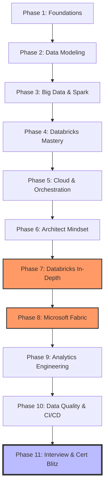

# 🚀 Data Engineering Architect Roadmap (The Certification & Career Masterclass)

Welcome to the definitive hub for becoming a **Data Engineering Architect**. This roadmap is designed to be hands-on, certification-aligned, and career-agnostic — preparing you for **FAANG**, **Consulting**, or **Startups**.

---

## 🗺️ The Learning Journey (11 Phases)

---

## 🎯 Certification & Career Mapping

| Phase | Core Tech | [DP-600](https://learn.microsoft.com/en-us/credentials/certifications/fabric-analytics-engineer-associate/) (Fabric) | [Databricks Associate](https://www.databricks.com/learn/certification/data-engineer-associate) | Career Focus |
|:---:|:---:|:---:|:---:|:---|
| **1-3** | Linux, SQL, Spark | 🟢 Fundamental | 🟢 Fundamental | **All** (Base skills) |
| **4** | Delta Lake, Jobs | 🟡 Neutral | 🔵 Core Domain | **Startup** (Lakehouse) |
| **5-6** | Airflow, Arch | 🔵 Core Domain | 🟡 Neutral | **Consultancy** (Design) |
| **7** | Unity Catalog, DLT | ⚪ N/A | 🔵 Core Domain | **Enterprise** |
| **8** | OneLake, Power BI | 🔵 Core Domain | ⚪ N/A | **Azure Shop** |
| **9-10**| dbt, Great Exp | 🟡 Strategic | 🟡 Strategic | **Startup / Growth** |
| **11** | Coding / Sys Design| 🔴 Exam Prep | 🔴 Exam Prep | **FAANG / Top Tier** |

---

## 📖 Master Table of Contents

### 🔥 [Phase 1: The Building Blocks (Foundations)](Phase_1_Foundations/README.md)
*   **Linux for DE**: Shell scripting, cron, and permissions. [Startup/Consultancy focus]
*   **SQL Mastery**: Window functions and performance tuning. [FAANG focus]
*   **Python Glue**: Generators, OOP, and Pydantic. [Software Engineering focus]

### 📐 [Phase 2: Data Modeling (The Blueprint)](Phase_2_Data_Modeling/README.md)
*   Standardizing on **Star Schema** and **SCDs**. This is the language of **Consultancies**.

### ⚡ [Phase 3: Big Data (Processing at Scale)](Phase_3_Big_Data_and_PySpark/README.md)
*   **PySpark internals**: Shuffling, Skew, and Spill. [FAANG/Big-Tech focus]

### 🧊 [Phase 4: Databricks Mastery](Phase_4_Databricks_Mastery/README.md)
*   **Databricks Associate Prep**: Delta Lake, Workflows, and Unity Catalog basics.

### 🌬️ [Phase 5: Cloud & Orchestration](Phase_5_Cloud_and_Orchestration/README.md)
*   **Airflow & Terraform**: Managing the "Data Stack as Code".

### 🏛️ [Phase 6: Architect Mindset](Phase_6_Architect_Mindset/README.md)
*   **System Design**: CAP Theorem, Lambda vs. Kappa, and Data Mesh. [Architect focus]

### 🌌 [Phase 7: Databricks In-Depth](Phase_7_Databricks_In_Depth/README.md)
*   **Advanced Databricks**: Delta Live Tables (DLT), MLflow, and Cost Optimization.

### 🌐 [Phase 8: Microsoft Fabric (DP-600)](Phase_8_Microsoft_Fabric/README.md)
*   **Fabric Masterclass**: OneLake, Direct Lake Power BI, and Real-Time Analytics.

### 🛠️ [Phase 9: Analytics Engineering (dbt)](Phase_9_Analytics_Engineering/README.md)
*   **The Modern Data Stack**: Building modular SQL models with dbt Core. [Startup focus]

### 🛡️ [Phase 10: Data Quality & CI/CD](Phase_10_Data_Quality_and_Observability/README.md)
*   **DataOps**: Great Expectations, Unit Testing, and GitHub Actions.

### 🏆 [Phase 11: Interview & Cert Mastery](Phase_11_Interview_Mastery/README.md)
*   **The Final Drill**: Coding puzzles, SQL Hard, and Mock Certification Exams.

---

## 🔑 Your Learning Path

| Target | Recommended Focus |
|:---|:---|
| **DP-600 Candidate** | Phases 1, 2, 5, 8, 11 |
| **Databricks Associate** | Phases 1, 3, 4, 7, 11 |
| **FAANG Data Engineer** | Phases 1, 3, 6, 11 (Hard) |
| **Startup Generalist** | Phases 1, 4, 9, 10 |

---
### 🏛️ Architect's Final Tip

> "Certification proves you know the **tool**. The roadmap proves you know the **craft**. To win in FAANG or Consulting, you must master the 'Why' behind every click."

*Start with [Phase 1: Foundations](Phase_1_Foundations/README.md) →*
