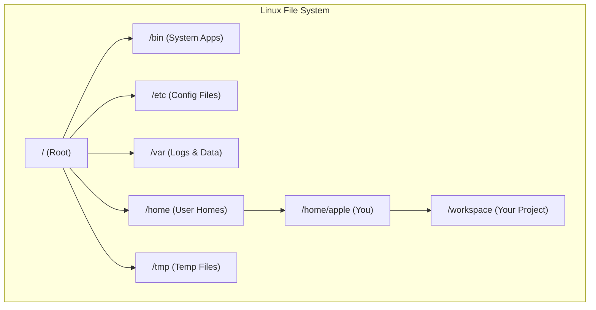

# Lesson 1: Linux for Data Architects (The Master Guide)

> **Goal:** By the end of this lesson, you will feel comfortable navigating any Linux server, writing automation scripts, managing permissions, scheduling jobs, and tuning system performance — the exact skills used every day in every data engineering team on the planet.

---

## 🏗️ Phase 1: Absolute Foundations (For Beginners)
If you have never seen a black screen with white text, start here.

### 1. What is a Terminal?
The **Terminal** (also called the Console or CLI) is a way to talk to your computer using text instead of a mouse.
*   **The Shell:** This is the program that listens to your text commands. The two most common shells are:
    *   `bash` (Bourne Again Shell) — used on most Linux servers.
    *   `zsh` (Z Shell) — used on modern macOS by default.
*   **Why use a Terminal?** Because in the cloud (AWS/Azure/GCP), servers have **no screen**. 100% of your interaction is through a terminal. If you can't use a terminal, you can't be a Data Engineer.

### 2. What is a "Directory"?
In Linux, we don't call them "folders"; we call them **Directories**.

| Linux      | Windows Description     |
|------------|--------------------------|
| `/`        | The very top (C:\)       |
| `/home`    | All user accounts        |
| `~`        | Your own home folder     |
| `/var/log` | All system log files     |
| `/etc`     | All config files         |
| `/tmp`     | Temporary files          |
| `/usr/bin` | All programs/commands    |



### 3. Basic Navigation (Moving Around)

| Command | What it does | Example |
|---------|-------------|---------|
| `pwd` | **P**rint **W**orking **D**irectory — "Where am I?" | `pwd` → `/home/apple` |
| `ls` | **L**i**s**t all files & directories | `ls -la` (detailed + hidden) |
| `cd` | **C**hange **D**irectory | `cd /var/log` |
| `cd ..` | Go UP one directory | `cd ..` |
| `cd ~` | Go HOME instantly | `cd ~` |
| `cd -` | Go to the PREVIOUS directory | `cd -` |

```bash
# Real-world example: navigating to a spark log
cd /var/log/spark
ls -lh                  # -h means "human-readable file sizes"
tail -f spark.log       # Watch the log update in real-time
```

### 4. Making, Moving & Deleting Files

| Command | Purpose | Example |
|---------|---------|---------|
| `mkdir -p` | Create nested directories | `mkdir -p data/raw/2024/01` |
| `touch` | Create empty file | `touch pipeline.sh` |
| `cp -r` | Copy a directory | `cp -r data/ data_backup/` |
| `mv` | Move or Rename | `mv old_name.sh new_name.sh` |
| `rm -rf` | Force-delete a directory | `rm -rf /tmp/old_logs` (⚠️ BE CAREFUL!) |
| `find` | Search for files | `find /data -name "*.csv"` |

> ⚠️ **WARNING:** `rm -rf` has no "Recycle Bin". Data deleted this way is **GONE FOREVER**. Always double-check your path!

---

## 🚀 Phase 2: Intermediate (The Developer Level)

### 1. Reading & Searching Files (The Data Engineer's Best Friends)

```bash
# Basic reading
cat file.txt            # Print entire file
head -n 20 file.txt     # Show first 20 lines
tail -n 50 file.txt     # Show last 50 lines
tail -f app.log         # LIVE FOLLOW — watch a log as it grows (Ctrl+C to stop)

# Searching inside files — grep is INCREDIBLY powerful
grep "ERROR" app.log                 # Find all error lines
grep -i "error" app.log              # Case-insensitive search
grep -n "ERROR" app.log              # Show line numbers
grep -r "customer_id" /pipelines/    # Recursive: search all .py files in a folder
grep -c "FAILED" app.log             # Count matching lines
grep -v "DEBUG" app.log              # Show everything EXCEPT debug lines

# Chaining commands with PIPE (|) — the most powerful concept in Linux
# "Take the output of the LEFT command and give it to the RIGHT command"
cat access.log | grep "404" | wc -l  # How many 404 errors are in the log?
ps aux | grep "spark"                 # Is Spark running right now?
```

> 💡 **DE Pro Tip:** `grep "ERROR" /var/log/spark/*.log | wc -l` — This single command tells you how many errors happened across ALL your Spark log files. SQL can't do this. Linux can.

### 2. Permissions (Who Can Do What?)

Every Linux file has 3 permission levels:

```
-rwxr-xr--  1  apple  data_team  4096  Apr 20  pipeline.sh
 ^^^|^^^|^^^
  | |   |
  | |   └── Others (everyone else): r-- = Read Only
  | |
  | └──────── Group (data_team): r-x = Read + Execute
  |
  └────────── Owner (apple): rwx = Read + Write + Execute
```

```bash
# Change permissions
chmod +x pipeline.sh        # Make it executable
chmod 755 pipeline.sh       # Owner: rwx, Group: r-x, Others: r-x
chmod 600 credentials.env   # Owner only can read/write (PERFECT for secrets!)

# Change ownership
chown apple:data_team pipeline.sh
chown -R apple:data_team /data/    # Recursively for all files in /data
```

> 💡 **Security Rule:** Config files with passwords (`.env`, credentials files) should **ALWAYS** be `chmod 600`. Never `chmod 777`.

### 3. Working with Large Files (The Data Engineer's Toolkit)

```bash
# Count how many records are in a CSV (minus 1 for header)
wc -l data.csv

# Get the first line (header) of a 10GB file instantly
head -1 large_data.csv

# Cut specific columns from a CSV (like SQL SELECT)
# Get columns 1, 3, and 5 (comma-separated file)
cut -d',' -f1,3,5 data.csv | head -20

# Sort a file
sort -t',' -k3 data.csv   # Sort by 3rd column

# Find unique values in column 2
cut -d',' -f2 data.csv | sort | uniq -c | sort -rn | head -10

# Check disk usage — critical for monitoring data pipelines
df -h             # Disk usage of all drives
du -sh /data/*    # Size of each folder in /data
```

### 4. Process Management (Is my job still running?)

```bash
# See all running processes
top                   # Interactive view (press 'q' to quit)
htop                  # Better version (install with: sudo apt install htop)
ps aux | grep python  # Find Python pipelines

# Run a job in the BACKGROUND
python pipeline.py &           # The & sends it to background
nohup python pipeline.py &     # SAFER: Runs even after you log out

# Kill a process
kill 12345             # Kill by Process ID (PID)
kill -9 12345          # Force kill (last resort)
pkill -f "pipeline.py" # Kill by process name

# Check what's using your ports
lsof -i :8080          # Who is using port 8080?
```

---

## 🏛️ Phase 3: Architect (The Professional Level)

### 1. Bash Scripting (Automation — The Real Power)

Data Engineers don't type commands all day. We write **Scripts**.

```bash
#!/bin/bash
# === Data Pipeline Daily Runner ===
# Author: Your Name | Date: 2024-03
# Purpose: Extract data, validate, and load to warehouse

# Best practice: Exit immediately if any command fails
set -e
set -o pipefail

# Variables at the top — easy to change
SOURCE_DIR="/data/raw"
DEST_DIR="/data/processed"
LOG_FILE="/var/log/pipeline_$(date +%Y%m%d).log"

# Logging function — professional pipelines always log
log() {
    echo "[$(date '+%Y-%m-%d %H:%M:%S')] $1" | tee -a "$LOG_FILE"
}

# Check if source directory exists
if [ ! -d "$SOURCE_DIR" ]; then
    log "ERROR: Source directory $SOURCE_DIR does not exist!"
    exit 1
fi

log "Starting pipeline run..."
log "Processing files in $SOURCE_DIR"

# Loop over all CSV files and process them
file_count=0
for file in "$SOURCE_DIR"/*.csv; do
    if [ -f "$file" ]; then
        filename=$(basename "$file")
        log "Processing: $filename"

        # Count records
        record_count=$(wc -l < "$file")
        log "  Records found: $record_count"

        # Move to processed folder
        cp "$file" "$DEST_DIR/"
        file_count=$((file_count + 1))
    fi
done

log "Pipeline complete. Processed $file_count files."
log "Output available at: $DEST_DIR"
```

### 2. Cron Jobs (The Scheduler — Run Tasks Automatically)

**Cron** is Linux's built-in scheduler. Every Data Engineer must know it.

```bash
# Edit your scheduled jobs
crontab -e

# Cron format: minute  hour  day  month  weekday  command
#              0-59    0-23  1-31  1-12   0-7
#
# Examples:
# Run at 2:00 AM every day
0 2 * * * /home/apple/pipelines/daily_run.sh >> /var/log/daily.log 2>&1

# Run every 15 minutes
*/15 * * * * /scripts/check_kafka.sh

# Run at 9 AM every Monday
0 9 * * 1 python /pipelines/weekly_report.py

# Run on the 1st of every month
0 0 1 * * /scripts/monthly_archive.sh

# The "2>&1" at the end captures BOTH stdout AND stderr into the log file
# Without this, you'll never know WHY a cron job failed!
```

### 3. Environment Variables (Managing Secrets the Right Way)

```bash
# BAD: Never hardcode passwords in scripts!
# Good: Use environment variables
export DB_HOST="prod-db.internal.company.com"
export DB_PASSWORD="$(cat /run/secrets/db_password)"  # Read from secret file

# In your .env file (chmod 600 ONLY!)
# DB_HOST=prod-db.internal.company.com
# DB_USER=pipeline_service
# DB_PASSWORD=super_secret_password_123

# Load it in your script
source /home/apple/.env
echo "Connecting to: $DB_HOST"
```

### 4. SSH — Connecting to Cloud Servers

In the cloud, all servers are remote. SSH is your "teleportation" into them.

```bash
# Connect to a remote server (AWS EC2, Azure VM, etc.)
ssh apple@10.0.0.25

# Connect with a key file (more secure, no password)
ssh -i ~/.ssh/my_key.pem ec2-user@52.25.124.10

# Copy a file TO the server
scp data.csv ec2-user@52.25.124.10:/data/

# Copy a file FROM the server
scp ec2-user@52.25.124.10:/var/log/pipeline.log ./local_copy.log

# Create an SSH key pair (do this once)
ssh-keygen -t rsa -b 4096 -C "your_email@company.com"
# Then put the PUBLIC key (~/.ssh/id_rsa.pub) on the server
# Store the PRIVATE key (~/.ssh/id_rsa) safely — treat it like a password!
```

### 5. Standard Output, Error & Redirection (The Pipeline Flow)

```bash
# Redirect output to a file (overwrites)
ls > files_list.txt

# Append output to a file
echo "New log entry" >> app.log

# Redirect Error only
ls /nonexistent 2> error.log

# Redirect both Output and Error
./pipeline.sh > log.txt 2>&1
```

---

## 🎯 Phase 4: Certification & Interview Drill

### 🛡️ Databricks Associate Drill
In Databricks, while we use Spark, Linux knowledge is vital for **Cluster Management** and **Storage Mounts**.
*   **Init Scripts:** You often write `.sh` scripts to install specific libraries on a cluster when it starts. These use the same bash logic you learned in Phase 3.
*   **DBFS vs Local:** `/dbfs/` on a Databricks cluster is a local mount of your storage. Navigating it uses `ls`, `cd`, and `cp`.
*   **Job Failure:** If a Databricks job fails with "Library not found", an architect might check the Init Script logs using `cat` and `grep`.

### 🏢 Consultancy Scenario: The "Choice"
**Scenario:** A client is moving from on-premise to Cloud. They have 500 legacy Bash scripts. Do we rewrite them?
*   **Architect Answer:** No, not all at once. Wrap them in **Docker containers** or run them as **Init Scripts** in Databricks/Fabric. This preserves logic while moving to the cloud (Refactor vs. Replatform).

### 🚀 Startup Scenario: The "Hacker"
**Scenario:** Your pipeline is slow. You have one server with 16GB RAM. You need to find the most frequent user ID in a 40GB file.
*   **Answer:** Don't use Python/Pandas (it will crash). Use Linux:
    `cut -d',' -f1 big_data.csv | sort | uniq -c | sort -nr | head -10`
    *This uses almost NO memory.*

### 🏛️ FAANG Scenario: The "Scaling"
**Scenario:** You need to monitor logs across 100 servers. How do you find a specific request ID?
*   **Answer:** You don't SSH into 100 boxes. You send logs to a central system (ELK/Splunk). But in the interview, they might ask: "How do you search a file if the disk is 99% full?"
*   **Advanced Tip:** Use `zgrep` to search compressed (`.gz`) log files without decompressing them first, saving critical disk space.

---

### 🧪 Hands-on Labs
- [basic_commands_lab.sh](basic_commands_lab.sh) (Start here!)
- [data_sync.sh](data_sync.sh) (Your first automation)

---

### ✅ Key Takeaways
1. **The Terminal is mandatory** — Cloud servers have no GUI.
2. **`grep`, `awk`, `sed`** — Your three most powerful data tools in Linux.
3. **Cron jobs** — How real pipelines are scheduled on-premise.
4. **Permissions** — Your first line of security defense. `chmod 600` for secrets.
5. **`tail -f`** — Your primary debugging tool. Watch logs live.
6. **`set -e` in scripts** — Fail fast. A silent failure is worse than a loud crash.
7. **Performance** — Linux tools like `grep` and `awk` are streaming-based and use minimal RAM.

[Next: Lesson 2: SQL Mastery (The Core) →](../Lesson_2_SQL_Mastery/README.md)

---

## ⚠️ Common Pitfalls (Beginner Mistakes)

1.  **The "Silent" Success:** Running a command like `rm` or `mv` and assuming it worked because there was no error message. 
    *   **Fix:** Use `ls` to verify the change, or check the exit status with `echo $?` (0 means success).
2.  **AbsolutePath vs RelativePath:** Trying to `cd` into a directory that exists but getting "No such file or directory" because you forgot you were already inside another folder.
    *   **Fix:** Always run `pwd` if you are lost. Use `/` for paths starting from the root and `.` for paths starting from your current location.
3.  **Forgetting `chmod +x`:** Writing a bash script and trying to run it with `./script.sh` but getting "Permission denied."
    *   **Fix:** Scripts are not executable by default. Run `chmod +x filename.sh` once.
4.  **The `rm -rf /` Nightmare:** Typing `rm -rf /` by mistake (perhaps trying to delete a subfolder but adding a space after the slash).
    *   **Fix:** **NEVER** use `rm -rf` without triple-checking the path. In production, use `rm -i` (interactive) which asks for confirmation.

---

## 🧪 Practice Exercises

### Exercise 1 — The Navigation Challenge (Beginner)
**Goal:** Practice moving and finding files.

1. Create a directory named `linux_lab`.
2. Inside it, create three folders: `raw`, `processed`, and `logs`.
3. Create an empty file in `raw` named `data_1.csv`.
4. "Process" the file by moving it from `raw` to `processed` and renaming it to `data_1_done.csv`.
5. Create a log entry: `echo "Process complete at $(date)" > logs/run.log`.
6. List all files in the `linux_lab` directory recursively.

---

### Exercise 2 — The Log Grepper (Intermediate)
**Goal:** Use pipes to extract information from text.

Suppose you have a file `server.log` with the following content:
```text
2024-04-20 10:01:00 INFO: System started
2024-04-20 10:05:22 ERROR: Database connection failed (Timeout)
2024-04-20 10:05:45 INFO: Retrying connection...
2024-04-20 10:06:10 ERROR: Database connection failed (Auth Error)
2024-04-20 10:10:00 INFO: Connection successful
```

**Your Task:**
1. Write a command to show only the lines containing "ERROR".
2. Write a command to count how many "ERROR" lines exist.
3. Write a command to find only the text inside the parentheses (e.g., Timeout, Auth Error) for all errors.
   *Hint:* Use `cut -d'(' -f2 | cut -d')' -f1`.

---

### Exercise 3 — The Auto-Archiver (Architect)
**Goal:** Write a bash script that cleans up old data.

**Requirements:**
1. The script should look into a directory `/tmp/data_drops/`.
2. Any file ending in `.tmp` should be deleted.
3. Any file older than 7 days should be moved to `/tmp/archive/`.
4. The script should append the number of files moved to a log file `/tmp/archive_log.txt`.

*Think about using `find /tmp/data_drops/ -mtime +7` for the date logic.*

---

## 💼 Common Interview Questions

**Q1: What is the difference between `head` and `tail`, and when is `tail -f` used?**
> `head` shows the beginning of a file (default 10 lines), while `tail` shows the end. `tail -f` (follow) is a crucial Data Engineering tool because it keeps the file open and displays new lines as they are written in real-time. This is how we monitor live Spark or Airflow logs.

**Q2: Explain the significance of the `|` (pipe) operator.**
> The pipe operator connects the Standard Output (stdout) of one command to the Standard Input (stdin) of another. It allows us to build complex "one-liner" pipelines, such as `cat logs.txt | grep "ERROR" | wc -l` to count errors without writing a script or a Spark job.

**Q3: How do you check which processes are consuming the most memory on a Linux server?**
> Use the `top` or `htop` command. Inside `top`, you can press `M` (Shift+M) to sort by memory usage. This is vital when a Spark driver or a Python script is about to crash the server due to an "Out of Memory" (OOM) error.

**Q4: What is the difference between `chmod` and `chown`?**
> `chmod` (**ch**ange **mod**e) changes the **permissions** of a file (who can read, write, or execute). `chown` (**ch**ange **own**er) changes the **ownership** of the file (which user and group own the file). You need both to secure data on a multi-user server.

**Q5: What does `set -e` do at the top of a bash script?**
> `set -e` tells the shell to exit the script immediately if any command returns a non-zero exit code (fails). Without this, if your "Delete Temp Data" step fails, the script might continue to "Upload to Production," causing data corruption. It is a "Fail-Fast" safety mechanism.
