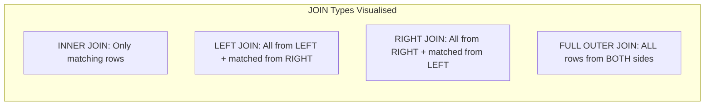
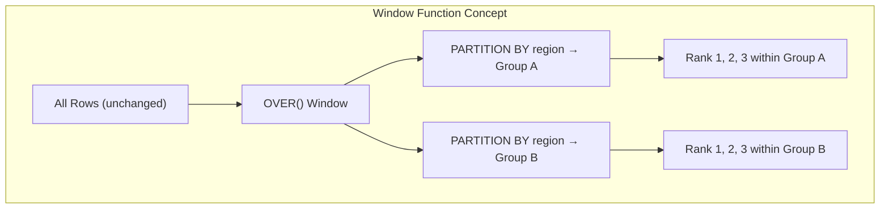
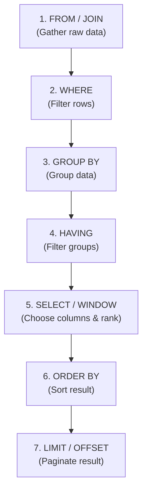

# Lesson 2: SQL Mastery for Architects (The Master Guide)

> **Goal:** SQL is the #1 skill for every Data Engineer. By the end of this lesson, you will understand not just HOW to write SQL, but WHY the database executes it the way it does — and how to make it 100x faster.

---

## 🏗️ Phase 1: Absolute Foundations (For Beginners)
SQL (Structured Query Language) is the universal language for talking to databases.

### 1. What is a Database?
Imagine a super-powered Excel file.
*   **Table:** One tab in the Excel file (e.g., `customers`).
*   **Column:** A vertical slice (e.g., `name`, `email`, `city`).
*   **Row:** A single horizontal record (e.g., one specific customer).
*   **Primary Key:** The unique ID of a row. No two rows can share the same Primary Key.
*   **Foreign Key:** A column that points to the Primary Key of ANOTHER table. This is how tables "talk" to each other.

### 2. DDL: Building the House (Data Definition Language)
DDL is how we create and modify the **structure** of the database.

```sql
-- CREATE: Build a new table
CREATE TABLE customers (
    customer_id   INT          PRIMARY KEY,
    full_name     VARCHAR(200) NOT NULL,
    email         VARCHAR(200) UNIQUE NOT NULL,
    city          VARCHAR(100),
    created_date  DATE         DEFAULT CURRENT_DATE
);

-- CREATE with a FOREIGN KEY reference
CREATE TABLE orders (
    order_id      INT           PRIMARY KEY,
    customer_id   INT           NOT NULL REFERENCES customers(customer_id),
    order_date    TIMESTAMP     NOT NULL,
    total_amount  DECIMAL(12,2) NOT NULL CHECK (total_amount > 0)
);

-- ALTER: Add a column to an existing table
ALTER TABLE customers ADD COLUMN loyalty_tier VARCHAR(20) DEFAULT 'Bronze';

-- DROP: Delete a table (⚠️ PERMANENT!)
DROP TABLE IF EXISTS old_temp_data;
```

### 3. DML: Adding the Furniture (Data Manipulation Language)
DML is how we **insert, update, and delete** individual records.

```sql
-- INSERT a new customer
INSERT INTO customers (customer_id, full_name, email, city)
VALUES (1, 'Priya Sharma', 'priya@example.com', 'Mumbai');

-- INSERT multiple rows at once (much faster!)
INSERT INTO customers (customer_id, full_name, email, city) VALUES
    (2, 'Rohan Mehta',  'rohan@example.com',  'Delhi'),
    (3, 'Anjali Patel', 'anjali@example.com', 'Bangalore');

-- UPDATE: Change existing data
UPDATE customers
SET city = 'Pune', loyalty_tier = 'Gold'
WHERE customer_id = 1;

-- DELETE: Remove rows carefully!
DELETE FROM customers
WHERE created_date < '2020-01-01' AND loyalty_tier = 'Bronze';
```

### 4. DQL: Asking Questions (Data Query Language)
This is 80% of your job as a Data Engineer.

```sql
-- Basic structure of every query
SELECT column1, column2
FROM   table_name
WHERE  condition
ORDER BY column1 ASC
LIMIT  100;

-- Real example:
SELECT
    full_name,
    city,
    loyalty_tier
FROM customers
WHERE city IN ('Mumbai', 'Delhi', 'Bangalore')
  AND loyalty_tier != 'Bronze'
ORDER BY full_name ASC;
```

---

## 🚀 Phase 2: Intermediate (The Developer Level)

### 1. Joins — The Heart of SQL

Real data is split into multiple tables. **JOINs** bring it back together.



```sql
-- INNER JOIN: Only customers who placed orders
SELECT
    c.full_name,
    o.order_id,
    o.total_amount,
    o.order_date
FROM customers c
INNER JOIN orders o ON c.customer_id = o.customer_id;

-- LEFT JOIN: ALL customers, even those with NO orders
-- (NULLs will appear for order columns where there is no match)
SELECT
    c.full_name,
    o.order_id,
    COALESCE(o.total_amount, 0) AS total_amount   -- Replace NULL with 0
FROM customers c
LEFT JOIN orders o ON c.customer_id = o.customer_id;

-- Answer: "Which customers have NEVER placed an order?"
SELECT c.full_name
FROM customers c
LEFT JOIN orders o ON c.customer_id = o.customer_id
WHERE o.order_id IS NULL;   -- Filter for the NULLs = the non-matches
```

### 2. GROUP BY — Aggregation

Collapse many rows into summary statistics.

```sql
-- How many orders does each city have?
SELECT
    c.city,
    COUNT(o.order_id)       AS total_orders,
    SUM(o.total_amount)     AS total_revenue,
    AVG(o.total_amount)     AS avg_order_value,
    MAX(o.total_amount)     AS biggest_order,
    MIN(o.order_date)       AS first_order_date
FROM customers c
JOIN orders o ON c.customer_id = o.customer_id
GROUP BY c.city
HAVING SUM(o.total_amount) > 100000    -- HAVING filters on AGGREGATED results
ORDER BY total_revenue DESC;
```

> 💡 **Key Rule:** `WHERE` filters **BEFORE** aggregation. `HAVING` filters **AFTER** aggregation.

### 3. CTEs — Common Table Expressions (Clean, Readable SQL)

CTEs let you name a sub-query and reuse it, making complex SQL readable.

```sql
-- Without CTE: Nested mess (hard to read)
SELECT * FROM (
    SELECT customer_id, SUM(total_amount) AS total
    FROM orders
    GROUP BY customer_id
) AS sub WHERE total > 5000;

-- With CTE: Clean and readable (preferred by every senior engineer)
WITH customer_totals AS (
    SELECT
        customer_id,
        SUM(total_amount)  AS total_spend,
        COUNT(order_id)    AS order_count
    FROM orders
    GROUP BY customer_id
),
high_value_customers AS (
    SELECT customer_id, total_spend
    FROM customer_totals
    WHERE total_spend > 5000
)
-- Final SELECT uses both CTEs
SELECT
    c.full_name,
    c.city,
    h.total_spend
FROM high_value_customers h
JOIN customers c ON h.customer_id = c.customer_id
ORDER BY h.total_spend DESC;
```

### 4. Subqueries

```sql
-- Correlated Subquery: Find customers whose total spend > average
SELECT full_name, city
FROM customers
WHERE customer_id IN (
    SELECT customer_id
    FROM orders
    GROUP BY customer_id
    HAVING SUM(total_amount) > (SELECT AVG(total_amount) FROM orders)
);
```

---

## 🏛️ Phase 3: Architect (The Professional Level)

### 1. Window Functions — The Most Powerful SQL Feature

Normal `GROUP BY` **collapses** rows. Window functions perform calculations **while keeping every row visible**.

```
Syntax: FUNCTION_NAME() OVER (PARTITION BY [group_column] ORDER BY [sort_column])
```

| Function | What It Does | Use Case |
|----------|-------------|---------|
| `ROW_NUMBER()` | Unique number per row, no ties | Deduplication |
| `RANK()` | Rank with gaps (1,1,3) on ties | Leaderboards |
| `DENSE_RANK()` | Rank without gaps (1,1,2) on ties | Competitive ranking |
| `LAG(col, n)` | Value from N rows BEFORE current | Calculate growth |
| `LEAD(col, n)` | Value from N rows AFTER current | Predict next event |
| `SUM() OVER` | Running total / cumulative sum | Revenue tracking |
| `NTILE(n)` | Divide rows into N buckets | Percentile analysis |

```sql
-- Full example: Sales Performance Dashboard
SELECT
    order_date,
    salesperson_name,
    region,
    sale_amount,

    -- 1. Global rank: Who is the #1 salesperson overall?
    RANK() OVER (ORDER BY sale_amount DESC) AS global_rank,

    -- 2. Regional rank: Who is #1 in EACH region? (Resets per region)
    RANK() OVER (PARTITION BY region ORDER BY sale_amount DESC) AS regional_rank,

    -- 3. Month-over-month growth: How much more than last month?
    LAG(sale_amount, 1) OVER (
        PARTITION BY salesperson_name
        ORDER BY order_date
    ) AS last_month_amount,

    sale_amount - LAG(sale_amount, 1) OVER (
        PARTITION BY salesperson_name
        ORDER BY order_date
    ) AS growth_amount,

    -- 4. Running total of sales per region (cumulative sum)
    SUM(sale_amount) OVER (
        PARTITION BY region
        ORDER BY order_date
        ROWS BETWEEN UNBOUNDED PRECEDING AND CURRENT ROW
    ) AS cumulative_regional_sales,

    -- 5. Percentile: Top 25% or bottom 25%?
    NTILE(4) OVER (ORDER BY sale_amount DESC) AS quartile

FROM fact_sales
ORDER BY order_date, salesperson_name;
```



### 2. Indexing — The Performance Game-Changer

An **Index** is a sorted lookup table. Without it, the DB reads every row (Full Table Scan). With it, it jumps directly to the answer.

```sql
-- Create a B-Tree Index (default — good for equality and range searches)
CREATE INDEX idx_orders_customer_id ON orders(customer_id);

-- Composite Index (when you filter on TWO columns together)
CREATE INDEX idx_orders_date_region ON orders(order_date, region);

-- UNIQUE Index (enforces uniqueness + speeds up lookups)
CREATE UNIQUE INDEX idx_customers_email ON customers(email);

-- PARTIAL Index (only index rows matching a condition — saves space!)
CREATE INDEX idx_orders_high_value ON orders(total_amount)
WHERE total_amount > 10000;

-- Check if your query uses an index:
EXPLAIN ANALYZE
SELECT * FROM orders WHERE customer_id = 42;
-- Look for: "Index Scan" = GOOD, "Seq Scan" = BAD (means no index used)
```

> 💡 **The Indexing Rules:**
> 1. **Always index your Foreign Keys** (`customer_id`, `product_id`)
> 2. **Index columns used in WHERE, JOIN, and ORDER BY**
> 3. **Don't over-index:** Each index slows down INSERT/UPDATE (extra maintenance)
> 4. **A missing index can turn a 0.2-second query into a 20-minute query**

### 3. EXPLAIN ANALYZE — The Architect's X-Ray
Before you can fix a slow query, you must see how the database engine is thinking. `EXPLAIN` shows the plan; `EXPLAIN ANALYZE` actually runs it and gives real timings.

#### A. Common Scan Types
| Scan Type | Performance | Meaning |
|-----------|-------------|---------|
| **Sequential Scan (Seq Scan)** | 🔴 SLOW | Reading every single page of the table from disk. |
| **Index Scan** | 🟢 FAST | Using an index to find specific pointers, then fetching the data. |
| **Index Only Scan** | 🚀 FASTEST | The index has all the info needed; the DB never touches the actual table. |
| **Bitmap Index Scan** | 🟡 MEDIUM | Used when an Index Scan would be too slow but a Seq Scan is too much. |

#### B. Common Join Methods (How tables meet)
1. **Nested Loop Join:** "For each row in Table A, check every row in Table B." Good for tiny tables only.
2. **Hash Join:** The DB builds a "Hash Map" of the smaller table in memory. Extremely fast for medium to large tables.
3. **Merge Join:** Both tables are sorted by the join key first, then "merged" together. The best for very large joins where everything is already sorted.

#### C. Professional Tuning Checklist
- **Filter Early:** Put your most restrictive conditions in the `WHERE` clause first.
- **Avoid `SELECT *`:** Reading extra columns forces the DB to do more work and prevents Index Only Scans.
- **SARGable Queries:** Avoid functions on your join columns (e.g., `WHERE YEAR(date) = 2024` is bad; `WHERE date >= '2024-01-01'` is good because it can use an index).
- **Update Statistics:** `ANALYZE table_name;` tells the database how much data is actually in the table so it can make better plan choices.

```sql
-- The Audit Command
EXPLAIN (ANALYZE, BUFFERS, VERBOSE)
SELECT c.full_name, SUM(o.total_amount)
FROM customers c
JOIN orders o ON c.customer_id = o.customer_id
WHERE o.order_date > '2024-01-01'
GROUP BY c.full_name;
```

### 4. Transactions — Guaranteeing Data Integrity

```sql
-- A transaction is a group of statements that ALL succeed or ALL fail
BEGIN;

    -- Step 1: Deduct from source account
    UPDATE accounts SET balance = balance - 500 WHERE account_id = 1;

    -- Step 2: Add to destination account
    UPDATE accounts SET balance = balance + 500 WHERE account_id = 2;

    -- If both worked: save it permanently
COMMIT;

-- If something went wrong at any point:
-- ROLLBACK;  -- Undo EVERYTHING back to the BEGIN state

-- SAVEPOINT: Rollback to a specific point (not the beginning)
BEGIN;
    INSERT INTO orders VALUES (...);
    SAVEPOINT after_insert;

    UPDATE inventory SET qty = qty - 1 WHERE product_id = 5;

    -- Something went wrong with update only
    ROLLBACK TO SAVEPOINT after_insert;  -- Keeps the INSERT, undoes only the UPDATE
COMMIT;
```

### 5. Advanced Data Types and Functions

```sql
-- JSON support (critical for modern DE work!)
CREATE TABLE events (
    event_id  INT PRIMARY KEY,
    payload   JSONB   -- JSONB = Binary JSON (indexed, faster than JSON)
);

-- Query inside JSON
SELECT
    event_id,
    payload->>'event_type'      AS event_type,
    (payload->>'amount')::FLOAT AS amount,
    payload->'metadata'->>'source' AS source
FROM events
WHERE payload->>'event_type' = 'purchase';

-- Date/Time manipulation — crucial for time-series analysis
SELECT
    order_date,
    DATE_TRUNC('month', order_date)           AS month_start,
    EXTRACT(DOW FROM order_date)              AS day_of_week,  -- 0=Sun, 6=Sat
    order_date + INTERVAL '30 days'           AS due_date,
    AGE(CURRENT_DATE, order_date)             AS order_age,
    TO_CHAR(order_date, 'YYYY-MM')            AS year_month
FROM orders;

-- String manipulation
SELECT
    UPPER(full_name)           AS name_upper,
    TRIM('  spaces  ')         AS clean_name,
    SUBSTRING(email, 1, POSITION('@' IN email) - 1) AS username,
    REGEXP_REPLACE(phone, '[^0-9]', '', 'g') AS clean_phone
FROM customers;
```

### 6. UPSERT (Insert or Update) — Critical for Pipelines

```sql
-- PostgreSQL: INSERT ... ON CONFLICT
INSERT INTO dim_customers (customer_id, full_name, city, loyalty_tier)
VALUES (1, 'Priya Sharma', 'Pune', 'Gold')
ON CONFLICT (customer_id)
DO UPDATE SET
    full_name    = EXCLUDED.full_name,
    city         = EXCLUDED.city,
    loyalty_tier = EXCLUDED.loyalty_tier,
    updated_at   = CURRENT_TIMESTAMP;

-- This pattern is the SQL equivalent of SCD Type 1
-- Used in EVERY production ETL pipeline
```

### 7. Logical Order of Execution (The Architect's Secret)
Most people write SQL in this order: `SELECT -> FROM -> WHERE -> GROUP BY`.
However, the database **executes** it in a completely different order. Understanding this allows you to debug "Column not found" errors and optimize slow queries.



---

## 🎯 Phase 4: Certification & Interview Drill

### 🛡️ DP-600 (Microsoft Fabric) Drill
Fabric uses **T-SQL** in its Data Warehouse and **Spark SQL** in its Lakehouse.
*   **Stored Procedures:** In Fabric DW, you use Stored Procedures to bundle logic.
    ```sql
    CREATE PROCEDURE sp_UpdateCustomerTier (@MinSpend DECIMAL)
    AS
    BEGIN
        UPDATE customers SET loyalty_tier = 'Gold' WHERE total_spend > @MinSpend;
    END;
    ```
*   **Performance:** Fabric uses **Columnar Storage**. While indexes exist, **Partitioning** and **V-Order** (internal optimization) are more important for billion-row tables.

### 🛡️ Databricks Associate Drill
*   **Delta Lake SQL:** You must master the `MERGE` command. It is the Databricks version of UPSERT.
    ```sql
    MERGE INTO target_table AS t
    USING source_updates AS s
    ON t.id = s.id
    WHEN MATCHED THEN UPDATE SET t.val = s.val
    WHEN NOT MATCHED THEN INSERT (id, val) VALUES (s.id, s.val);
    ```
*   **Spark SQL Internals:** Know that a `JOIN` in Spark might trigger a **Shuffle**. If one table is small, use a `BROADCAST` hint to speed it up.

### 🏢 Consultancy Scenario: The "Legacy"
**Scenario:** A client has a "Flat File" (one giant CSV) and wants a "Modern Data Warehouse".
*   **Architect Answer:** Use **Normalization** (3NF) for the internal staging to ensure data integrity, then **Denormalize** into a **Star Schema** (Phase 2) for the final reporting layer (Power BI/Tableau).

### 🚀 Startup Scenario: The "Growth"
**Scenario:** Your database is slow, but you can't afford a bigger server.
*   **Answer:** Look for the "Heavy Hitters". Use `EXPLAIN` to find queries doing **Full Table Scans** on large tables and add targeted indexes. Also, implement **Connection Pooling** on the app side to save database resources.

### 🏛️ FAANG Scenario: The "Hard" Query
**Scenario:** Find the top 3 selling products *per category*, but only for categories that had at least $10,000 in total sales yesterday.
*   **FAANG Drill:** This requires a **CTE** to filter categories first, then a **Window Function** (`DENSE_RANK()`) to rank products within those categories.
    ```sql
    WITH high_value_categories AS (
        SELECT category_id FROM sales 
        WHERE sale_date = CURRENT_DATE - 1
        GROUP BY category_id HAVING SUM(amount) > 10000
    ),
    ranked_products AS (
        SELECT 
            product_id, category_id, amount,
            DENSE_RANK() OVER(PARTITION BY category_id ORDER BY amount DESC) as rank
        FROM sales
        WHERE category_id IN (SELECT category_id FROM high_value_categories)
    )
    SELECT * FROM ranked_products WHERE rank <= 3;
    ```

---

### 🧪 Hands-on Labs
- [basic_sql_lab.sql](basic_sql_lab.sql) (Start here!)
- [advanced_indexing.sql](advanced_indexing.sql) (Performance tuning)
- [analytical_queries.sql](analytical_queries.sql) (FAANG & Cert Drills)

---

### ✅ Key Takeaways
1. **Joins** — The most critical SQL concept. Master LEFT, INNER, and FULL OUTER.
2. **Window Functions** — `RANK()`, `LAG()`, `SUM() OVER()` — these separate junior from senior.
3. **Indexing** — A missing index can make a query 1000x slower. Always check with `EXPLAIN ANALYZE`.
4. **CTEs** — Write readable SQL. Future-you will thank you.
5. **Transactions** — Never move money or critical data without a `BEGIN/COMMIT` block.
6. **UPSERT/MERGE** — The backbone of every production ETL pipeline.
7. **Performance** — Filter early, select only needed columns, and understand your execution plan.

[Next: Lesson 3: Python Glue for DE →](../Lesson_3_Python_Glue/README.md)

---

## ⚠️ Common Pitfalls (Beginner Mistakes)

1.  **The "Blind" SELECT:** Writing `SELECT *` in production code. 
    *   **The Issue:** It wastes network bandwidth and memory. If a new column is added to the table, your application might break or slow down significantly.
    *   **Fix:** Always list the specific columns you need.
2.  **Filter Failure (WHERE vs HAVING):** Trying to filter aggregated results inside a `WHERE` clause.
    *   **The Issue:** `WHERE` happens **before** the data is grouped. You'll get an error like "Aggregate functions not allowed in WHERE."
    *   **Fix:** Use `HAVING` for filters on `COUNT`, `SUM`, etc.
3.  **NULL Comparison Mistake:** Using `column = NULL` or `column != NULL`.
    *   **The Issue:** In SQL, `NULL` is not a value; it's a state of "Unknown." Comparisons with `=` will always return false/unknown.
    *   **Fix:** Use `IS NULL` or `IS NOT NULL`.
4.  **Join Explosion:** Joining two tables on a column that is not unique on both sides (many-to-many).
    *   **The Issue:** This can create a "Cartesian Product" where the result set has millions of redundant rows, crashing the database.
    *   **Fix:** Always verify the "Cardinality" of your join key before running the query.

---

## 🧪 Practice Exercises

### Exercise 1 — The Sales Report (Beginner)
**Goal:** Practice basic SELECT, JOIN, and GROUP BY.

**Table `orders`:** `order_id, customer_id, amount, order_date`
**Table `customers`:** `customer_id, name, city`

**Your Task:**
1. Write a query to find the total amount spent by each customer name.
2. Filter the result to only show customers who spent more than $500.
3. Sort the list from highest spender to lowest.

---

### Exercise 2 — The Deduplication Challenge (Intermediate)
**Goal:** Use Window Functions to clean messy data.

Suppose you have a table `web_events` with duplicate entries for the same `session_id` due to a logging bug.

**Web Events:** `event_id, session_id, user_id, timestamp`

**Your Task:**
1. Use `ROW_NUMBER()` to assign a number to each event within its `session_id`, sorted by `timestamp` descending (latest first).
2. Write a query that returns only the **latest** event for every `session_id`.
   *Hint: Wrap the query in a CTE and filter where row_number = 1.*

---

### Exercise 3 — The Growth Calculator (Architect)
**Goal:** Use `LAG` to calculate Month-over-Month (MoM) growth.

**Table `monthly_revenue`:** `report_month, total_revenue`

**Your Task:**
1. Write a query that shows: `report_month`, `current_month_revenue`, and `previous_month_revenue`.
2. Add a third column named `percentage_growth`.
   *Formula: (Current - Previous) / Previous * 100*

---

## 💼 Common Interview Questions

**Q1: What is the difference between a LEFT JOIN and an INNER JOIN?**
> An **INNER JOIN** only returns rows where there is a match in **both** tables. A **LEFT JOIN** returns **all** rows from the left table, and the matched rows from the right table. If there is no match on the right, it returns `NULL` values. Use LEFT JOIN when you want to find "Missing" records (e.g., Customers who haven't ordered).

**Q2: When would you use a CTE instead of a Subquery?**
> Technically, they perform the same. However, **CTEs (Common Table Expressions)** are preferred for readability and maintenance. They allow you to define your logic at the top of the query and reference it like a temporary table. Subqueries make SQL difficult to read ("Nested Hell"), especially when you have 3+ levels of nesting.

**Q3: What is "Database Normalization" and why do we do it?**
> Normalization is the process of organizing data into multiple related tables to reduce **redundancy** and improve **data integrity**. For example, storing a customer's address once in a `customers` table rather than repeating it for every row in the `orders` table. This prevents "Update Anomalies" (where you update the address in one place but forget the others).

**Q4: How does a B-Tree Index speed up a query?**
> Instead of scanning the table from top to bottom (O(N) complexity), a B-Tree index structured like a balanced tree allows the database to find a specific value in O(log N) time. It's like using an index at the back of a textbook to find a page number instead of reading every page.

**Q5: What is the order of execution in a SQL query?**
> It's not the same as the order you write it! The database executes it as:
> 1. `FROM` / `JOIN` (Gather the data)
> 2. `WHERE` (Filter rows)
> 3. `GROUP BY` (Aggregate)
> 4. `HAVING` (Filter groups)
> 5. `SELECT` (Choose columns)
> 6. `ORDER BY` (Sort)
> 7. `LIMIT` (Restrict count)
