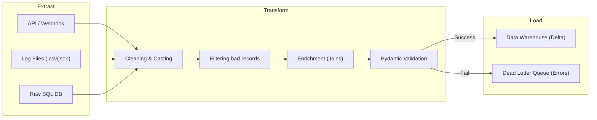
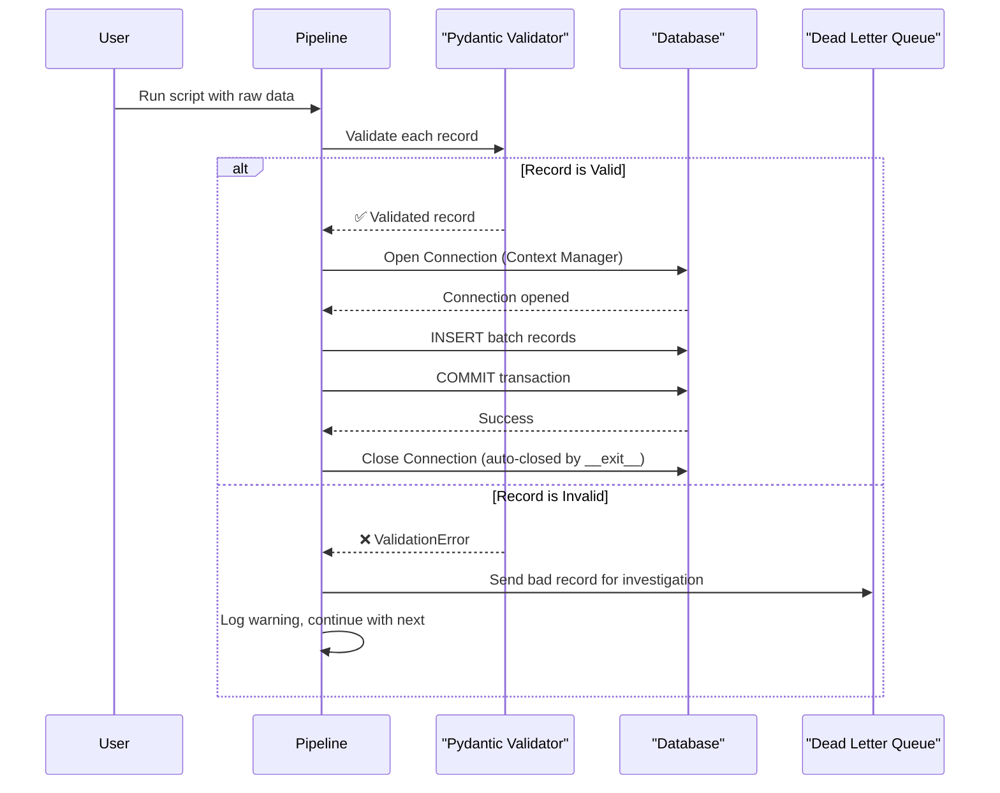

# Lesson 3: Python Glue for Data Architects (The Master Guide)

> **Goal:** Python is the "glue" that connects every part of a data system. By the end of this lesson, you will write production-quality Python code: type-safe, well-structured, and built for pipelines that handle millions of records reliably.

---

## 🏗️ Phase 1: Absolute Foundations (For Beginners)
Python is a programming language that is easy to read, like English.

### 1. Variables and Data Types

```python
# Strings (Text)
name = "Priya Sharma"
city = 'Mumbai'

# Numbers
age = 28            # int (whole number)
salary = 95000.50   # float (decimal)

# Boolean (True/False)
is_active = True
has_premium = False

# None (the "empty" value — important in data!)
email = None   # Customer didn't provide email

# Type checking
print(type(name))   # <class 'str'>
print(type(age))    # <class 'int'>
```

### 2. Lists, Tuples, Sets, and Dictionaries

These are the four containers you'll use every day.

```python
# LIST: Ordered, changeable, allows duplicates
cities = ["Mumbai", "Delhi", "Bangalore", "Mumbai"]
cities.append("Pune")          # Add to end
cities.remove("Delhi")         # Remove by value
print(cities[0])               # Access by index: "Mumbai"
print(cities[-1])              # Last item: "Pune"
print(cities[1:3])             # Slice: ["Bangalore", "Mumbai"]

# TUPLE: Ordered, UNCHANGEABLE (use for constants/configs)
db_credentials = ("host.db.com", 5432, "admin")  # Immutable

# SET: Unordered, NO DUPLICATES (great for finding unique values!)
unique_cities = set(cities)    # Removes the duplicate "Mumbai"
print(len(unique_cities))      # 3

# DICTIONARY: Key-Value pairs (like a JSON object)
customer = {
    "id": 1001,
    "name": "Priya Sharma",
    "city": "Pune",
    "purchases": [450.00, 1200.00, 89.99]
}
print(customer["name"])                    # Access: "Priya Sharma"
print(customer.get("phone", "N/A"))        # Safe access (no KeyError!)
customer["loyalty_tier"] = "Gold"          # Add new key
```

### 3. Control Flow

```python
# IF / ELIF / ELSE
score = 85
if score >= 90:
    grade = "A"
elif score >= 75:
    grade = "B"
elif score >= 60:
    grade = "C"
else:
    grade = "Fail"

# FOR LOOP — iterating over data (your most common loop)
products = ["Apple", "Banana", "Cherry"]
for product in products:
    print(f"Processing: {product}")

# WHILE LOOP — retry logic (critical for API calls)
retries = 0
while retries < 3:
    try:
        # attempt connection
        break
    except Exception:
        retries += 1

# LIST COMPREHENSION — concise Python style
prices = [10, 25, 5, 100, 7]
expensive = [p for p in prices if p > 20]   # [25, 100]
doubled    = [p * 2 for p in prices]         # [20, 50, 10, 200, 14]
```

---

## 🚀 Phase 2: Intermediate (The Developer Level)

### 1. The ETL Cycle (The Data Multi-Tool)
Every Data Engineer uses Python to build ETL (Extract, Transform, Load) pipelines. Here is how the logic flows:



### 2. Functions — Reusable Blocks of Logic

```python
# Basic function with type hints (professional Python always has type hints!)
def clean_phone_number(phone: str) -> str:
    """
    Removes all non-numeric characters from a phone number.

    Args:
        phone: Raw phone string like "+91 (98765) 43210"
    Returns:
        Cleaned digits only: "919876543210"
    """
    import re
    return re.sub(r"[^0-9]", "", phone)

# Default arguments
def connect_to_db(host: str, port: int = 5432, timeout: int = 30) -> dict:
    return {"host": host, "port": port, "timeout": timeout}

# *args (variable number of arguments)
def calculate_total(*prices: float) -> float:
    return sum(prices)

total = calculate_total(10.0, 25.5, 7.99)   # 43.49

# **kwargs (named keyword arguments)
def create_record(**fields) -> dict:
    fields["created_at"] = "2024-03-19"
    return fields

record = create_record(name="Priya", city="Pune", tier="Gold")
```

### 2. Error Handling — Critical for Production Pipelines

```python
import logging

# Set up proper logging (NEVER use print() in production code!)
logging.basicConfig(
    level=logging.INFO,
    format='%(asctime)s | %(levelname)s | %(message)s'
)
logger = logging.getLogger(__name__)

def fetch_data_from_api(endpoint: str, retries: int = 3) -> dict:
    """Fetch with automatic retry on failure."""
    import requests
    import time

    for attempt in range(1, retries + 1):
        try:
            logger.info(f"Attempt {attempt}: Fetching from {endpoint}")
            response = requests.get(endpoint, timeout=10)
            response.raise_for_status()    # Raises error for 4xx/5xx status codes
            logger.info("Fetch successful!")
            return response.json()

        except requests.exceptions.Timeout:
            logger.warning(f"Attempt {attempt} timed out. Retrying...")
        except requests.exceptions.HTTPError as e:
            logger.error(f"HTTP Error: {e}. Not retrying.")
            raise   # Re-raise — don't silently swallow this
        except Exception as e:
            logger.error(f"Unexpected error: {e}")
            if attempt < retries:
                time.sleep(2 ** attempt)  # Exponential backoff: 2s, 4s, 8s
            else:
                raise

    raise RuntimeError(f"All {retries} attempts failed for {endpoint}")
```

### 3. Pydantic — Data Validation (Your Pipeline's First Defence)

In Data Engineering, **bad data is your biggest enemy**. Pydantic validates your data BEFORE it enters your system.

```python
from pydantic import BaseModel, EmailStr, validator, Field
from datetime import datetime
from typing import Optional, List
from decimal import Decimal

class OrderItem(BaseModel):
    product_id: int
    quantity:   int         = Field(gt=0, description="Must be positive")
    unit_price: Decimal     = Field(gt=0)

class IncomingOrder(BaseModel):
    order_id:       int
    customer_email: EmailStr           # Pydantic validates it's a real email!
    order_date:     datetime
    items:          List[OrderItem]    # Nested validation
    discount_pct:   Optional[float]  = Field(default=0.0, ge=0, le=100)

    @validator('order_id')
    def order_id_must_be_positive(cls, v):
        if v <= 0:
            raise ValueError('order_id must be positive')
        return v

    @property
    def total_amount(self) -> Decimal:
        subtotal = sum(item.quantity * item.unit_price for item in self.items)
        return subtotal * (1 - Decimal(self.discount_pct) / 100)

# --- Usage ---
try:
    order = IncomingOrder(**raw_json_data)     # Validates automatically!
    print(f"Valid order. Total: {order.total_amount}")
except ValidationError as e:
    logger.error(f"Invalid data received: {e}")
    # Send to a Dead Letter Queue (DLQ) for investigation
```

---

## 🏛️ Phase 3: Architect (The Professional Level)

### 1. Object-Oriented Programming (OOP) for DE

Building complex systems with OOP means your code is organized, testable, and reusable.

```python
from typing import Iterator
import psycopg2
import logging

logger = logging.getLogger(__name__)

class DatabaseConnector:
    """
    Manages a PostgreSQL database connection.
    Uses a context manager to guarantee the connection is closed.
    """

    def __init__(self, host: str, port: int, database: str, user: str, password: str):
        self._host      = host
        self._port      = port
        self._database  = database
        self._user      = user
        self._password  = password
        self._conn      = None

    def __enter__(self):
        """Called when entering 'with' block — opens the connection."""
        logger.info(f"Connecting to {self._host}:{self._port}/{self._database}")
        self._conn = psycopg2.connect(
            host=self._host, port=self._port,
            database=self._database, user=self._user,
            password=self._password
        )
        return self

    def __exit__(self, exc_type, exc_val, exc_tb):
        """Called when leaving 'with' block — ALWAYS closes the connection."""
        if self._conn:
            if exc_type:
                self._conn.rollback()
                logger.error(f"Rolling back due to error: {exc_val}")
            else:
                self._conn.commit()
                logger.info("Transaction committed successfully.")
            self._conn.close()
            logger.info("Connection closed.")

    def execute(self, query: str, params: tuple = None) -> None:
        with self._conn.cursor() as cur:
            cur.execute(query, params)

    def fetch_all(self, query: str, params: tuple = None) -> list:
        with self._conn.cursor() as cur:
            cur.execute(query, params)
            return cur.fetchall()

# --- Usage: The 'with' block guarantees the connection closes! ---
db_config = {
    "host": "prod-db.internal.com", "port": 5432,
    "database": "warehouse",        "user": "pipeline_svc",
    "password": "..."
}
with DatabaseConnector(**db_config) as db:
    results = db.fetch_all("SELECT * FROM dim_customers WHERE city = %s", ("Pune",))
    for row in results:
        print(row)
# Connection is now CLOSED, even if an exception was raised above!
```

### 2. Decorators — Wrapping Functions Without Changing Them

```python
import functools
import time
import logging

logger = logging.getLogger(__name__)

# A decorator that times how long a function takes
def timer(func):
    @functools.wraps(func)    # Preserves the original function name
    def wrapper(*args, **kwargs):
        start = time.perf_counter()
        result = func(*args, **kwargs)
        elapsed = time.perf_counter() - start
        logger.info(f"Function '{func.__name__}' completed in {elapsed:.3f}s")
        return result
    return wrapper

# A decorator that retries on failure
def retry(max_attempts: int = 3, delay_seconds: float = 2.0):
    def decorator(func):
        @functools.wraps(func)
        def wrapper(*args, **kwargs):
            for attempt in range(1, max_attempts + 1):
                try:
                    return func(*args, **kwargs)
                except Exception as e:
                    if attempt == max_attempts:
                        raise
                    logger.warning(f"Attempt {attempt} failed: {e}. Retrying in {delay_seconds}s")
                    time.sleep(delay_seconds)
        return wrapper
    return decorator

# --- Apply both decorators to a function ---
@timer
@retry(max_attempts=3, delay_seconds=5)
def load_data_to_warehouse(records: list) -> int:
    """Loads records into the data warehouse."""
    # ... actual load logic ...
    return len(records)

# Calling it is identical — decorators are invisible to the caller!
count = load_data_to_warehouse(my_records)
```

### 3. Generators — Processing Infinite Data with Tiny Memory

```python
from typing import Generator, Iterator
import csv

# BAD: Loading a 10GB file into memory (will crash with MemoryError!)
def load_bad(filepath: str) -> list:
    with open(filepath) as f:
        return list(csv.DictReader(f))   # ALL 10GB in RAM at once!

# GOOD: Generator processes ONE chunk at a time (uses ~1MB of RAM regardless of file size)
def stream_csv(filepath: str, chunk_size: int = 1000) -> Generator[list, None, None]:
    """
    Reads a CSV file in chunks. Never loads the whole file into memory.
    Processes a 100GB file with the same ~1MB of RAM as a 1KB file.
    """
    with open(filepath, 'r', encoding='utf-8') as f:
        reader = csv.DictReader(f)
        chunk = []
        for i, row in enumerate(reader, 1):
            chunk.append(dict(row))
            if i % chunk_size == 0:
                yield chunk    # 'yield' is the magic: pause, send data, resume
                chunk = []
        if chunk:
            yield chunk    # Don't forget the last partial chunk!

# Usage: Memory stays at ~1MB even with a 100GB file
total_processed = 0
for batch in stream_csv("/data/huge_orders.csv", chunk_size=5000):
    # Process 5000 rows at a time
    # e.g., bulk insert to database
    total_processed += len(batch)
    logger.info(f"Processed {total_processed} records so far...")
```

### 4. Concurrency — Running Multiple Tasks at Once

```python
from concurrent.futures import ThreadPoolExecutor, ProcessPoolExecutor, as_completed
from typing import List, Callable
import requests

# I/O-BOUND tasks (API calls, network) → Use THREADS (GIL doesn't matter for I/O)
def fetch_single_api(url: str) -> dict:
    return requests.get(url, timeout=30).json()

def fetch_all_apis_parallel(urls: List[str], max_workers: int = 10) -> list:
    """Fetch 10 APIs simultaneously instead of one by one."""
    results = []
    with ThreadPoolExecutor(max_workers=max_workers) as executor:
        # Submit all tasks and get futures
        future_to_url = {executor.submit(fetch_single_api, url): url for url in urls}

        for future in as_completed(future_to_url):
            url = future_to_url[future]
            try:
                data = future.result()
                results.append(data)
            except Exception as e:
                logger.error(f"Failed to fetch {url}: {e}")
    return results

# CPU-BOUND tasks (data transformation, hashing) → Use PROCESSES
def transform_batch(batch: list) -> list:
    return [expensive_calculation(row) for row in batch]

def transform_parallel(all_data: list, num_workers: int = 4) -> list:
    """Use all CPU cores for CPU-heavy transformations."""
    chunks = [all_data[i::num_workers] for i in range(num_workers)]
    with ProcessPoolExecutor(max_workers=num_workers) as executor:
        results = list(executor.map(transform_batch, chunks))
    return [item for sublist in results for item in sublist]   # Flatten
```



### 5. Type Safety with Type Hints (The Senior Way)

```python
from typing import List, Dict, Optional, Union

def process_batch(data: List[Dict[str, Union[str, int]]], throttle: Optional[float] = None) -> bool:
    # Python doesn't enforce these at runtime, but tools like 'mypy' and your IDE will flag errors!
    return True
```

---

## 🎯 Phase 4: Certification & Interview Drill

### 🛡️ Databricks Associate Drill
*   **PySpark UDFs:** In Databricks, when you write a standard Python function and use it inside Spark, it's called a **UDF (User Defined Function)**.
    *   **Interview Question:** "Why are standard Python UDFs slow in Spark?"
    *   **Answer:** Because Spark (JVM) has to serialize the data, send it to a Python process, run the function, and send it back.
    *   **The Fix:** Use **Pandas UDFs** (Vectorized UDFs) which use Apache Arrow to move data much faster between JVM and Python.

### 🛡️ DP-600 (Microsoft Fabric) Drill
*   **Notebook utils:** In Fabric, you often use `mssparkutils` or `notebookutils` to interact with files in OneLake.
    ```python
    # List files in a Lakehouse
    notebookutils.fs.ls("abfss://...")
    ```
*   **Environment management:** Know how to use `%pip install` vs **Fabric Environments** (the preferred, "Consultancy" way to manage dependencies at scale).

### 🏢 Consultancy Scenario: The "Multi-Cloud Adapter"
**Scenario:** A client uses AWS today but might move to Azure next year.
*   **Architect Answer:** Use the **Strategy Pattern** in Python. Create an abstract `Storage` class and then subclasses like `S3Storage` and `ADLSStorage`. This way, the main pipeline code never changes; you just swap the adapter.

### 🚀 Startup Scenario: The "Lean API"
**Scenario:** A marketing team wants a real-time list of "High Value Customers" via a URL.
*   **Answer:** Use **FastAPI** with **Pydantic**. It's the fastest way to build a production-ready data API that is automatically documented (Swagger UI).

### 🏛️ FAANG Scenario: The "Memory Leak"
**Scenario:** You are processing 1 million JSON records from an API. Your script starts fast but gets slower and slower until it crashes.
*   **Answer:** You are likely appending everything to a list.
*   **The Drill:** Use a **Generator** to `yield` records one by one, or use `itertools.islice` to process in fixed-size batches. Always clear your local variables or use `gc.collect()` in extreme cases.

---

### 🧪 Hands-on Labs
- [basic_python_lab.py](basic_python_lab.py) (Start here!)
- [etl_pipeline.py](etl_pipeline.py) (Production patterns)
- [validation_and_connection.py](validation_and_connection.py) (Pydantic & OOP)

---

### ✅ Key Takeaways
1. **Type hints everywhere** — `prevents 80% of bugs.`
2. **Pydantic** — Validate ALL incoming data. Bad data kills pipelines silently.
3. **Context Managers (`with`)** — Never leave a database connection open. Ever.
4. **Generators** — The only way to process data larger than your RAM.
5. **Decorators** — `@retry` and `@timer` make production pipelines robust.
6. **Concurrency** — Threads for I/O (APIs), Processes for CPU (Transformations).
7. **Production standard** — Use logging, type hints, and Pydantic models.

[Phase 2: Data Modeling (The Blueprint) →](../../Phase_2_Data_Modeling/README.md)
