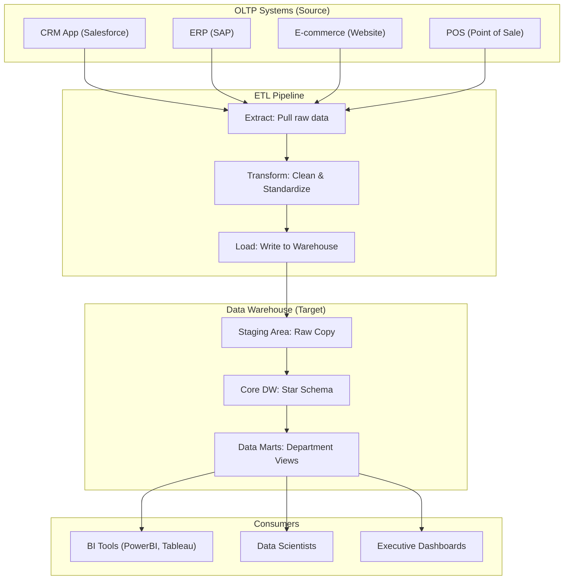
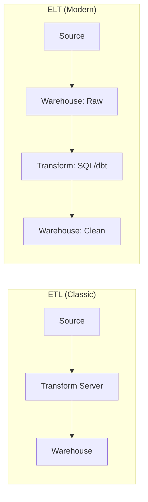

# Lesson 1: Introduction to Data Warehousing (The Master Guide)

> **Goal:** Understand the fundamental purpose of a Data Warehouse, the difference between operational and analytical systems, and how the modern Lakehouse bridges the gap between the two.

---

## 🏗️ Phase 1: Absolute Foundations (For Beginners)
Why do we need a "Data Warehouse" if we already have a "Database"?

### 1. What is a "Data Warehouse"?
A **Data Warehouse (DW)** is a large, centralized repository that stores historical data from multiple different source systems — all cleaned and organized for analysis and reporting.

**The Analogy:**
*   **Operational Database (The Front Desk):** A hotel reception desk. People check in, check out, change their booking, ask for their key. Thousands of small, fast transactions per second.
*   **Data Warehouse (The Archive Room):** The accounting office at the end of the year. Nobody is checking in here. Analysts ask: "What was our average occupancy rate in Q3?", "Which room type was most profitable?", "How did this year compare to last year?"

### 2. OLTP vs. OLAP — The Core Contrast

| Feature | OLTP (Online Transaction Processing) | OLAP (Online Analytical Processing) |
|:--------|:-------------------------------------|:-------------------------------------|
| **Purpose** | Run the business (operations) | Understand the business (analytics) |
| **Examples** | Banking app, Amazon orders, ATM | Yearly sales reports, trend dashboards |
| **Queries** | Small (1–100 rows) | Massive (millions–billions of rows) |
| **Speed** | Milliseconds (instant) | Seconds to minutes |
| **Data Age** | Current data only | Years of historical data |
| **Schema** | Normalized (3NF) | Denormalized (Star Schema) |
| **Users** | Thousands of app users | Hundreds of analysts |
| **Optimized for** | Writes (INSERT, UPDATE) | Reads (SELECT, GROUP BY) |
| **Example DB** | PostgreSQL, MySQL, Oracle | Snowflake, Redshift, BigQuery, Databricks |



---

## 🚀 Phase 2: Intermediate (The Developer Level)

### 1. ETL vs. ELT — The Paradigm Shift

#### Classic ETL (Extract → Transform → Load)
The traditional approach used before cloud warehouses existed.
1. **Extract:** Pull data from the source system.
2. **Transform:** Clean and restructure data on a **separate server** (like Informatica or Talend).
3. **Load:** Write the clean data to the warehouse.

*   **Pros:** Clean data arrives in the warehouse. Source systems are protected from heavy queries.
*   **Cons:** The transformation server is expensive. Schema changes break transformations.

#### Modern ELT (Extract → Load → Transform)
The modern approach used with cloud warehouses (Snowflake, BigQuery, Databricks).
1. **Extract:** Pull data from the source.
2. **Load:** Load the **raw** data directly into the warehouse.
3. **Transform:** Use the massive computing power of the warehouse itself to transform.

*   **Pros:** Cloud warehouses are cheap and infinitely scalable for compute. SQL transformations are reproducible. Tools like **dbt** manage this beautifully.
*   **Cons:** Raw (messy) data lives in your warehouse temporarily.



### 2. The Staging Area — The Loading Dock

Before data goes into the "clean" warehouse, it goes into a **Staging Area** — a temporary holding zone.

```sql
-- Step 1: Load raw CSV data into staging (no cleaning yet!)
-- This is a direct copy, columns may have wrong types or nulls
CREATE TABLE staging.orders_raw (
    order_id_raw    VARCHAR(50),   -- VARCHAR because we don't trust the source!
    customer_raw    VARCHAR(200),
    amount_raw      VARCHAR(50),   -- Could be "N/A" or "null" from bad sources
    date_raw        VARCHAR(50)
);
COPY staging.orders_raw FROM '/data/raw/orders.csv' CSV HEADER;

-- Step 2: Transform and load from Staging into the Core DW
INSERT INTO warehouse.fact_orders (order_id, customer_id, amount, order_date)
SELECT
    CAST(order_id_raw AS INT),
    CAST(customer_raw AS INT),
    CAST(NULLIF(amount_raw, 'N/A') AS DECIMAL(12,2)),
    TO_DATE(date_raw, 'YYYY-MM-DD')
FROM staging.orders_raw
WHERE order_id_raw ~ '^[0-9]+$'  -- Only load valid numeric IDs
  AND amount_raw != 'N/A';
```

### 3. Data Marts — Department-Specific Views

A **Data Mart** is a focused subset of the Data Warehouse for a specific business department.

```
Data Warehouse (All Data)
├── Sales Data Mart      (Sales team: orders, revenue, rep performance)
├── Finance Data Mart    (Finance team: P&L, cost center, budgets)
├── Inventory Data Mart  (Operations: stock levels, reorder points)
└── HR Data Mart         (HR team: headcount, attrition, salaries)
```

*   **Why?** Each department only needs their own data. Why let the HR team see Sales commissions? Data Marts provide **security** and **simplicity**.

---

## 🏛️ Phase 3: Architect (The Professional Level)

### 1. The Single Source of Truth (SSOT)

The most important job of a Data Warehouse Architect: ensuring that when the CEO asks "How much did we sell last month?", **every single team says the same number**.

*   **The Problem:** Without a warehouse, Sales uses their CRM, Finance uses their ERP, and Operations uses an Excel. They all measure things differently. Chaos ensues.
*   **The Solution:** All teams query the **same warehouse**, using the **same logic**. When you change a business rule (e.g., "include returns in revenue"), you change it **once** in the warehouse, and all 50 dashboards automatically update.

### 2. Columnar Storage — Why Warehouses Are So Fast

Traditional databases store data **row by row:**
```
Row 1: [1, "Priya", "Mumbai", 95000]
Row 2: [2, "Rohan", "Delhi", 80000]
```

Data Warehouses store data **column by column:**
```
ID column:     [1, 2, 3, 4, 5]
Name column:   ["Priya", "Rohan", "Anjali", ...]
City column:   ["Mumbai", "Delhi", "Pune", ...]
Salary column: [95000, 80000, 72000, ...]
```

**Why is this faster for analytics?**
```sql
-- This query only needs the "Salary" column
SELECT AVG(salary) FROM employees;

-- Row-based DB: Reads EVERY row (ID, Name, City, Salary) just to get Salary → SLOW
-- Columnar DB: Reads ONLY the Salary column → 10x FASTER, 75% less I/O
```

> 💡 Combined with **compression**, a columnar warehouse can store 10x more data in the same space, because similar values (like city names) compress extremely well: `"Mumbai"` repeated 1 million times becomes just a code.

### 3. The Modern Lakehouse — Best of Both Worlds

| Feature | Data Lake | Data Warehouse | Lakehouse |
|---------|-----------|----------------|-----------|
| Cost | Cheap | Expensive | Cheap |
| Structure | None (raw files) | Strict schema | Flexible Delta schema |
| ACID Transactions | No | Yes | Yes (Delta Lake) |
| ML/Streaming | Yes | No | Yes |
| BI Reports | Hard | Easy | Easy |
| Example | AWS S3 raw | Snowflake | Databricks Delta Lake |

### 4. Semantic Layer — The Interface for Humans

In modern architectures like **Microsoft Fabric**, the Semantic Layer is where you define **Measures** (like "Total Profit") that business users can drag-and-drop.

---

## 🎯 Phase 4: Certification & Interview Drill

### 🛡️ DP-600 (Microsoft Fabric) Drill
*   **OneLake:** Understand the **Shortcut** feature. It's the ultimate "Consultancy" move — you can reference data in S3 or Google Storage *without* moving it into Fabric.
*   **Fabric Warehouse vs Lakehouse:** 
    *   **Lakehouse:** Better for Spark/Python users, scales infinitely, uses Files + Tables.
    *   **Warehouse:** Better for T-SQL experts, supports cross-database joins, supports **DML/DDL** exactly like SQL Server.

### 🛡️ Databricks Associate Drill
*   **Medallion Architecture:** This is the core of Databricks.
    *   **Bronze:** Raw, unformatted data.
    *   **Silver:** Filtered, cleaned, augmented (the "SSOT" for developers).
    *   **Gold:** Aggregated, business-level datasets (the "SSOT" for users).
*   **ACID in the Lake:** Databricks achieves DW-like reliability on raw files using **Delta Lake**.

### 🏢 Consultancy Scenario: The "Modernization"
**Scenario:** A client wants to move from a legacy SQL Server to Snowflake. They ask: "Why bother? SQL Server is working fine."
*   **Architect Answer:** SQL Server is an **OLTP** engine. As your data grows to Terabytes, your analytical queries will crash your production app. Snowflake (or Fabric/Databricks) is **OLAP** — it separates compute from storage and uses **Columnar Storage**, making analysis 100x faster without affecting app performance.

### 🚀 Startup Scenario: The "Cost Crisis"
**Scenario:** Your cloud bill is skyrocketing. Your BigQuery/Snowflake queries are expensive because they process 10TB a day.
*   **Answer:** Implement **Partitioning** and **Pre-aggregation**. If users only look at "Today's Sales," don't let them query 10 years of data. Use partitioned tables so the query only "scans" the rows for today, saving 99% of the cost.

### 🏛️ FAANG Scenario: The "Latency"
**Scenario:** We need a dashboard that updates every 30 seconds. Can we use a standard Data Warehouse?
*   **Answer:** Most traditional DWs have 15-minute+ latency.
*   **The Drill:** Propose a **Lambda Architecture** (Phase 6) or a **Lakehouse** with **Spark Structured Streaming**. This allows you to append new data to your "Delta" tables in real-time while analysts query them simultaneously.

---

### 🧪 Hands-on Labs
- [conceptual_modeling_lab.sql](conceptual_modeling_lab.sql) (Identifying Facts vs. Dimensions)

---

### ✅ Key Takeaways
1. **OLTP → Operations** (fast writes). **OLAP → Analytics** (fast reads). Never mix them.
2. **ETL vs ELT:** Modern cloud warehouses use ELT. Load first, transform with SQL/dbt.
3. **Staging Area:** Always validate data before it reaches your "gold" tables.
4. **Single Source of Truth:** Every team must agree on one authoritative data source.
5. **Columnar storage** is the secret weapon of every enterprise data warehouse.
6. **The Lakehouse** (Delta Lake / OneLake) is the industry direction for modern DE.
7. **SSOT (Single Source of Truth)** is the goal; **Data Quality** is the requirement.

[Next: Lesson 2: Normalization 101 →](../Lesson_2_Normalization_101/README.md)

---

## ⚠️ Common Pitfalls (Beginner Mistakes)

1.  **Treating the DW like a Backup:** Thinking the Data Warehouse is just a copy of the production database.
    *   **The Issue:** A warehouse should be **organized for users**. If you just copy the messy, complex operational tables 1:1, analysts will struggle to query them, and performance will be terrible.
2.  **Skipping the Staging Layer:** Loading data directly from the source into your final reporting tables.
    *   **The Issue:** If the source system goes down or data is corrupted mid-load, your reports are permanently broken. 
    *   **Fix:** Always land data in a **Staging Area** (Bronze) first.
3.  **Ignoring the "Grain":** Failing to define what one row represents in a fact table.
    *   **The Issue:** If the grain is inconsistent (e.g., some rows are individual orders, others are daily summaries), your sums and averages will be wrong.
    *   **Fix:** Declare a clear grain (e.g., "One row per transaction line item").
4.  **Over-Architecting Too Early:** Trying to build a "Perfect" model that covers every possible future requirement.
    *   **The Issue:** In the modern world, requirements change fast. A complex, rigid model becomes a bottleneck. Use **Agile Modeling** — build what's needed for the current dashboard, but build it correctly.

---

## 🧪 Practice Exercises

### Exercise 1 — Grain Identification (Beginner)
**Goal:** Learn to identify the fundamental unit of data.

**Scenario:** You are building a system for a hospital. You have three potential tables to design:
1.  **Patient Appointments**
2.  **Doctor Shift Schedule**
3.  **Lab Test Results**

**Your Task:**
Identify the **Grain** for each table. (Example: "One row per patient visit").

---

### Exercise 2 — ETL vs ELT (Intermediate)
**Goal:** Choose the right approach for a scenario.

**Scenario A:** A pharmacy needs to move data from a legacy SQL system to the cloud. The data contains raw patient names that must be encrypted **before** they ever touch the cloud for security reasons.
**Scenario B:** A retail startup wants to load 1TB of web clickstream data into Snowflake each day to run complex ML models.

**Your Task:**
Decide whether **ETL** or **ELT** is better for each scenario and explain why.

---

### Exercise 3 — The Data Mart Design (Architect)
**Goal:** Design a multi-department warehouse structure.

**Scenario:** A multi-national company has a central Data Warehouse.
- The **Marketing** team uses Facebook Ads data and Shopify sales data.
- The **Finance** team uses Shopify sales data and QuickBooks expense data.
- The **Supply Chain** team uses QuickBooks expense data and Warehousing logistics data.

**Your Task:**
Draw a simple diagram (or list) showing:
1. Which data sources go into the central Warehouse.
2. Which Data Marts you would create.
3. How you ensure the standard Shopify sales data is **consistent** between the Finance and Marketing marts.

---

## 💼 Common Interview Questions

**Q1: What is the difference between a Data Lake and a Data Warehouse?**
> A **Data Warehouse** is structured, schema-on-write, and optimized for BI/SQL. A **Data Lake** is unstructured (files), schema-on-read, and stores everything in its raw format. The **Lakehouse** (like Databricks or Fabric) is the middle ground: it stores data cheaply as files but uses a metadata layer (Delta) to provide the reliability and performance of a warehouse.

**Q2: Why is "Columnar Storage" better for an OLAP system?**
> In OLAP, we rarely ask for all columns of a single row (e.g., "Show me everything about Order #123"). Instead, we ask for aggregations on a few columns across millions of rows (e.g., "SUM the 'Amount' for all orders in April"). Columnar storage allows the engine to skip 90% of the data on disk and only read the specific columns requested, which is significantly faster.

**Q3: Explain the concept of "SSOT" (Single Source of Truth).**
> SSOT means there is one, and only one, place where a specific data element is defined. For example, the definition of "Active Customer" should be the same across every report in the company. We achieve this by defining that logic in the Data Warehouse (Gold layer) so that every team consumes the same pre-calculated value.

**Q4: What is the difference between "Staging" and "Archive"?**
> **Staging** is a temporary zone where data is landed before it is processed into the warehouse. It is usually cleared out after a successful load. **Archive** is a permanent (or long-term) storage area for raw source data, used if we ever need to "Re-play" the entire history of the warehouse due to a bug or logic change.

**Q5: When would you choose Snowflake over a standard PostgreSQL database for data storage?**
> Use **PostgreSQL (OLTP)** for apps where you need fast, atomic small updates and low cost for small data. Use **Snowflake (OLAP)** when your data reaches the "Big Data" scale (1TB+) and you need to run complex analytical queries that would crash a standard transactional database. Snowflake's ability to scale compute and storage separately makes it superior for large-scale analytics.
