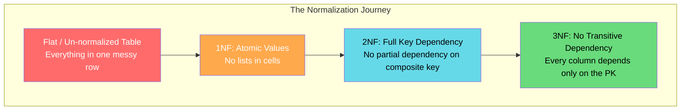

# Lesson 2: Normalization 101 (The Master Guide)

> **Goal:** Understand the rules that prevent bad data, learn each Normal Form with real examples, and know WHEN to break those rules for performance.

---

## 🏗️ Phase 1: Absolute Foundations (For Beginners)
Normalization is the process of organizing a relational database to **eliminate redundancy** and **ensure data integrity**.

### 1. The Problem: Redundant (Repeated) Data

**The Un-normalized (Flat) Table:**

| order_id | customer_name | customer_email | customer_city | product_name | product_category | product_price | quantity | order_date |
|----------|-------------|----------------|---------------|-------------|-----------------|---------------|----------|------------|
| 1001 | Priya Sharma | priya@ex.com | Mumbai | Laptop | Electronics | 75000 | 1 | 2024-01-10 |
| 1002 | Priya Sharma | priya@ex.com | Mumbai | Mouse | Electronics | 1500 | 2 | 2024-01-10 |
| 1003 | Rohan Mehta | rohan@ex.com | Delhi | Laptop | Electronics | 75000 | 1 | 2024-01-11 |

**Problems with this design:**
1.  **Update Anomaly:** If Priya moves to Pune, you must update 2 rows (or more!). Miss one → inconsistency.
2.  **Delete Anomaly:** If you delete order 1003, you lose Rohan's entire existence in the system.
3.  **Insert Anomaly:** You can't add a new product to your catalog without also adding a fake order.
4.  **Storage Waste:** "Electronics", "Mumbai", "Priya Sharma" are stored over and over.

---

### 2. First Normal Form (1NF) — Atomic Values

**Rule:** Every cell must contain a **single, atomic (indivisible) value**. No lists, no sets, no comma-separated values.

**Violation (NOT 1NF):**
```
| order_id | customer_name | products_ordered       |
|----------|-------------|------------------------|
| 1001     | Priya        | "Laptop, Mouse, Webcam" |  ← VIOLATION: List in a cell!
```

**Fix — Give each item its own row (1NF):**
```sql
-- Create an order_items table where each item is its own row
CREATE TABLE order_items (
    order_item_id  INT PRIMARY KEY,
    order_id       INT,          -- Which order?
    product_id     INT,          -- Which product?
    quantity       INT
);
```

---

### 3. Second Normal Form (2NF) — Full Functional Dependency

**Rule:** Must be in 1NF. Every non-key column must depend on the **ENTIRE primary key** (not just part of it). This only applies when you have a **composite primary key** (two-column key).

**Violation (NOT 2NF):**
```
Primary Key: (order_id, product_id)

| order_id | product_id | product_name | quantity | customer_city |
                                    ↑                   ↑
                       Depends on product_id    Depends on order_id only
                            PARTIAL DEPENDENCY → VIOLATION!
```

*   `product_name` depends only on `product_id`, NOT on the full `(order_id, product_id)` pair.
*   `customer_city` depends only on `order_id`, NOT on the full `(order_id, product_id)` pair.

**Fix — Separate tables (2NF):**
```sql
-- Products table (product_name depends ONLY on product_id → its own table)
CREATE TABLE products (
    product_id    INT PRIMARY KEY,
    product_name  VARCHAR(200),
    price         DECIMAL(12,2)
);

-- Orders table (customer_city depends ONLY on order_id → its own table)
CREATE TABLE orders (
    order_id      INT PRIMARY KEY,
    customer_id   INT,
    order_date    DATE
);

-- Junction table: only the facts about the ORDER+PRODUCT combination
CREATE TABLE order_items (
    order_id      INT REFERENCES orders(order_id),
    product_id    INT REFERENCES products(product_id),
    quantity      INT,
    PRIMARY KEY (order_id, product_id)
);
```

---

### 4. Third Normal Form (3NF) — No Transitive Dependencies

**Rule:** Must be in 2NF. No non-key column should depend on **another non-key column**. Every column must depend ONLY on the primary key.

**Violation (NOT 3NF):**
```
| customer_id | full_name    | city     | state       | pincode |
                               ↑ depends on customer_id
                                           ↑ state depends on CITY (not customer_id!) → VIOLATION
```

*   `state` depends on `city`, not directly on `customer_id`.
*   This is called a **Transitive Dependency** (A → B → C). We want A → C directly.

**Fix (3NF):** Create a `cities` or `locations` lookup table.
```sql
CREATE TABLE cities (
    city_code    CHAR(5) PRIMARY KEY,
    city_name    VARCHAR(100),
    state        VARCHAR(100),
    pincode      VARCHAR(10)
);

CREATE TABLE customers (
    customer_id  INT PRIMARY KEY,
    full_name    VARCHAR(200),
    city_code    CHAR(5) REFERENCES cities(city_code)  -- FK to cities table
);
```

Now if Mumbai's state changes (hypothetically), you update it in ONE row in `cities`, not across thousands of customers.



---

## 🚀 Phase 2: Intermediate (The Developer Level)

### 1. Why Normalize? (Data Integrity in Practice)

```sql
-- BEFORE normalization: Updating city for one customer
-- If "Mumbai" is stored across 1 million order rows...
UPDATE orders_flat SET customer_city = 'Greater Mumbai'
WHERE customer_name = 'Priya Sharma';
-- → This might update 50 rows. Miss 1? Inconsistency forever.

-- AFTER normalization: Update in ONE place
UPDATE customers SET city_code = 'GMB'
WHERE customer_id = 1001;
-- → 1 row changed. Every query using this customer now automatically sees 'Greater Mumbai'.
```

### 2. Beyond 3NF: BCNF, 4NF, 5NF (Brief Overview)

| Form | Additional Rule | When to Use |
|------|----------------|-------------|
| **BCNF** (Boyce-Codd) | Every determinant must be a candidate key | When 3NF still has anomalies |
| **4NF** | No multi-valued dependencies | Complex many-to-many relationships |
| **5NF** | No join dependencies | Highly academic; rarely needed in DE practice |

> 🎯 **Architect's Rule:** For most enterprise DE work, **3NF is the target for OLTP systems**. Going beyond 3NF creates excessive complexity for marginal gain. Understand 3NF perfectly.

---

## 🏛️ Phase 3: Architect (The Professional Level)

### 1. Strategic De-normalization — Breaking the Rules Responsibly

In a **Data Warehouse**, we often deliberately **de-normalize** (combine tables) for analytical performance. This seems like going backwards, but it's a conscious, informed decision.

**The De-normalization Decision Framework:**

| Factor | Normalize | De-normalize |
|--------|-----------|-------------|
| System type | OLTP (writes) | OLAP (reads/analytics) |
| Query type | Many small queries | Few large queries |
| Users | App users (writes) | Analysts (reads) |
| Join frequency | Low (selective) | High (always joining) |
| Change frequency | High (live data) | Low (historic data) |

```sql
-- NORMALIZED (3NF) — Good for OLTP, BAD for analytics
-- To get "Product Category for Order 1001", you must join 4 tables:
SELECT o.order_id, p.product_name, c.category_name, d.department_name
FROM orders o
JOIN order_items oi ON o.order_id = oi.order_id
JOIN products p ON oi.product_id = p.product_id
JOIN categories c ON p.category_id = c.category_id
JOIN departments d ON c.department_id = d.department_id;

-- DE-NORMALIZED (for Data Warehouse dim_product) — Bad for OLTP, GREAT for analytics
-- All product context is in ONE wide dimension table:
CREATE TABLE dim_product (
    product_key      INT PRIMARY KEY,    -- Surrogate key
    product_id       INT,                -- Natural key from source
    product_name     VARCHAR(200),
    sub_category     VARCHAR(100),       -- Denormalized: was a separate table
    category         VARCHAR(100),       -- Denormalized: was a separate table
    department       VARCHAR(100),       -- Denormalized: was a separate table
    brand            VARCHAR(100),
    supplier_name    VARCHAR(200),       -- Denormalized: was a separate table
    is_active        BOOLEAN
);

-- Now the analyst query is SIMPLE and FAST:
SELECT dp.category, SUM(fs.amount) AS revenue
FROM fact_sales fs
JOIN dim_product dp ON fs.product_key = dp.product_key
GROUP BY dp.category;
```

### 2. Practical Example — Full OLTP to OLAP Transformation

```sql
-- ===========================
-- OLTP (Source): 3NF Design
-- ===========================
-- customers(customer_id, name, city_code)
-- cities(city_code, city_name, state, country)
-- products(product_id, name, category_id, price)
-- categories(category_id, name, dept_id)
-- orders(order_id, customer_id, order_date)
-- order_items(order_id, product_id, quantity)

-- ===========================
-- OLAP (Target): Star Schema (De-normalized)
-- ===========================
-- dim_customer(customer_key, customer_id, full_name, city, state, country)
-- dim_product(product_key, product_id, name, category, department, price)
-- dim_date(date_key, full_date, day_name, month, quarter, year, is_weekend)
-- fact_sales(sale_key, customer_key, product_key, date_key, quantity, amount)

-- The ETL transformation:
INSERT INTO dim_customer (customer_id, full_name, city, state, country)
SELECT
    c.customer_id,
    c.full_name,
    ci.city_name,    -- Denormalization: merging cities table INTO dim_customer
    ci.state,
    ci.country
FROM customers c
JOIN cities ci ON c.city_code = ci.city_code;
```

---

## 🎯 Phase 4: Certification & Interview Drill

### 🛡️ DP-600 (Microsoft Fabric) Drill
*   **Normalization in Fabric:** While the source (SQL DBs) should be normalized, the Fabric **Semantic Model** performs best when it is **Denormalized** into a Star Schema.
*   **Relationship Types:** Normalization forces you into **One-to-Many** relationships. Avoid **Many-to-Many** in Fabric reports; instead, create a "Bridge Table" (a classic 2NF/3NF concept).

### 🛡️ Databricks Associate Drill
*   **Join Performance:** In Databricks (Spark), Joins are expensive. Normalization (3NF) requires many joins. 
*   **The Architect's Move:** To optimize, we "De-normalize" the Silver layer into Gold tables. This reduces the **Shuffle** cost during queries.

### 🏢 Consultancy Scenario: The "Legacy Refactor"
**Scenario:** A client has a redundant system where customer names are stored in 5 different tables. They complain about "Bad Data" (names not matching).
*   **Architect Answer:** This is a violation of **2NF/3NF**. We must **Normalize** the source database to a single `customers` table to ensure **Data Integrity** (SSOT). This prevents anomalies where one table is updated but others are not.

### 🚀 Startup Scenario: The "Pivot"
**Scenario:** Your startup changes its product structure every month. 3NF is making it hard to update the code.
*   **Answer:** Use **JSONB** (Semi-structured) for the flexible parts of your schema while keeping the core (ID, created_at) normalized. This gives you the integrity of SQL with the speed of NoSQL.

### 🏛️ FAANG Scenario: The "Joins vs. Storage"
**Scenario:** You have a table with 10 Billion rows. Joining it to 5 other normalized tables for every query is too slow.
*   **Answer:** Denormalize. Storage is cheap at scale; compute (Joins) is expensive.
*   **The Drill:** Propose a **Pre-joined (Flat) Table** or a **Materialized View**. This replicates data (increasing storage) but eliminates the Join-cost for every individual user query.

---

### 🧪 Hands-on Labs
- [normalization_lab.sql](normalization_lab.sql) (Refactoring a flat table into 3NF)

---

### ✅ Key Takeaways
1. **1NF:** One value per cell. No lists or sets in a column.
2. **2NF:** Every column depends on the *whole* primary key.
3. **3NF:** Every column depends on the PK *directly*, not through another column.
4. **De-normalization is not bad** — it's a strategic decision for analytical performance in Gold tables.
5. **Data Integrity** is the primary reason for Normalization in OLTP systems.
6. **Join reduction** is the primary reason for Denormalization in OLAP systems.

[Next: Lesson 3: Star vs Snowflake →](../Lesson_3_Star_vs_Snowflake/README.md)

---

## ⚠️ Common Pitfalls (Beginner Mistakes)

1.  **Over-Normalization:** Normalizing data so aggressively that even the simplest query requires 10+ joins.
    *   **The Issue:** Your database will be technically "Perfect" (3NF) but practically useless because it's too slow to query and too complex for developers to understand.
    *   **Fix:** Stop at **3NF**. Only go further if you have a specific, measurable data anomaly problem.
2.  **The "Repeating Group" Trap:** Creating columns like `phone_1`, `phone_2`, `phone_3` instead of a separate table.
    *   **The Issue:** This violates **1NF**. What happens if a customer has 4 phones? You have to alter the table structure, which is a major operations headache.
    *   **Fix:** Create a `customer_phones` table with `customer_id` and `phone_number`.
3.  **Mixing Concerns:** Putting "User Address" and "Order Details" in the same table.
    *   **The Issue:** If a user cancels all their orders, you might accidentally delete their address from your system. This is a **Delete Anomaly**.
    *   **Fix:** Every table should represent ONE real-world entity (The "Aboutness" rule).
4.  **Implicit 1NF Violations:** Storing multiple email addresses in a single string separated by commas.
    *   **The Issue:** You can't easily query "Find all customers with a Gmail account" without using slow `LIKE %gmail%` scans that can't use indexes.

---

## 🧪 Practice Exercises

### Exercise 1 — From Flat to 1NF & 2NF (Beginner)
**Goal:** Fix a messy spreadsheet-style table.

**Messy Table:** `Project_ID, Project_Name, Employee_ID, Employee_Name, Employee_Role, Hourly_Rate`
- *Problem:* `Employee_Name` and `Hourly_Rate` only depend on `Employee_ID`.
- *Problem:* `Project_Name` only depends on `Project_ID`.

**Your Task:**
1. Split this into 3 tables to satisfy **2NF**. 
2. Define the Primary Key and Foreign Key for each table.

---

### Exercise 2 — Identifying 3NF Violations (Intermediate)
**Goal:** Spot transitive dependencies.

**Table `stores`:** `store_id (PK), manager_name, manager_phone, manager_email`
- *Fact:* A manager can manage multiple stores.
- *Fact:* The `manager_phone` and `manager_email` belong to the manager, not the store.

**Your Task:**
1. Explain why this violates **3NF**.
2. Propose a new 3-table structure to fix it.

---

### Exercise 3 — The Normalization Audit (Architect)
**Goal:** Audit a real-world schema.

**Scenario:** You are handed a database for a library.
`Books(ISBN, Title, Author_Name, Author_Nationality, Publisher_Name, Publisher_Address)`

**Your Task:**
1. List all the **Update Anomalies** that could happen here.
2. Write the SQL `CREATE TABLE` statements for a fully **3NF** version of this schema.

---

## 💼 Common Interview Questions

**Q1: What is 1NF and what is the most common way beginners break it?**
> **1NF (First Normal Form)** requires that every cell contains an "Atomic" value—no lists, no sets, no nested objects. The most common way beginners break it is by using **comma-separated strings** (e.g., `tags: "blue, large, shiny"`) to store multiple values in a single column.

**Q2: Explain the difference between 2NF and 3NF in simple terms.**
> **2NF** is about the **ENTIRE key**. It says: "Don't store data about one part of a composite key if it doesn't apply to the whole key." 
> **3NF** is about **NON-key columns**. It says: "Don't store data that depends on another non-key column." (The famous phrase: "Depends on the key, the whole key, and nothing but the key, so help me Codd").

**Q3: When would a Data Engineer deliberately choose to DENORMALIZE?**
> A Data Engineer denormalizes when building **Analytical (OLAP)** systems like a Data Warehouse (Gold layer). Joins are the most expensive part of a query. By pre-joining tables into a wide dimension or fact table, we trade **extra storage space** for **faster query speeds** and simpler SQL for the end-users.

**Q4: What is an "Anomaly" in a database?**
> An anomaly is a data inconsistency caused by poor design.
> - **Insert Anomaly:** You can't add data because you're missing a piece of related data.
> - **Update Anomaly:** You update data in one row but forget to update the duplicate version in another row.
> - **Delete Anomaly:** You delete a record and accidentally lose unrelated data that happened to be in the same row.

**Q5: Can you normalize a NoSQL database like MongoDB?**
> In NoSQL, we usually "Embed" data (denormalize) for speed because NoSQL databases are not designed to handle complex joins. However, you *can* normalize by using "References" (IDs). We typically only normalize in NoSQL if the data is being updated very frequently and we want to avoid massive 30-minute update jobs across 1 million documents.
