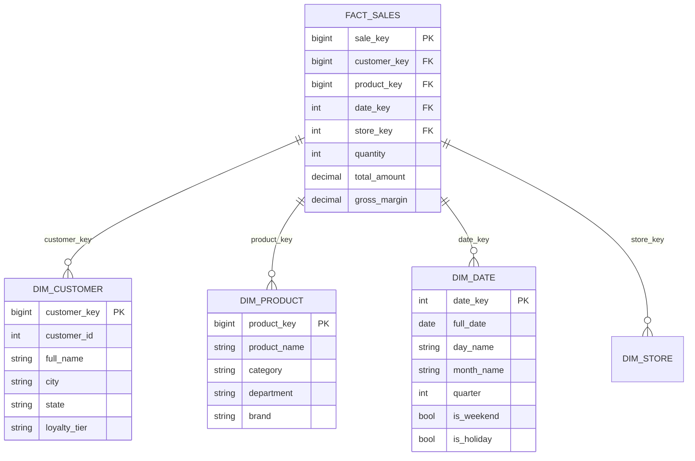
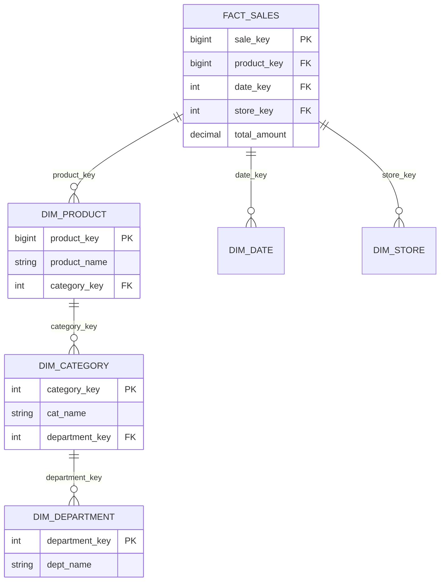
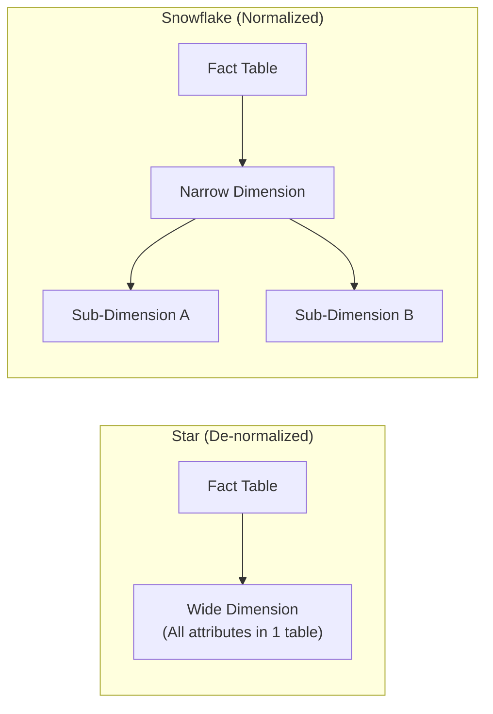

# Lesson 3: Star vs. Snowflake Schema (The Master Guide)

> **Goal:** Know exactly when to use a Star Schema vs. a Snowflake Schema, understand de-normalization for analytics, and build dimension tables that analysts will love.

---

## 🏗️ Phase 1: Absolute Foundations (For Beginners)

### 1. The Two Types of Tables

In any Data Warehouse, every table is either a **Fact table** or a **Dimension table**.

| Table Type | The Question It Answers | Examples |
|-----------|------------------------|---------|
| **Fact** | "What happened? How much?" | `fact_sales`, `fact_orders`, `fact_clicks` |
| **Dimension** | "Who? What? Where? When?" | `dim_customer`, `dim_product`, `dim_date`, `dim_store` |

**The Fact Table (The Verb):**
-  Contains **Measurements** (numbers you can sum, average, or count)
-  Examples: `sale_amount`, `quantity_sold`, `revenue`, `discount`
-  Contains **Foreign Keys** that point to Dimension tables
-  Has **many, many rows** (millions to billions)
-  **Rarely read in isolation** — always joined to dimensions

**The Dimension Table (The Noun):**
-  Contains **Descriptive attributes** (text, flags, categories)
-  Examples: `customer_name`, `product_category`, `city`, `is_holiday`
-  Contains a **Primary Key** (Surrogate Key — usually auto-increment)
-  Has **far fewer rows** than fact tables (thousands to millions)
-  **Where the analyst filters** — "Show me sales for... Gold tier customers... Electronics... in Q1"

```sql
-- Fact table: Many rows, mostly numbers and foreign keys
CREATE TABLE fact_sales (
    sale_key        BIGINT GENERATED ALWAYS AS IDENTITY,  -- Surrogate PK
    customer_key    BIGINT,        -- FK → dim_customer
    product_key     BIGINT,        -- FK → dim_product
    date_key        INT,           -- FK → dim_date
    store_key       INT,           -- FK → dim_store

    -- Measures (The actual data)
    quantity        INT,
    unit_price      DECIMAL(12,2),
    discount_pct    DECIMAL(5,2),
    total_amount    DECIMAL(12,2),
    gross_margin    DECIMAL(12,2)
);

-- Dimension table: Fewer rows, rich descriptive attributes
CREATE TABLE dim_product (
    product_key      BIGINT GENERATED ALWAYS AS IDENTITY,  -- Surrogate PK
    product_id       VARCHAR(50),         -- Natural key from source
    product_name     VARCHAR(200),
    sub_category     VARCHAR(100),
    category         VARCHAR(100),
    department       VARCHAR(100),
    brand            VARCHAR(100),
    unit_of_measure  VARCHAR(50),
    is_active        BOOLEAN,
    launch_date      DATE
);
```

---

## 🚀 Phase 2: Intermediate (The Developer Level)

### 1. The Star Schema (The #1 Choice for Enterprise Warehouses)

**Structure:** The Fact table sits in the **center** like a star. Dimension tables radiate outward.



**Why Star Schema is the #1 Choice:**

```sql
-- Analyst query on a Star Schema: Simple, fast, readable
SELECT
    dc.loyalty_tier,
    dp.category,
    dd.quarter,
    SUM(fs.total_amount) AS total_revenue,
    COUNT(fs.sale_key)   AS num_transactions
FROM fact_sales fs
JOIN dim_customer dc ON fs.customer_key = dc.customer_key
JOIN dim_product  dp ON fs.product_key  = dp.product_key
JOIN dim_date     dd ON fs.date_key     = dd.date_key
WHERE dd.year = 2024
  AND dc.state = 'Maharashtra'
GROUP BY dc.loyalty_tier, dp.category, dd.quarter
ORDER BY total_revenue DESC;
-- Only 4 tables involved. Clean, predictable, fast.
```

### 2. The Snowflake Schema (When Normalization Meets Warehousing)

**Structure:** Dimension tables are further broken down into sub-dimensions (normalized).



**Star vs Snowflake: The Structural Difference**



### 3. Star vs Snowflake — Head to Head Comparison

| Aspect | Star Schema | Snowflake Schema |
|--------|-------------|-----------------|
| **Query Complexity** | Low (few JOINs) | High (many JOINs) |
| **Query Speed** | Fast | Slower |
| **Storage** | Slightly more (repetition) | Slightly less |
| **Analyst Experience** | Easy to navigate | Confusing |
| **BI Tool Compatibility** | Excellent | Can cause issues |
| **Maintenance** | Simple | Complex |
| **When to Use** | 99% of the time | Very large dimensions with expensive updates |

> 🎯 **Architect's Verdict:** In modern cloud warehouses (Databricks, Snowflake, BigQuery), storage is nearly free. **Always choose Star Schema.** The storage savings from Snowflake don't justify the query complexity. The only exception is if you have very large dimension tables (50M+ rows) that change frequently.

---

## 🏛️ Phase 3: Architect (The Professional Level)

### 4. Surrogate Keys vs. Natural Keys — A Critical Decision

```sql
-- NATURAL KEY: The ID from the source system (e.g., customer_id = "CUST-001")
-- SURROGATE KEY: An artificial, auto-generated ID (e.g., customer_key = 1001)

CREATE TABLE dim_customer (
    customer_key   BIGINT GENERATED ALWAYS AS IDENTITY PRIMARY KEY,  -- Surrogate Key
    customer_id    VARCHAR(50) NOT NULL,                               -- Natural Key
    full_name      VARCHAR(200),
    city           VARCHAR(100),
    is_current      BOOLEAN DEFAULT TRUE
);

-- Fact table always references the SURROGATE key
CREATE TABLE fact_sales (
    customer_key  BIGINT REFERENCES dim_customer(customer_key),
    amount        DECIMAL(12,2)
);
```

---

## 🎯 Phase 4: Certification & Interview Drill

### 🛡️ DP-600 (Microsoft Fabric) Drill
*   **Direct Lake Performance:** For Fabric's Power BI integration, **Star Schema** is the gold standard. A Snowflake schema will force the engine out of "Direct Lake" and back into "Import/DirectQuery" mode, slowing down your dashboard.
*   **Cardinality:** Always prefer **1:Many** (Dimension to Fact) over **Many:Many**. Use bridge tables only as a last resort.

### 🛡️ Databricks Associate Drill
*   **Joins vs. Storage:** Databricks (Spark) handles Joins through "Shuffles". 
*   **The Drill:** Star Schema reduces Shuffles. In a Snowflake schema, every extra join (`dim_product` → `dim_category`) is another potential Shuffle. Always de-normalize into a Star Schema for Spark performance.

### 🏢 Consultancy Scenario: The "Report Request"
**Scenario:** A client says their dashboards take 30 seconds to load. You look at the schema and see 15 tables joined in a massive Snowflake pattern.
*   **Architect Answer:** Propose a **Star Schema Migration**. By collapsing the normalized dimensions into single wide tables, you reduce the Join overhead. In many cases, this can bring report load times down from 30s to <2s.

### 🚀 Startup Scenario: The "No Schema"
**Scenario:** Your startup uses MongoDB. There is no schema. How do you build a report?
*   **Answer:** Use the **Schema on Read** approach. In your Lakehouse (Silver layer), use Spark/Python to flatten the JSON into a **Star Schema** (Gold layer). This gives the startup's analysts a familiar SQL structure while keeping the source flexible.

### 🏛️ FAANG Scenario: The "Fact Table Join"
**Scenario:** You have two Fact tables: `fact_sales` and `fact_returns`. You need to calculate "Net Revenue" (Sales - Returns) by Product Category.
*   **Answer:** Do NOT join the two fact tables directly. This creates a "Many-to-Many" nightmare and double-counting.
*   **The Drill:** Query both facts separately and **JOIN on a Conformed Dimension** (`dim_product`). This is the only safe way to compare metrics across different business processes.

---

### 🧪 Hands-on Labs
- [star_schema_design.sql](star_schema_design.sql) (Convert a list of source tables into a Star Schema)

---

### ✅ Key Takeaways
1. **Fact tables** = metrics. **Dimension tables** = context.
2. **Star Schema** is the standard for modern DE (99% of cases).
3. **Snowflake Schema** is normalized dimensions (rarely needed now).
4. **Surrogate Keys** decouple your warehouse from source system changes.
5. **Conformed Dimensions** allow you to join different Fact tables together (Galaxy Schema).
6. **Performance:** Star Schema = Fewer Joins = Faster Queries.

[Next: Lesson 4: The Date Dimension →](../Lesson_4_The_Date_Dimension/README.md)

---

## ⚠️ Common Pitfalls (Beginner Mistakes)

1.  **Fact-to-Fact Joins:** Joining two fact tables directly (e.g., `fact_sales` JOIN `fact_inventory`).
    *   **The Issue:** Because fact tables are huge and have many rows for the same keys, this creates a "Many-to-Many" explosion that produces incorrect numbers (double-counting) and likely crashes the database.
    *   **Fix:** Always join fact tables through a shared (Conformed) Dimension.
2.  **Snowflaking for the Sake of it:** Normalizing your dimensions just because "that's how I did it in college for SQL class."
    *   **The Issue:** You are adding unnecessary complexity. Every `JOIN` in a Snowflake schema makes the final report slightly slower.
    *   **Fix:** Default to **Star Schema**. Only Snowflake if you have a massive dimension (50M+ rows) where frequent updates are causing lock-ups.
3.  **Using Business Keys as Join Keys:** Joining `fact_sales` to `dim_customer` using the `customer_email`.
    *   **The Issue:** What if a customer changes their email? You now have to update the email in millions of rows in the Fact table.
    *   **Fix:** Use an integer **Surrogate Key** (`customer_key`) for joins. It never changes, even if the user's name or email does.
4.  **The "Blob" Fact Table:** Putting descriptive text (like `customer_name`) directly into the Fact table to "save a join."
    *   **The Issue:** This makes the Fact table massive (wide) and wastes space. It also means you have no "Source of Truth" for the name.
    *   **Fix:** Fact tables should be narrow—mostly numbers and integer keys.

---

## 🧪 Practice Exercises

### Exercise 1 — Fact vs. Dimension (Beginner)
**Goal:** Categorize tables in a new system.

**You are building a Music Streaming Warehouse.** Categorize these into "Fact" or "Dimension":
1.  `Songs` (Title, Artist, Duration)
2.  `Listening_Events` (When the user hit play, duration listened)
3.  `Users` (Name, Tier, Signup_Date)
4.  `Song_Likes` (User_ID, Song_ID, Timestamp)
5.  `Subscription_Plans` (Price, Features)

---

### Exercise 2 — Converting Snowflake to Star (Intermediate)
**Goal:** Denormalize for performance.

**Your Source System has:**
- `fact_orders`
- `dim_product` (references `cat_id`)
- `dim_category` (references `dept_id`)
- `dim_department`
- `dim_supplier` (references `city_id`)
- `dim_city`

**Your Task:**
Identify how many tables will be in your final **Star Schema** (one fact and X dimensions) and list which columns would be combined into which tables.

---

### Exercise 3 — The Galaxy Schema Design (Architect)
**Goal:** Connect multiple business processes.

**Scenario:** A library wants to track `Book_Checkouts` and `Book_Purchases`.
Both processes involve `Books` and `Library_Members`.

**Your Task:**
1. Draw/List the **Conformed Dimensions**.
2. Explain how an analyst would calculate the "Checkout-to-Purchase" ratio for a specific book category without joining the two fact tables directly.

---

## 💼 Common Interview Questions

**Q1: Why is the Star Schema generally preferred over the Snowflake Schema in Data Warehousing?**
> The Star Schema is preferred primarily for **query performance** and **simplicity**. It reduces the number of JOINs required to answer a question. Since analysts and BI tools (like Power BI) are the primary users of a warehouse, a simpler Star structure makes it easier for them to write SQL and for the database to optimize the execution.

**Q2: What is a "Surrogate Key" and why is it mandatory in an Architect-level design?**
> A Surrogate Key is a system-generated unique identifier (usually a simple integer) that becomes the Primary Key of a dimension table. It is mandatory because it decouples the warehouse from the source system. If a source system recycles an ID or changes a natural key (like an email), our internal surrogate keys remain stable, preserving the integrity of our historical records.

**Q3: What is a "Conformed Dimension"?**
> A Conformed Dimension is a dimension table that is shared by multiple fact tables. For example, `dim_date` or `dim_product`. This is the "glue" that allows us to perform "Cross-Process Analysis" (e.g., comparing Marketing Spend vs. Actual Sales) by using the same dimension as the common join point.

**Q4: Explain the "Grain" of a fact table.**
> The Grain is the definition of what exactly one row in the Fact table represents. It is the most important decision an architect makes. For example, is the grain "One row per Customer per Day" (Summary) or "One row per Individual Transaction Line" (Transaction)? Mixing grains in a single table leads to incorrect aggregations.

**Q5: What is a "Degenerate Dimension"?**
> A Degenerate Dimension is a descriptive attribute that stays in the Fact table because it doesn't have any related descriptive data of its own. The most common example is the **Order Number** or **Invoice Number**. We keep it in the Fact table to allow analysts to group records belonging to the same document, without creating a separate, redundant `dim_invoice` table.
