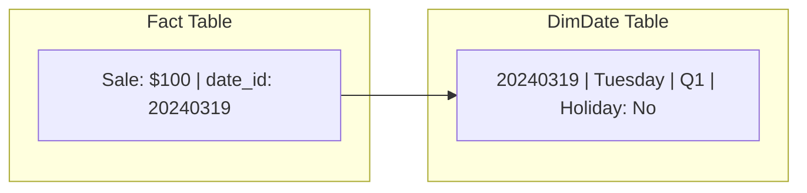

# Lesson 4: The Date Dimension (The Master Guide)

## 🏗️ Phase 1: Absolute Foundations (For Beginners)
Why use an ID for a Date?

### 1. What is a "Date Dimension"?
In every Fact table, you will see a column called `date_id` (e.g., `20240319`). This links your Fact table to a specialized table called **DimDate**.

### 2. Why "date_id" instead of a Date?
Imagine you want to know if a sale happened on a **Weekend**. 
*   *Old Way:* Calculate it every time using SQL functions (Slow!).
*   *New Way:* Just look at the `is_weekend` column in DimDate. It's pre-calculated!



## 🚀 Phase 2: Intermediate (The Developer Level)
### 1. The Anatomy of DimDate
A professional DimDate table contains 50+ columns like:
*   `date_id`: Integer, Primary Key (e.g., 20240101).
*   `day_name`: Monday, Tuesday...
*   `month_name`: January, February...
*   `quarter`: 1, 2, 3, 4.
*   `is_weekend`: True/False.
*   `is_holiday`: True/False.

## 🏛️ Phase 3: Architect (The Professional Level)
### 1. Performance & Consistency
Pre-calculating time attributes in a single table avoids huge computation costs across billions of rows. It also ensures that the Sales and Finance teams use the exact same definition of a "Holiday".

### 2. The Architect's Dilemma: Date vs. Time
**Question:** If I have a timestamp (e.g., `2024-03-19 14:05:22`), should I put it all in one dimension?
**The Answer:** NO. 

If you create a `dim_datetime` table for every second, it would reach **31 Million rows per year**. That is too slow for a dimension.

### 2. The Solution: The Split Pattern
1.  **dim_date**: 1 row per day (Small, Fast). Use for Seasonality, Holidays, Weekends.
2.  **dim_time**: 1 row per Minute or Second (1,440 or 86,400 rows total). Use for Hourly trends.
3.  **fact_table**: Store two keys: `date_id` AND `time_id`.

---

## 🎯 Phase 4: Certification & Interview Drill

### 🛡️ DP-600 (Microsoft Fabric) Drill
*   **Time Intelligence:** In Power BI (Fabric), you can use DAX functions like `SAMEPERIODLASTYEAR`. However, these *require* a proper **Date Dimension** table to work accurately.
*   **Best Practice:** Never use the "Auto Date/Time" feature in Power BI. Always build or import a specialized Date table.

### 🛡️ Databricks Associate Drill
*   **Spark Date Functions:** Know how to use `date_format`, `explode(sequence(...))`, and `unix_timestamp`.
*   **The Drill:** You can generate a 100-year Date dimension in 5 seconds using Spark:
    ```python
    df = spark.sql("SELECT explode(sequence(to_date('2000-01-01'), to_date('2100-12-31'), interval 1 day)) as calendar_date")
    ```

### 🏢 Consultancy Scenario: The "Fiscal Year"
**Scenario:** A client's "Year 2024" actually starts on July 1st, 2023. Their standard reports are all wrong.
*   **Architect Answer:** Add a `fiscal_year`, `fiscal_quarter`, and `fiscal_month` column to your **DimDate** table. This allows the business to report on "Fiscal Performance" while still keeping standard "Calendar" columns for tax purposes.

### 🚀 Startup Scenario: The "Lean Script"
**Scenario:** You need a Date table but don't want to maintain a separate table in your database.
*   **Answer:** Create a **View** that generates dates on-the-fly using a recursive CTE. It's zero-maintenance and works in any SQL-based tool.

### 🏛️ FAANG Scenario: The "Timezone Trap"
**Scenario:** You have a global app. A user in Tokyo buys something at 2 AM (Monday), while in New York it's 12 PM (Sunday). Which day does the revenue belong to?
*   **Answer:** Store everything in **UTC** in the Fact table.
*   **The Drill:** Provide columns in DimDate for major markets (e.g., `is_holiday_US`, `is_holiday_UK`). For local reporting, your BI tool should apply the timezone offset *before* joining to the Date dimension.

---

### 🧪 Hands-on Labs
- [generate_date_dimension.sql](generate_date_dimension.sql) (A SQL script to build a 20-year Date table)

---

### ✅ Key Takeaways
1. **Date IDs** (20240319) are faster for Joins than strings or standard date objects.
2. **DimDate** avoids expensive runtime calculations for weekends, holidays, and quarters.
3. **Split Date and Time** if you need granularity at the second/minute level.
4. **Fiscal Years** and **Holidays** are business-specific; customize your Date table for your client.
5. **UTC is the law** for global Fact tables.

[Next: Lesson 5: Fact & Dimension Deep Dive →](../Lesson_5_Fact_Dimension_Deep_Dive/README.md)

---

## ⚠️ Common Pitfalls (Beginner Mistakes)

1.  **The "Null Date" Problem:** Encountering an order that hasn't been shipped yet (ship_date is NULL in source).
    *   **The Issue:** You can't join a `NULL` from the Fact table to a Primary Key in DimDate. Your inner joins will hide these rows, and your reports will be missing data.
    *   **Fix:** Add a "dummy" row to your DimDate with an ID like `-1` or `19000101` and a description "Not Applicable" or "Unknown". Replace NULLs in your Fact table with this ID.
2.  **Hardcoding Holidays:** Writing code like `if month=12 and day=25 then is_holiday=True`.
    *   **The Issue:** Holidays like Easter or Diwali move every year. Some holidays (like Juneteenth) are new.
    *   **Fix:** Use a reliable library (like `holidays` in Python) or a manual business upload table to populate the `is_holiday` column once a year.
3.  **Using string Dates ("2024-03-19") as Keys:**
    *   **The Issue:** Strings take up more space (8-10 bytes) than integers (4 bytes) and are slower to join.
    *   **Fix:** Use a "Smart Integer Key" like `YYYYMMDD` (e.g., `20240319`). It's readable but performs like a number.
4.  **Auto Date/Time in BI Tools:** Relying on the built-in "Auto Date" features of Power BI or Tableau.
    *   **The Issue:** These tools create hundreds of hidden tables behind the scenes, slowing down your dashboard and making custom fiscal years impossible to implement.
    *   **Fix:** Disable auto-date and use your explicit `dim_date` table.

---

## 🧪 Practice Exercises

### Exercise 1 — The Smart Key Logic (Beginner)
**Goal:** Convert dates to integer keys.

**Dates:**
1.  January 15th, 2024
2.  December 31st, 1999
3.  Feb 2nd, 2024

**Your Task:**
Write the "Smart Integer Key" for each and explain why we don't just use `1, 2, 3...` as IDs for dates.

---

### Exercise 2 — Fiscal Quarter Calculation (Intermediate)
**Goal:** Handle non-standard calendars.

**Scenario:** A company's Fiscal Year starts on **April 1st**.
- If a sale happens on May 10th, 2024, it is **Fiscal Quarter 1**. 
- If it happens on Feb 15th, 2024, it is **Fiscal Quarter 4**.

**Your Task:**
Write a SQL `CASE` statement to calculate the `fiscal_quarter_number` based on the `calendar_month_number`.

---

### Exercise 3 — The Time Grain Split (Architect)
**Goal:** Design a high-resolution warehouse.

**Scenario:** A high-frequency trading firm needs to track trades down to the **second**, but most analysts only care about **daily** summaries.

**Your Task:**
1.  Describe the two Dimension tables you would create.
2.  List the columns you would put in the "Time-of-day" dimension vs. the "Calendar-date" dimension.
3.  Calculate how many rows the "Time-of-day" dimension would have if the grain is **1 Second**.

---

## 💼 Common Interview Questions

**Q1: Why do we use a separate Date Dimension table instead of just using the date column in the Fact table?**
> A Date Dimension pre-calculates expensive attributes (Holidays, Weekends, Fiscal Periods, Working Days) once. This avoids redundant, slow calculations across billion-row fact tables. It also ensures that the entire company uses the exact same definition of "Financial Year" or "Holiday," providing a "Single Source of Truth" for time.

**Q2: What is a "Smart Date Key" (YYYYMMDD) and what are its benefits?**
> A Smart Date Key is an integer representing a date (e.g., 20240420). 
> 1. **Performance:** Integers are significantly faster to join and filter than strings or date objects.
> 2. **Readability:** You can look at the Fact table raw data and know the date without joining, which is great for debugging.
> 3. **Partitioning:** Most databases can easily partition data by these integer ranges.

**Q3: How do you handle "Future Dates" or "Missing Dates" in a Join?**
> You should never have a NULL in a foreign key column if you can avoid it. We handle this by adding "Special Rows" to our Date Dimension, such as ID `-1` with label "Unknown" and ID `99991231` with label "Indefinite". In our ETL process, we use `COALESCE(sale_date_id, -1)` to ensure every row in the Fact table has a valid join point.

**Q4: Explain the importance of "Timezone Normalization" in Global Data Warehouses.**
> If asystem handles global transactions, storing dates in "Local Time" makes global analysis (e.g., "Total sales in the last hour") impossible. The industry standard is to transform all dates to **UTC** (Coordinated Universal Time) before they enter the Fact table. If local reporting is needed, we store the "Local Timezone Offset" as an attribute or apply it in the BI layer.

**Q5: What is a "Calendar Table" in the context of a BI tool like Power BI/Fabric?**
> It is the same as a Date Dimension. In Power BI, it is often called a "Marked Date Table." It is mandatory for "Time Intelligence" functions like YTD (Year-to-Date) or YoY (Year-over-Year). Without a continuous, gap-free Date table, these functions will either return errors or incorrect results.
