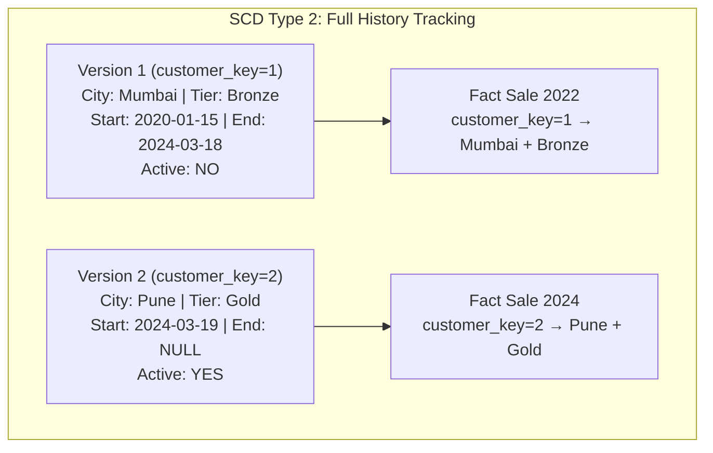

# Lesson 6: Slowly Changing Dimensions (SCD) Mastery (The Master Guide)

> **Goal:** Master the three main SCD types, understand when to use each one, and implement them using both traditional SQL and modern Databricks MERGE.

---

## 🏗️ Phase 1: Absolute Foundations (For Beginners)
Data is not static. Customers move cities. Product prices change. Employees switch departments. How do you track these changes in a Data Warehouse?

**The Core Problem:**
```
dim_customer before: [ID: 1001, Name: Priya, City: Mumbai, Tier: Bronze]

Priya MOVES to Pune. Priya gets promoted to GOLD tier.

Question: What do we do with the old record?
```

The answer depends on the business question you need to answer:
-  **"Where does Priya live NOW?"** → Type 1 (Overwrite)
-  **"Where did Priya live when she made each purchase?"** → Type 2 (Add Row)
-  **"What was her tier before AND after?"** → Type 3 (Add Column)

---

### SCD Type 0 — Fixed / Never Changes
Some attributes should **NEVER change** after they are set.
*   **Examples:** Date of Birth, Original Sign-up Date, First Order Date.
*   **Implementation:** No update is allowed. Source changes are ignored.

---

### SCD Type 1 — Overwrite (The "Amnesia" Approach)
**Rule:** Simply overwrite the old value with the new value. History is lost.

| When to use | When NOT to use |
|------------|----------------|
| Correcting a typo | Tracking changes over time |
| Non-analytical attributes | When history matters for reports |
| Data quality fixes | After an audit trail is required |

```sql
-- Before: Priya has a typo in her name
-- dim_customer: [1001, "Piya Sharma", "Mumbai", "Bronze"]

-- Type 1: Just fix it. Forget the typo ever existed.
UPDATE dim_customer
SET full_name = 'Priya Sharma'
WHERE customer_id = 1001;

-- After: [1001, "Priya Sharma", "Mumbai", "Bronze"]
-- Historical fact_sales records linking to customer_key 1001
-- will now show "Priya Sharma" — the typo is GONE from all history.
```

---

## 🚀 Phase 2: Intermediate (The Developer Level)

### SCD Type 2 — Add New Row (The "Gold Standard")
**Rule:** When an attribute changes, **close** the old record and **create a new record**. Full history is preserved.

This requires three extra columns:
-  **`surrogate_key`** — A new artificial key for each version.
-  **`effective_start_date`** — When this version became active.
-  **`effective_end_date`** — When this version was replaced (NULL = Currently Active).
-  **`is_current`** — A flag: 1=Active, 0=Historical (optional but very useful).

```sql
-- The dim_customer table designed for SCD Type 2
CREATE TABLE dim_customer (
    customer_key        BIGINT PRIMARY KEY,       -- Surrogate Key (auto-increment)
    customer_id         INT NOT NULL,              -- Natural Key from source system
    full_name           VARCHAR(200),
    city                VARCHAR(100),
    loyalty_tier        VARCHAR(20),
    effective_start_date DATE NOT NULL,
    effective_end_date   DATE,                     -- NULL means this is the CURRENT record
    is_current          BOOLEAN DEFAULT TRUE
);

-- Initial load: Priya is a Bronze customer in Mumbai
INSERT INTO dim_customer VALUES
(1, 1001, 'Priya Sharma', 'Mumbai', 'Bronze', '2020-01-15', NULL, TRUE);
```

**When Priya moves to Pune AND gets Gold tier:**

```sql
BEGIN;

-- Step 1: Close the OLD record (set its end date and mark as not current)
UPDATE dim_customer
SET
    effective_end_date = CURRENT_DATE - INTERVAL '1 day',
    is_current = FALSE
WHERE customer_id = 1001
  AND is_current = TRUE;

-- Step 2: Insert a NEW record for the new version
INSERT INTO dim_customer
(customer_key, customer_id, full_name, city, loyalty_tier, effective_start_date, effective_end_date, is_current)
VALUES
(2, 1001, 'Priya Sharma', 'Pune', 'Gold', CURRENT_DATE, NULL, TRUE);

COMMIT;
```

**The Result — Full history preserved:**

| customer_key | customer_id | city | tier | start_date | end_date | is_current |
|-------------|-------------|------|------|-----------|---------|------------|
| 1 | 1001 | Mumbai | Bronze | 2020-01-15 | 2024-03-18 | FALSE |
| 2 | 1001 | Pune | Gold | 2024-03-19 | NULL | **TRUE** |

**Now the magic: Analyzing purchases across history:**
```sql
-- "What was Priya's tier and city WHEN she made each purchase?"
-- This is only possible with SCD Type 2!
SELECT
    fs.order_date,
    fs.amount,
    dc.city,           -- The city she was in AT THE TIME of purchase
    dc.loyalty_tier    -- The tier she had AT THE TIME of purchase
FROM fact_sales fs
JOIN dim_customer dc
    ON fs.customer_key = dc.customer_key  -- Joins to THE VERSION active at purchase time!
WHERE dc.customer_id = 1001
ORDER BY fs.order_date;

-- ✅ Orders from 2020-2024: city=Mumbai, tier=Bronze
-- ✅ Orders from 2024+: city=Pune, tier=Gold
```



---

### SCD Type 3 — Add New Column (Limited History)
**Rule:** Add a new column to store the PREVIOUS value. Only tracks one change.

```sql
-- SCD Type 3 table design
CREATE TABLE dim_customer_type3 (
    customer_key         INT PRIMARY KEY,
    customer_id          INT,
    full_name            VARCHAR(200),
    current_city         VARCHAR(100),   -- The CURRENT city
    previous_city        VARCHAR(100),   -- The PREVIOUS city (NULL if never moved)
    city_changed_date    DATE
);

-- Priya moves from Mumbai to Pune:
UPDATE dim_customer_type3
SET
    previous_city     = current_city,    -- Save old value
    current_city      = 'Pune',          -- Set new value
    city_changed_date = CURRENT_DATE
WHERE customer_id = 1001;
```

**When to use Type 3:**
-  When you only care about "current" vs "previous" (not full history)
-  When you need to compare before/after in a single row
-  **Limitation:** If Priya moves AGAIN (Pune → Bangalore), you lose the Mumbai history forever!

---

## 🏛️ Phase 3: Architect (The Professional Level)

### 1. SCD Type 6 — The Hybrid (Type 1+2+3 Combined)

Used by large enterprises who need current values denormalized for speed, but also full history.

```sql
CREATE TABLE dim_customer_type6 (
    customer_key        BIGINT PRIMARY KEY,       -- Type 2: Surrogate
    customer_id         INT,                       -- Natural Key
    full_name           VARCHAR(200),

    -- Tracks history (Type 2 columns)
    historical_city     VARCHAR(100),              -- The city for THIS specific version
    effective_start     DATE,
    effective_end       DATE,
    is_current          BOOLEAN,

    -- Overwritten with current value in ALL rows (Type 1 behavior)
    current_city        VARCHAR(100)               -- Always reflects WHERE the customer is NOW
);

-- Why? Two use cases served simultaneously:
-- 1. Join via customer_key → historical_city = city at time of purchase (Type 2)
-- 2. Join via customer_id + is_current=TRUE → current_city for TODAY's campaigns (Type 1)
```

### 2. Modern Implementation: Delta Lake MERGE (The Databricks Way)

The most efficient and scalable way to implement SCD Type 2 at scale.

```sql
-- In Databricks SQL / Delta Lake
-- This single MERGE handles BOTH Type 1 and Type 2 in one atomic operation!

MERGE INTO dim_customer AS target
USING (
    -- The incoming new/changed data from the source
    SELECT
        customer_id,
        full_name,
        city,
        loyalty_tier,
        CURRENT_DATE AS effective_start_date
    FROM staging.customers_delta  -- Only changed records (CDC)
) AS source

ON target.customer_id = source.customer_id
   AND target.is_current = TRUE

-- CASE 1: Record EXISTS and CHANGED → SCD Type 2
WHEN MATCHED AND (
    target.city != source.city OR
    target.loyalty_tier != source.loyalty_tier
) THEN UPDATE SET
    target.is_current        = FALSE,
    target.effective_end_date = CURRENT_DATE - 1

-- CASE 2: Record does NOT EXIST → New Customer Insert
WHEN NOT MATCHED THEN INSERT (
    customer_id, full_name, city, loyalty_tier,
    effective_start_date, effective_end_date, is_current
) VALUES (
    source.customer_id, source.full_name, source.city, source.loyalty_tier,
    source.effective_start_date, NULL, TRUE
);

-- NOTE: After the MERGE, a separate INSERT adds new rows for the changed customers.
-- This pattern is typically done in a DLT (Delta Live Tables) pipeline.
```

### 3. SCD Decision Matrix

| Business Question | Best SCD Type |
|------------------|--------------|
| "What city is this customer in NOW?" | Type 1 (or Type 6 current_city) |
| "What city was this customer in WHEN they bought?" | Type 2 |
| "What was their tier BEFORE vs NOW?" | Type 3 |
| "All of the above" | Type 6 (Hybrid) |
| "Date of birth / Fixed attributes" | Type 0 |

---

## 🎯 Phase 4: Certification & Interview Drill

### 🛡️ DP-600 (Microsoft Fabric) Drill
*   **Fabric SCD Strategy:** Microsoft Fabric's Data Warehouse supports T-SQL. You can use standard `UPDATE` and `INSERT` patterns for SCD Type 1 and 2.
*   **Direct Lake & SCD:** When you add new rows for SCD Type 2, the **V-Order** optimization in Fabric automatically handles the compression, ensuring that your Power BI reports remain fast even with millions of historical versions.

### 🛡️ Databricks Associate Drill
*   **Delta Lake MERGE:** You MUST master the `MERGE INTO` command. It is the core of "Change Data Capture" (CDC) and SCD implementation in the Databricks Lakehouse.
*   **SCD Type 2 vs CDC:** Understand that CDC (from sources like Debezium) often feeds your SCD Type 2 tables in the Silver layer.

### 🏢 Consultancy Scenario: The "Audit Nightmare"
**Scenario:** A client in the banking sector needs to know exactly which interest rate was applied to a loan on May 14th, 2022. They currently use SCD Type 1 (Overwrite).
*   **Architect Answer:** SCD Type 1 is a disaster here. You have lost the history. You MUST migrate to **SCD Type 2**. This will allow you to point-in-time join the `fact_loans` to the `dim_rates` table using the `effective_start/end_date` to find the exact rate for any date in history.

### 🚀 Startup Scenario: The "Memory Overflow"
**Scenario:** Your startup is growing fast. Your SCD Type 2 `dim_visitors` table has grown from 10k rows to 50 Million rows because users change their "Last Seen" status every minute.
*   **Answer:** Do NOT use SCD Type 2 for high-frequency changes.
*   **The Move:** Move the "Last Seen" timestamp to a separate **Fact table** or use **SCD Type 4** (History Table). Keep the main Dimension table clean (Type 1) and offload the high-frequency changes to a "Mini-Dimension" or Fact record.

### 🏛️ FAANG Scenario: The "Scale Problem"
**Scenario:** You have a 1 Billion row Dimension table. A simple `UPDATE` for SCD Type 1 takes 2 hours.
*   **Answer:** Never use `UPDATE` on massive datasets.
*   **The Drill:** Use the **Insert-Only Architecture**. Write the new records to a new partition and "Switch" the table metadata, or use **Delta Lake/Iceberg** which handles these "Upserts" much more efficiently through metadata pointers rather than rewriting the whole file.

---

### 🧪 Hands-on Labs
- [scd_type2_merge_lab.sql](scd_type2_merge_lab.sql) (Implementing SCD2 using the MERGE command)

---

### ✅ Key Takeaways
1. **SCD Type 1** = Correcting errors (Lose history).
2. **SCD Type 2** = Tracking history (Add rows). This is the DE standard.
3. **SCD Type 3** = Before/After (Add columns).
4. **SCD Type 6** = The Hybrid (Type 1 + 2 + 3). Provides maximum flexibility.
5. **Surrogate Keys** are mandatory for SCD Type 2 to distinguish between different versions of the same entity.
6. **MERGE** is the modern tool of choice for implementing SCDs at scale.

[Next: Lesson 7: Modeling Practical (Build a Warehouse) →](../Lesson_7_Modeling_Practical/README.md)

---

## ⚠️ Common Pitfalls (Beginner Mistakes)

1.  **Missing the Change Logic:** Implementing SCD Type 2 but failing to check if the data *actually* changed before inserting a new row.
    *   **The Issue:** Your dimension table will double in size every day even if no data changed, leading to millions of identical rows.
    *   **Fix:** Use a `HASH` function or a `WHERE` clause that compares every relevant column before triggering the SCD update.
2.  **Date Gaps:** Setting the `end_date` of the old record to be different from the `start_date` of the new record.
    *   **The Issue:** If a sale happens in the "gap" between those two dates, your query will fail to find a matching customer version.
    *   **Fix:** Always use the same logic (e.g., `New.StartDate = Old.EndDate + 1 second`).
3.  **Using Business keys in Fact Joins:** Joining `fact_sales` to `dim_customer` using the `customer_id` (Natural Key).
    *   **The Issue:** You will get multiple rows and "Double Count" your sales, because the `customer_id` exists multiple times in the dimension (one for each version).
    *   **Fix:** Always join using the **Surrogate Key** (`customer_key`).
4.  **SCD Type 1 on Type 2 tables:** Accidentally overwriting a column in a Type 2 table that should have been tracked.
    *   **The Issue:** You lose history and break the "Point-in-time" accuracy of past reports.
    *   **Fix:** Clearly document which attributes are Type 1 (e.g., Typo fixes) and which are Type 2 (e.g., Tier changes).

---

## 🧪 Practice Exercises

### Exercise 1 — Manual SCD2 Walkthrough (Beginner)
**Goal:** Track a customer move manually.

**Current Record:**
- `key: 101 | id: 50 | name: "Amol" | city: "Delhi" | start: "2020-01-01" | end: "NULL" | current: TRUE`

**Update:** Amol moves to "Bangalore" on June 1st, 2024.

**Your Task:**
Write out the updated rows (both the old one modified and the new one added) as they would appear in the table on June 2nd.

---

### Exercise 2 — The SQL MERGE Logic (Intermediate)
**Goal:** Write a logic for SCD Type 1 changes.

**Scenario:** You have a dimension `dim_employee`. You realize that the `employee_email` was entered as `"amol.n@compny.com"` (typo) and should be `"amol.n@company.com"`.

**Your Task:**
Write a SQL `UPDATE` statement that fixes this. Explain why this is a **Type 1** change and NOT a Type 2 change.

---

### Exercise 3 — Effective Date Ranges (Architect)
**Goal:** Query data for a specific point in time.

**Scenario:** An analyst needs to know the total sales for products in the "Electronics" category as it was defined on **January 1st, 2023**.

**Your Task:**
Write a SQL query using `BETWEEN` logic on `effective_start_date` and `effective_end_date` to filter the `dim_product` table for that specific date.

---

## 💼 Common Interview Questions

**Q1: What is the main difference between SCD Type 1 and SCD Type 2?**
> **SCD Type 1** overwrites existing data with new data, losing all history of the previous value. **SCD Type 2** preserves history by creating a new version of the record with a unique surrogate key and effective date ranges. Use Type 1 for correcting errors; use Type 2 for tracking important business changes (like region or tier moves).

**Q2: Why are "Surrogate Keys" essential for SCD Type 2?**
> In SCD Type 2, a "Natural Key" (like `customer_id`) is no longer unique—it appears once for every version of that customer. To join a specific sale to the *correct* version of the customer, we need a unique identifier for that specific version. That identifier is the Surrogate Key.

**Q3: How do you handle a "NULL" end_date in SCD Type 2?**
> A `NULL` end_date typically signifies that the record is the "Current" version. However, for easier SQL joins, many architects use a "Far-Future Date" like `9999-12-31`. This allows you to use `BETWEEN` logic without having to handle `IS NULL` exceptions in every query.

**Q4: What is SCD Type 6 and why is it called "6"?**
> SCD Type 6 is a "Hybrid" approach that combines Types 1, 2, and 3 ($1+2+3=6$). 
> - **Type 2:** It keeps historical rows (versions).
> - **Type 3:** It has an "Original Value" column.
> - **Type 1:** it has a "Current Value" column that is overwritten in ALL historical rows so you can see the current state without a complex join.

**Q5: How does Delta Lake's `MERGE` command simplify SCD implementation?**
> In traditional SQL, implementing SCD Type 2 requires a multi-step process: finding changes, closing old records, and inserting new ones. Delta Lake's `MERGE` command allows you to handle these "Upsert" scenarios in a single, atomic, and high-performance operation, ensuring data consistency even in massive distributed environments like Spark.
