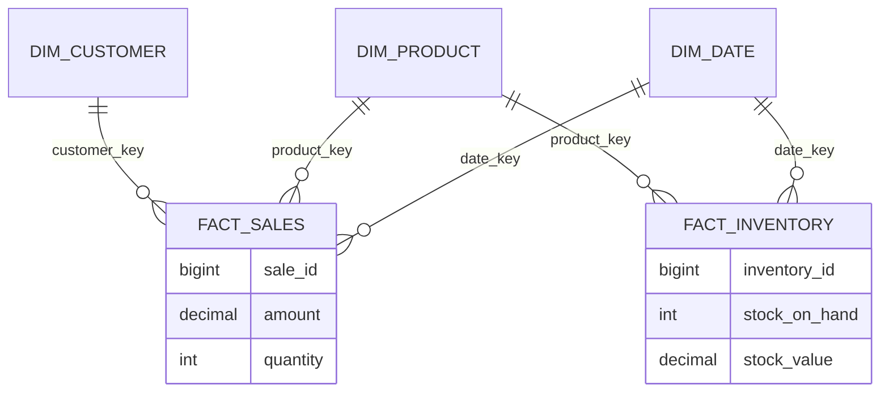

# Lesson 7: Modeling Practical Lab — Build a Retail Data Warehouse

> **Goal:** Put everything you've learned into practice. You will design a professional, production-ready Star Schema for a global E-commerce company.

---

## 🏗️ The Scenario: "GlobalGizmos Inc."
GlobalGizmos sells electronics in 5 countries. They have:
1.  **Sales Data** (Amount, Quantity, Discount)
2.  **Inventory Data** (Stock levels at various warehouses)
3.  **Shipping Data** (When items were shipped/delivered)
4.  **Customer Data** (Name, City, Loyalty Tier)

**Your Task:** Design a **Galaxy Schema** that allows the CEO to see "Profit vs. Stock Levels" by "Product Category" for every "Quarter".

---

## 🛠️ Step 1: The DDL (Blueprint)

```sql
-- 1. Dimension Tables (The Nouns)
CREATE TABLE dim_products (
    product_key      BIGINT PRIMARY KEY, -- Surrogate Key
    product_id       VARCHAR(50),        -- Natural Key
    product_name     VARCHAR(200),
    category         VARCHAR(100),
    brand            VARCHAR(100),
    unit_cost        DECIMAL(10,2),
    is_active        BOOLEAN
);

CREATE TABLE dim_customers (
    customer_key     BIGINT PRIMARY KEY,
    customer_id      VARCHAR(50),
    full_name        VARCHAR(200),
    city             VARCHAR(100),
    loyalty_tier     VARCHAR(20),
    effective_start  DATE,               -- SCD Type 2 Ready
    effective_end    DATE,
    is_current       BOOLEAN
);

CREATE TABLE dim_date (
    date_key         INT PRIMARY KEY,    -- Format: 20240319
    full_date        DATE,
    day_name         VARCHAR(10),
    month_name       VARCHAR(10),
    quarter          INT,
    year             INT,
    is_holiday       BOOLEAN
);

-- 2. Fact Tables (The Verbs)
CREATE TABLE fact_sales (
    sale_id          BIGINT PRIMARY KEY,
    product_key      BIGINT REFERENCES dim_products(product_key),
    customer_key     BIGINT REFERENCES dim_customers(customer_key),
    date_key         INT REFERENCES dim_date(date_key),
    quantity         INT,
    sale_amount      DECIMAL(12,2),
    tax_amount       DECIMAL(12,2)
);

CREATE TABLE fact_inventory (
    inventory_id     BIGINT PRIMARY KEY,
    product_key      BIGINT REFERENCES dim_products(product_key),
    date_key         INT REFERENCES dim_date(date_key),
    warehouse_name   VARCHAR(100),
    stock_on_hand    INT,
    stock_value      DECIMAL(12,2)
);
```

---

## 🚀 The Visual Blueprint



---

## 🎯 Phase 4: Certification & Interview Drill

### 🛡️ DP-600 (Microsoft Fabric) Drill
*   **Star Schema Optimization:** In Power BI, you should hide the **Foreign Keys** in the Fact table. Only the **Dimension Attributes** should be visible to users. This prevents "Key Confusion".
*   **Cardinality:** Ensure all relationships from Dim to Fact are **1:Many** and **Single-Direction Filter**. This is the highest performance setting in Fabric.

### 🛡️ Databricks Associate Drill
*   **Z-Ordering:** On your `fact_sales` table, apply `ZORDER BY (date_key, product_key)`. This co-locates the data on disk, making your Joins to the Date and Product dimensions extremely fast.
*   **Partitioning:** Since `fact_sales` is the largest table, partition it by `year` or `date_key`.

### 🏢 Consultancy Scenario: The "Bridge"
**Scenario:** A customer can have multiple addresses (Home, Work, Vacation). How do you link one sale to multiple addresses?
*   **Architect Answer:** Use a **Bridge Table**. Create a `dim_customer_addresses` table that links `customer_key` to multiple address records. This allows a "Many-to-Many" relationship while keeping the model clean.

### 🚀 Startup Scenario: The "MVP"
**Scenario:** You need to build this tomorrow. You don't have time for DDL.
*   **Answer:** Use **dbt**. Standardize your staging views and let dbt manage the table creation and Surrogate Key generation (`dbt_utils.generate_surrogate_key`).

### 🏛️ FAANG Scenario: The "Update"
**Scenario:** A brand changes its name from "Oreo" to "Nabisco Oreo". You have 5 Billion sales rows linked to this brand.
*   **Answer:** Do NOT update the Fact table.
*   **The Drill:** Update the **Dimension table** (SCD Type 1 for a simple name change, or SCD Type 2 if you need history). Because the Fact table uses a `product_key`, it remains untouched. This is why Surrogate Keys are vital for scale.

---

### 🧪 Hands-on Lab: Final Modeling Challenge
1.  Extend the schema above to include a **dim_stores** dimension.
2.  Add a `fact_shipping` table to track delivery latencies.
3.  Write a SQL query to find "Top 5 Products with High Stock but Zero Sales in Q1".

---

### ✅ Key Takeaways
1. **Surrogate Keys** are your best friend for stability.
2. **Conformed Dimensions** (Date/Product) allow you to compare different business facts.
3. **Data Quality** starts at the model layer.
4. **Partitioning & Z-Ordering** are the secret weapons for Big Data performance.

[Next Chapter: Phase 3: Big Data & PySpark →](../../Phase_3_Big_Data_and_PySpark/README.md)

---

## ⚠️ Common Pitfalls (Beginner Mistakes)

1.  **Modeling Every Column:** Trying to bring all 100 columns from the source table into your dimension.
    *   **The Issue:** Your dimension table becomes a "Blob" of data that is hard to navigate. Analysts only use 10-20% of those columns for real reporting.
    *   **Fix:** Only model the columns used for filtering, grouping, or describing. You can always add more later.
2.  **Circular Relationships:** Creating a loop in your schema (e.g., Fact → Dim1 → Dim2 → Fact).
    *   **The Issue:** This confuses BI tools and SQL optimizers, leading to infinite loops or incorrect results depending on the join path.
    *   **Fix:** Maintain a strict **Hierarchy** (Dimensions point to Facts, not vice versa).
3.  **Hardcoding Business Logic in Dimensions:** Adding a column like `is_profitable` that requires a complex calculation.
    *   **The Issue:** If the definition of "Profitable" changes, you have to rewrite your entire dimension table.
    *   **Fix:** Perform complex calculations in the **Fact Table** or the **Semantic Layer (Power BI/Tableau)**. Dimensions should be for descriptive attributes.
4.  **Neglecting the "Null" Record:** Not having a placeholder row for when a foreign key in the fact table is missing.
    *   **The Issue:** A simple `JOIN` will exclude those rows from your reports, hiding potential data issues.
    *   **Fix:** Every dimension should have a row with ID `-1` and values like "Unknown" or "N/A".

---

## 🧪 Practice Exercises

### Exercise 1 — The Retail Modeling Step (Beginner)
**Goal:** Build the primary relationship.

**Scenario:** You have a `raw_sales` table with millions of rows.
Each row has a `product_code` (e.g., "LAP-001").

**Your Task:**
1.  Design a `dim_product` table.
2.  Write the SQL to generate a `product_key` (Surrogate Key).
3.  Explain the "Extract, Transform, and Load" (ETL) steps to move the data from `raw_sales` into your new `fact_sales` and `dim_product` tables.

---

### Exercise 2 — Adding a Conformed Dimension (Intermediate)
**Goal:** connect multiple business units.

**Scenario:** GlobalGizmos now has a **Return** process.
- When a customer returns a product, it is logged in `fact_returns`.

**Your Task:**
1.  Identify which existing dimensions from Phase 1 should be reused for `fact_returns`.
2.  Why is it important to use the **exact same** `dim_date` and `dim_product` tables for both Sales and Returns?

---

### Exercise 3 — The Performance Audit (Architect)
**Goal:** Optimize a large-scale warehouse.

**Scenario:** `fact_sales` has reached 10 Billion rows. A join to `dim_customers` to find "Sales by City" takes 10 minutes.

**Your Task:**
1.  Would you **Normalize** or **Denormalize** `dim_customers` to help performance?
2.  Which column would you choose for **Partitioning** in the Fact table?
3.  Propose the use of a **Materialized View** or **Aggregate Table** to speed up the "By City" report.

---

## 💼 Common Interview Questions

**Q1: How do you handle "Late Arriving Facts"? (e.g., a sale from last week arrives today)**
> Late arriving facts are handled by our **Date Dimension**. We join the sale to the date it actually occurred (`transaction_date`), not today's date. If we are using SCD Type 2 for dimensions, we must also ensure we join the sale to the version of the dimension that was active *at that time* (point-in-time join).

**Q2: What is the first thing you do when handed a large source system for modeling?**
> The first thing is to **Indentify the Business Process** (e.g., "Order Fulfillment") and define the **Grain** (e.g., "One row per individual item in an order"). Modeling without a clearly defined grain leads to double-counting and architectural failure.

**Q3: Explain the concept of "Data Lineage" in the context of modeling.**
> Data Lineage is the map of where data comes from and how it changes as it moves through the Medallion architecture (Bronze → Silver → Gold). In modeling, we must document which source columns feed into which dimension attributes so that when data is "wrong," we can trace it back to the original source system.

**Q4: When would you use a "Galaxy Schema" instead of a Star Schema?**
> A Galaxy Schema (or Fact Constellation) is used in large enterprise environments where you have **multiple Fact tables** sharing **multiple Conformed Dimensions**. It is actually just a collection of Star Schemas. We use it whenever the business needs to analyze cross-functional performance (e.g., linking Sales, Inventory, and Shipping).

**Q5: What is a "Bridge Table" and why is it problematic for performance?**
> A Bridge Table is used to resolve **Many-to-Many** relationships (e.g., one book written by many authors). It sits between the Dimension and the Fact. It is problematic because it requires an extra Join and a complex "Multiplication" of rows, which can dramatically slow down analytical queries and complicate calculations for end-users.
