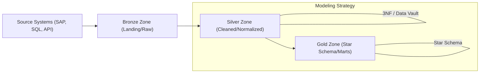

# 📐 Phase 2: Data Modeling — The Architect's Blueprint

> **Goal:** High-quality data modeling is what separates a "coder" from an "architect". By the end of this phase, you will know how to design data warehouses that scale, are easy to query, and perform at light speed in Power BI and Databricks.

---

## 🏗️ The Medallion Modeling Flow

---

## 📚 Lessons in This Phase

| # | Lesson | Key Concepts | Career Focus |
|---|--------|-------------|:---:|
| [1](./Lesson_1_Intro_to_DW/README.md) | **Intro to DW** | OLTP vs OLAP, ETL vs ELT, Lakehouse | **All** |
| [2](./Lesson_2_Normalization_101/README.md) | **1NF, 2NF, 3NF** | Anomalies, Integrity, Database design | **Consultancy** |
| [3](./Lesson_3_Star_vs_Snowflake/README.md) | **Star Schema** | Fact vs Dimension, Keys, Normalization | **DP-600 / Power BI** |
| [4](./Lesson_4_The_Date_Dimension/README.md) | **The Date Dimension** | Time-series, Smart Keys, Granularity | **All** |
| [5](./Lesson_5_Fact_Dimension_Deep_Dive/README.md) | **Fact/Dim Deep Dive** | Junk, Degenerate, Conformed Dimensions | **Architect** |
| [6](./Lesson_6_SCD_Tracking_History/README.md) | **SCD Types 0-6** | Tracking changes over time, MERGE | **Databricks Associate** |
| [7](./Lesson_7_Modeling_Practical/README.md) | **Modeling Lab** | Build a full E-commerce Star Schema | **Portfolio** |

---

## 🎯 Phase 4: Certification & Interview Drill

### 🛡️ DP-600 (Microsoft Fabric) Drill
*   **Relationship Cardinality:** You must understand **1:Many** (standard) vs **Many:Many** (dangerous). Fabric/Power BI performs best with **One-Way (Single) Filter Direction**.
*   **Star Schema is King:** For **Direct Lake** mode in Fabric, a clean Star Schema is mandatory for performance.

### 🛡️ Databricks Associate Drill
*   **Z-ORDER & Partitioning:** Modeling for Spark is different. You often use **Z-ORDER** on your Join keys (Dimensions) and **Partitioning** on high-cardinality columns (Date, Region).
*   **SCD Type 2:** Implementing SCD2 with Spark requires a specialized `MERGE` logic (Insert + Update).

### 🏢 Consultancy Scenario: The "Messy Client"
**Scenario:** A client has 200 tables with no relationships. They want a dashboard "tomorrow".
*   **Architect Answer:** Don't model everything. Identify the **Business Process** (e.g., Sales), find the **Grain** (One row per order line), and build a **Minimal Star Schema** focusing on the critical 5 dimensions. (Agile Modeling).

### 🏛️ FAANG Scenario: The "Scale"
**Scenario:** We have 500 million orders per day. How do we model the Dimension table for "User Profiles" that changes every hour?
*   **Answer:** Use **SCD Type 4** (History Table) or **SCD Type 2** but with **Bucketing** on `user_id` to prevent "Shuffling" during massive Joins.

---

### 🏛️ Architect's Tip
> "Normalize for **Storage** (Silver), Denormalize for **Performance** (Gold). If your Power BI report is slow, the problem is usually your Data Model, not your DAX."

[Start with Lesson 1: Intro to Data Warehousing →](./Lesson_1_Intro_to_DW/README.md)
