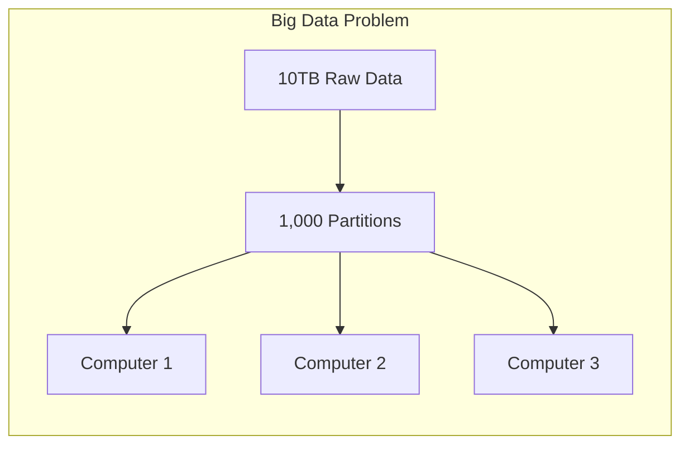

# Lesson 1: Why Apache Spark? (The Master Guide)

## 🏗️ Phase 1: Absolute Foundations (For Beginners)
What is "Big Data"?

### 1. The Limit of One Computer
Imagine you have a 10GB file. Your laptop has 8GB of RAM. You can't open that file. You need more memory.

### 2. What is a "Cluster"?
A **Cluster** is just a group of many computers (Nodes) connected together.
*   **A "Job":** A piece of work you send to the cluster.
*   **Distribution:** Spark takes your 10GB file and cuts it into 100 tiny pieces (Partitions). Each computer in the cluster works on one piece.

### 3. What is Apache Spark?
Spark is the **Distributed Computing** engine. It manages all those computers to work on your data as if they were one machine.



## 🚀 Phase 2: Intermediate (The Developer Level)
### 1. The Map-Reduce Problem
Spark's predecessor (Hadoop) was very slow because it wrote data to disk after every step. 
*   **Spark's Fix:** It keeps data in **RAM (Memory)**. This makes it 100x faster than Hadoop.

### 2. Lazy Evaluation (The Secret Sauce)
Spark doesn't do anything until you ask for the final answer (`.show()` or `.save()`). It spends its time "Planning" the most efficient way to get that answer.

### 3. The Lineage (Fault Tolerance)
If one machine in the cluster fails, Spark doesn't crash the whole job. It remember the "Recipe" (Lineage) of how the data was built and simply re-runs the missing piece on a different computer.

---

## 🎯 Phase 4: Certification & Interview Drill

### 🛡️ Databricks Associate Drill
*   **The Evolution of Spark API:**
    *   **RDD (Resilient Distributed Dataset):** The low-level API. Hard to code, no optimization. (Internal use only now).
    *   **DataFrames:** High-level API. Like a SQL table or Excel sheet. Highly optimized by the **Catalyst Optimizer**.
    *   **Datasets:** Type-safe API (Scala/Java only). Not used in PySpark.
*   **The Drill:** In an interview, always say you prefer **DataFrames/Spark SQL** because of the Catalyst Optimizer.

### 🛡️ DP-600 (Microsoft Fabric) Drill
*   **Serverless Spark:** In Fabric, you don't manage the cluster servers. You simply select a "Pool size" (Small, Medium, Large). Fabric handles the "Driver" and "Executors" behind the scenes.

### 🏢 Consultancy Scenario: "The Cost/Performance Balance"
**Scenario:** A client wants to use Spark for a 100MB file because "Spark is modern."
*   **Architect Answer:** **Stop.** Spark has "Cluster Startup Overhead." It takes 2-3 minutes to turn on the machines. A 100MB file can be processed in 2 seconds using **DuckDB** or **Vanilla Python**. Spark is only for when "Vertical Scaling" (bigger laptop) is more expensive than "Horizontal Scaling" (more cheap machines).

### 🚀 Startup Scenario: "The Unified Engine"
**Scenario:** You need to do SQL, Machine Learning, and Streaming. Do you need 3 different tools?
*   **Answer:** No. **Spark is a Unified Engine**. You can use Spark SQL for ETL, MLlib for Machine Learning, and Structured Streaming for real-time data — all in the same Python script.

### 🏛️ FAANG Scenario: "The Distributed Join"
**Scenario:** You have a 1PB (Petabyte) table and a 100TB table. You need to join them.
*   **Answer:** This will trigger a **Shuffle**.
*   **The Drill:** To optimize, ensure the data is **Colocated**. If both tables are partitioned by the same key (e.g., `user_id`), Spark can join them locally on each machine without moving a single byte across the network.

---

### 🧪 Hands-on Labs
- [spark_context_test.py](spark_context_test.py) (Verify your local Spark installation)

---

### ✅ Key Takeaways
1. **Vertical Scaling** = Bigger machine. **Horizontal Scaling** = More machines (Spark's way).
2. **Spark's RAM focus** makes it 100x faster than Hadoop's Disk focus.
3. **Lazy Evaluation** allows Spark to optimize your code before running it.
4. **DataFrames** are the standard API for modern Data Engineering.
5. **Horizontal Scaling** is the only way to process Petabyte-scale data.

[Next: Lesson 2: Spark Architecture (The Cluster Internals) →](../Lesson_2_Spark_Architecture/README.md)

---

## ⚠️ Common Pitfalls (Beginner Mistakes)

1.  **Using Spark for "Small Data":** Trying to use Spark to process a 50MB Excel file.
    *   **The Issue:** The time it takes for Spark to "Spin up" the cluster and distribute the data is longer than the actual processing time.
    *   **Fix:** Use **Pandas** or **Polars** for data under 1GB.
2.  **Misunderstanding Lazy Evaluation:** Being confused when a `print("Starting...")` statement runs but the actual data processing code before it doesn't show any errors yet.
    *   **The Issue:** Errors in your transformations (like `col("wrong_name")`) won't be caught until you call an **Action** (like `df.show()`).
    *   **Fix:** Always call a small `.limit(10).show()` during development to "vibe check" your transformations.
3.  **The `list()` trap:** Trying to convert a massive Spark DataFrame into a Python list: `my_list = df.collect()`.
    *   **The Issue:** `collect()` pulls ALL data from the cluster into the RAM of your **Driver** (the orchestrator machine). If the data is 1TB and your Driver has 16GB RAM, your program will crash (OOM).
    *   **Fix:** Always filter or aggregate your data down to a small size before using `.collect()`.
4.  **Assuming Order:** Assuming that the rows in a Spark DataFrame are in the same order they were in the source file.
    *   **The Issue:** Because Spark distributes data across many machines, the order is lost during the read process.
    *   **Fix:** If order matters, you **must** use an `orderBy()` transformation.

---

## 🧪 Practice Exercises

### Exercise 1 — Calculating Partitions (Beginner)
**Goal:** Understand how work is divided.

**Scenario:** You have a 100GB dataset. Your Spark cluster is configured with a `maxPartitionSize` of 128MB.

**Your Task:**
1.  Calculate roughly how many **Partitions** Spark will create for this dataset. 
2.  If you have 10 Worker Nodes, how many partitions will each node handle?

---

### Exercise 2 — Transformations vs. Actions (Intermediate)
**Goal:** Identify when Spark "actually" works.

**Look at this code:**
```python
df = spark.read.csv("data.csv")           # Line 1
df_filtered = df.filter(df.age > 21)     # Line 2
df_grouped = df_filtered.groupBy("city") # Line 3
df_sum = df_grouped.count()              # Line 4
df_sum.show()                            # Line 5
```

**Your Task:**
Identify which lines are **Transformations** (Planning) and which line is the **Action** (Execution).

---

### Exercise 3 — The Fault Tolerance Re-run (Architect)
**Goal:** Understand Spark's "Lineage."

**Scenario:** You have a job with 1,000 tasks. At Task #950, one of the Worker Nodes (Executor 3) loses power and dies.

**Your Task:**
1.  Does the whole job restart from zero?
2.  How does Spark know what data was on the dead node?
3.  Explain the concept of an **RDD Lineage Graph** in this context.

---

## 💼 Common Interview Questions

**Q1: What is the difference between an RDD and a DataFrame in Spark?**
> **RDD (Resilient Distributed Dataset)** is the original, low-level API. It is "unstructured," meaning Spark doesn't know what's inside (to Spark, it's just a blob of objects). **DataFrames** are the modern, "structured" API. They have a schema (columns). This allows the **Catalyst Optimizer** to look at your code and optimize the query plan, making DataFrames much faster and easier to use than RDDs.

**Q2: Explain "Lazy Evaluation" and why it is a benefit.**
> Lazy Evaluation means Spark does not execute transformations immediately. Instead, it records them in a Directed Acyclic Graph (DAG). The benefit is that Spark can look at the **entire** chain of transformations and optimize them. For example, if you filter for `age > 21` at the very end, Spark is smart enough to apply that filter **early** while reading the data, saving time and memory.

**Q3: What happens during a "Shuffle" in Spark?**
> A Shuffle is the process of redistributing data across the cluster. It happens during operations like `groupBy()`, `join()`, or `distinct()`. Shuffling is the **most expensive** operation in Spark because it requires moving data over the network and writing temporary files to disk.

**Q4: Why is Spark 100x faster than Hadoop MapReduce?**
> The primary reason is **Memory (RAM) Over Disk**. Hadoop MapReduce writes data back to the physical disk after every single step (Map, then Disk, then Reduce, then Disk). Spark keeps data in the RAM of the executors across multiple transformations. It also uses a sophisticated DAG engine that optimizes the execution plan, whereas Hadoop is a rigid two-step process.

**Q5: What is the "Driver" and what are the "Executors"?**
> The **Driver** is the brain of the operation. It hosts your `SparkSession`, takes your code, converts it into tasks, and schedules them. The **Executors** are the workers. They live on the nodes in the cluster, execute the tasks assigned by the Driver, and store the data in memory/disk. If the Driver dies, the job fails. If an Executor dies, the Driver just assigns its work to another one.
