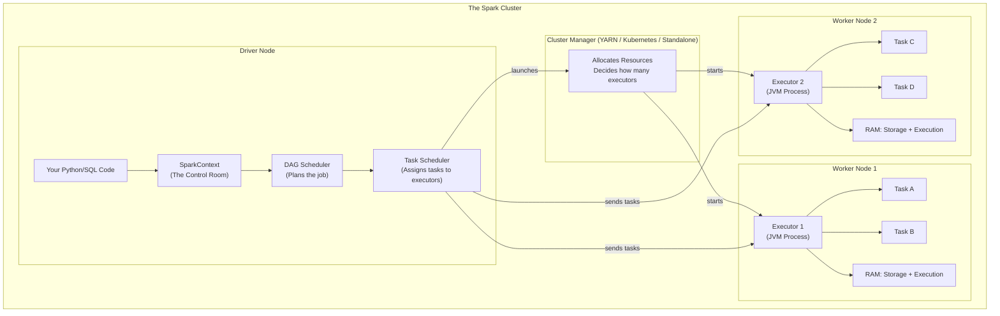
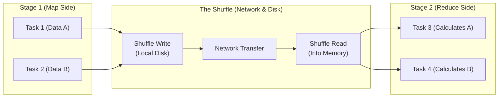

# Lesson 2: Spark Architecture Deep Dive (The Master Guide)

> **Goal:** Understand exactly what happens inside Spark when you run a job — from DAG planning to execution on executors — so you can diagnose and fix any performance problem.

---

## 🏗️ Phase 1: Absolute Foundations (For Beginners)

### 1. The Big Picture — Two Sides of Spark

Every Spark job has two sides:

**The Driver (The Brain / Manager):**
-  Runs your Python/Scala code
-  Plans the job into stages
-  Sends work to executors
-  Collects results and brings them back
-  ONE driver per Spark application

**The Executors (The Muscles / Workers):**
-  Receive tasks from the Driver
-  Actually process the data
-  Store data in their local RAM (cache)
-  Report results back to the Driver
-  MANY executors per Spark application (can be 1 to 10,000)



### 2. What is a "Partition"?

Spark never loads your entire dataset into one computer's memory. It **splits** the data into **Partitions**.

```
Your 100GB Parquet file:
→ Split into 1000 partitions of 100MB each
→ Each partition fits in one executor's RAM
→ Each partition is processed by one "Task"
→ 1000 Tasks can run in parallel across many executors
```

**Rule of thumb:** 1 partition = 1 task = should be 128MB–512MB.

```python
# See how many partitions your DataFrame has
df = spark.read.parquet("s3://bucket/data/")
print(f"Partitions: {df.rdd.getNumPartitions()}")  # e.g., 1000

# Repartition (triggers a shuffle!) — changes partition count
df_200 = df.repartition(200)

# Coalesce (no full shuffle) — only reduces partition count
df_10 = df.coalesce(10)
```

---

## 🚀 Phase 2: Intermediate (The Developer Level)

### 1. Transformations vs. Actions — The Key Distinction

This is the most misunderstood concept in Spark.

**Transformations (Lazy — Do Nothing Yet):**
-  Return a NEW DataFrame (nothing is computed yet)
-  Build up a "recipe" (the DAG / execution plan)
-  Examples: `filter()`, `select()`, `join()`, `groupBy()`, `withColumn()`

**Actions (Eager — Execute Now):**
-  Trigger the actual computation
-  Return a result (to the Driver or to disk)
-  Examples: `count()`, `show()`, `collect()`, `save()`, `write()`

```python
# Transformations (building the plan — INSTANT to write)
df_raw = spark.read.parquet("s3://bucket/raw/")      # Transformation
df_filtered = df_raw.filter(col("amount") > 1000)    # Transformation
df_joined = df_filtered.join(df_users, "user_id")    # Transformation
df_grouped = df_joined.groupBy("city").sum("amount") # Transformation

# Nothing has been computed yet! The plan is just in memory.

# ACTION (triggers EVERYTHING above — now Spark runs!)
df_grouped.show()     # Finally computes + shows first 20 rows

# Another action — runs the whole pipeline AGAIN from scratch!
df_grouped.count()    # ← This is why caching important DataFrames saves time
```

### 2. The DAG — Spark's Execution Plan

When an Action is triggered, Spark builds a **DAG (Directed Acyclic Graph)** — a blueprint of all transformation steps.

```
Your code (sequence of transformations):
df1 = read parquet
df2 = filter(amount > 0)
df3 = join(dim_users)     ← This requires a SHUFFLE (data must be co-located!)
df4 = groupBy(city)       ← Another SHUFFLE
df5 = write to Delta

Spark's DAG:
[Stage 1] read + filter  → (shuffle write)
                              ↓
[Stage 2] join            → (shuffle write)  
                              ↓
[Stage 3] groupBy + write
```

### 3. Jobs, Stages, and Tasks — The Hierarchy

```
APPLICATION (one SparkSession)
└── JOB (one Action: a .count() or .write())
    └── STAGE (separated by Shuffles — data must move between executors)
        └── TASK (one partition = one task = runs on one CPU core)
```

---

### 4. The Shuffle Process (Where the Network Melts)
A **Shuffle** occurs when data must move between executors to gather related rows together (e.g., for a Join or GroupBy).



> 💡 **Performance Key Insight:** Each **Stage boundary = a shuffle**. Shuffles write data to disk and send it across the network. They are expensive. **Minimizing stages = minimizing shuffles = faster jobs.**

---

## 🏛️ Phase 3: Architect (The Professional Level)

### 1. The Catalyst Optimizer — Spark's Brain

The **Catalyst Optimizer** automatically transforms your logical query plan into the most efficient physical plan. It applies rules in 4 phases:

```
Phase 1: Analysis
  Your SQL/DataFrame code → Logical Plan (unresolved)
  Catalyst checks: Do the column names exist? Are the types correct?

Phase 2: Logical Optimization
  Catalyst applies rules to improve the plan:
  ✅ Predicate Pushdown: Move filters as early as possible (read less data!)
  ✅ Column Pruning: Only read columns you actually USE (ignore the rest)
  ✅ Constant Folding: Pre-calculate constants (today = 2024-03-19)
  ✅ Partition Pruning: Skip partitions that don't match WHERE clause

Phase 3: Physical Planning
  Catalyst generates multiple physical plans and picks the cheapest one
  (based on cost estimation from table statistics)
  Decides: BroadcastHashJoin? SortMergeJoin? ShuffleHashJoin?

Phase 4: Code Generation (Tungsten)
  Catalyst generates optimized JVM bytecode for the chosen plan
  → Runs near-native C speed (much faster than interpreted Python!)
```

**Predicate Pushdown Example:**

```sql
-- You write this SQL:
SELECT * FROM orders WHERE order_date = '2024-03-19'

-- WITHOUT Catalyst: Read all 10 years of data, then filter
-- WITH Catalyst:    Filter is pushed down to the Parquet file reader!
--                  Only reads the folder "year=2024/month=03/day=19/"
--                  Skips 99.97% of data automatically!

-- You can see what Catalyst planned:
df.explain("formatted")
-- Look for: "PartitionFilters" and "PushedFilters" in the output
```

### 2. The Tungsten Engine — Memory Management

Tungsten is the execution engine underneath the Catalyst Optimizer. It achieves near-native speed by:

```
1. Off-Heap Memory Management:
   Standard Java stores objects on the JVM Heap (subject to Garbage Collection pauses)
   Tungsten stores objects in OFF-HEAP memory (bypasses GC completely!)
   → No GC pauses = predictable latency

2. Cache-Aware Algorithms:
   Tungsten sorts data to maximize CPU cache hits (L1/L2 cache on each core)
   → 2-5x faster execution of aggregations and sorts

3. Whole-Stage Code Generation:
   Instead of calling many small functions per row, Tungsten compiles
   entire pipeline stages into a SINGLE tight JVM loop
   → 10x faster than interpreted SQL engines

4. Binary Data Format:
   Data stored in compact binary format (not Java objects)
   → Uses 5x less memory than equivalent Java objects
```

### 3. Spark Memory Model — Deep Dive

```
Total Executor Memory (e.g., 16GB):

┌──────────────────────────────────────────────────────┐
│  Reserved Memory: 300MB (always fixed, for Spark itself) │
├──────────────────────────────────────────────────────┤
│  User Memory: ~3.4GB (spark.memory.fraction = 0.8 → 20% left for user) │
│  (Your Python UDFs, temporary objects outside Spark)  │
├──────────────────────────────────────────────────────┤
│  Unified Memory: ~12.3GB (60% of remainder)           │
│                                                        │
│  ┌───────────────────────┐ ┌────────────────────────┐ │
│  │  Storage Memory       │ │  Execution Memory       │ │
│  │  (spark.memory.       │ │  (shuffles, joins,      │ │
│  │   storageFraction=0.5)│ │   sorts, aggregations)  │ │
│  │  ≈6.15GB              │ │  ≈6.15GB                │ │
│  │                       │ │                         │ │
│  │  Used by: .cache()    │ │  Used by: Tasks         │ │
│  │  persist()           │ │  Spills to disk if full │ │
│  └───────────────────────┘ └────────────────────────┘ │
│  (Storage and Execution can borrow from each other!)   │
└──────────────────────────────────────────────────────┘

Key Config:
spark.executor.memory          = 16g     (total executor memory)
spark.memory.fraction          = 0.8     (80% for Unified Memory)
spark.memory.storageFraction   = 0.5     (50% of Unified = storage)
spark.sql.shuffle.partitions   = 200     (default post-shuffle partitions)
```

**Diagnosing Memory Issues:**

```python
# Signs of memory problems:
# 1. "Spill" in Spark UI → Execution memory full, writing to disk (slow!)
# 2. OOM (Out of Memory) → Total executor memory exceeded (crash!)
# 3. High GC time in Spark UI → JVM heap pressure

# Solutions:
# For Spill: Increase executor memory OR reduce spark.sql.shuffle.partitions
# For OOM: Increase executor memory OR break job into smaller chunks
# For GC: Use off-heap memory (spark.memory.offHeap.enabled=true)

spark.conf.set("spark.memory.offHeap.enabled", "true")
spark.conf.set("spark.memory.offHeap.size", "4g")  # 4GB off-heap per executor
```

### 4. Cluster Architecture Options

```
Deployment Modes:

1. LOCAL (Development)
   Everything runs in one JVM on your laptop
   spark.master = "local[4]" (4 threads = 4 cores)
   
2. STANDALONE (Simple Production)
   Spark's own built-in cluster manager
   Good for dedicated Spark clusters

3. YARN (Hadoop Ecosystem)
   YARN manages resources for Spark + Hive + MapReduce
   Common in on-premise Hadoop environments

4. KUBERNETES (Cloud-Native)
   One pod per executor
   Scales to zero when not in use
   Industry standard in 2024

5. DATABRICKS (Managed)
   Fully managed Spark on AWS/Azure/GCP
   Handles Kubernetes, autoscaling, and networking automatically
```

### 5. Reading the Spark UI Like An Expert
*   **Jobs Tab:** Total duration and success rate.
*   **Stages Tab:** Look for **Shuffle Write** size. If it's high, your job is bottlenecked by the network.
*   **SQL Tab:** Check for **BroadcastHashJoin**. This is the highest-performance Join type.
*   **Resource Manager (YARN/K8s):** Check if any executor keeps dying (OOM).

---

## 🎯 Phase 4: Certification & Interview Drill

### 🛡️ Databricks Associate Drill
*   **AQE (Adaptive Query Execution):** Spark 3.0+ feature. It re-plans the DAG *during* execution based on actual data sizes. 
    *   **Coalescing partitions:** Auto-joins small partitions.
    *   **Skew Join Optimization:** Auto-handles skewed keys.
*   **Shuffle Partitions:** The default is **200**. 
    *   **The Drill:** For small data (<2GB), 200 is too many (too much overhead). For large data (>100GB), 200 is too few (partitions too large). Adjust using `spark.conf.set("spark.sql.shuffle.partitions", N)`.

### 🛡️ DP-600 (Microsoft Fabric) Drill
*   **Spark Settings in Fabric:** You can set Spark configs at the **Workspace** level or **Notebook** level.
*   **High Concurrency Mode:** Fabric notebooks can share the same Spark session to save on "Cold Start" times (the 2-3 minutes it takes to spin up nodes).

### 🏢 Consultancy Scenario: "The OOM Mystery"
**Scenario:** A client's Spark job fails with `java.lang.OutOfMemoryError: Java heap space`.
*   **Architect Answer:** This is usually an **Executor OOM**.
*   **The Fix:** 1. Increase executor memory. 2. Increase number of partitions (to make each task smaller). 3. Avoid `.collect()` which brings all data to the Driver. If it's a **Driver OOM**, it's almost always a `.collect()` or a massive Broadcast Join.

### 🚀 Startup Scenario: "The Resource Squeeze"
**Scenario:** You have a limited budget and can only afford 2 Executors with 4GB RAM each.
*   **Answer:** Turn on **Off-Heap Memory** and use **Kyro Serialization**. Kyro is much more space-efficient than standard Java serialization, allowing you to store 2-3x more data in the same RAM.

### 🏛️ FAANG Scenario: "The Straggler Task"
**Scenario:** 999 tasks finish in 10 seconds. The 1000th task takes 2 hours. Why?
*   **Answer:** **Data Skew**. One key (e.g., `user_id = 'NULL'`) has millions of rows, while others have 10 rows.
*   **The Drill:** Propose **Salting**. Add a random number (1-10) to the join key, then duplicate the other table accordingly. This "shatters" the giant key across 10 different tasks.

---

### 🧪 Hands-on Labs
- [spark_ui_lab.py](spark_ui_lab.py) (Run a complex join and analyze it in the Spark UI)

---

### ✅ Key Takeaways
1. **Driver = Brain. Executor = Muscle.**
2. **Each Stage boundary is a Shuffle.** Shuffles kill performance.
3. **Lazy Evaluation** allows for plan optimization (Catalyst).
4. **AQE (Adaptive Query Execution)** is the biggest leap in Spark 3 performance.
5. **Data Skew** is the #1 reason for "frozen" Spark jobs at FAANG scale.
6. **Spark UI** is the only way to "see" your cluster's heartbeat.

[Next: Lesson 3: DataFrame CRUD (The Daily Routine) →](../Lesson_3_DataFrame_CRUD/README.md)

---

## ⚠️ Common Pitfalls (Beginner Mistakes)

1.  **The "Shuffle Wall":** Setting `spark.sql.shuffle.partitions` to the default of **200** for every job.
    *   **The Issue:** If you are processing a small 100MB file, Spark will create 200 tiny tasks (0.5MB each). The overhead of creating those tasks is 10x slower than the actual work. If you are processing 1TB, 200 tasks will be 5GB each, which will crash the executors (OOM).
    *   **Fix:** Adjust the partition count based on data size: `TotalSize / 128MB`.
2.  **Neglecting the Spark UI:** Treating Spark like a "Black Box" and just waiting for it to finish.
    *   **The Issue:** You won't see "Disk Spill" or "Straggler Tasks" (Skew) unless you open the UI. A job that takes 1 hour might be fixable in 5 minutes if you saw it was bottlenecked by a single task.
    *   **Fix:** Always check the **Stages** tab in the Spark UI for any job taking >5 minutes.
3.  **Caching Everything:** Using `.cache()` on every single DataFrame in your script.
    *   **The Issue:** You will run out of Storage Memory, causing Spark to write your "cached" data to disk, which is slower than just re-reading it.
    *   **Fix:** Only `.cache()` or `.persist()` a DataFrame if you plans to reuse it in **3 or more** different actions.
4.  **UDF Performance Trap:** Writing custom Python functions (`udf`) for things that could be done with built-in Spark functions.
    *   **The Issue:** Standard Spark functions (like `upper()`) run in optimized JVM code (Tungsten). Python UDFs require Spark to move data back and forth between the JVM and Python process, which is 10-100x slower.
    *   **Fix:** Use `pyspark.sql.functions` first. Only use UDFs as a last resort.

---

## 🧪 Practice Exercises

### Exercise 1 — Mapping the Hierarchy (Beginner)
**Goal:** Visualize the execution.

**A script has 3 Actions:** `.show()`, `.count()`, and `.write.parquet()`.
**Your Task:**
1.  How many **Jobs** will appear in the Spark UI?
2.  If the `.write` action involves a `groupBy`, how many **Stages** would you expect for that specific job?

---

### Exercise 2 — Resource Math (Intermediate)
**Goal:** Size your cluster correctly.

**Cluster Config:**
- 5 Worker Nodes
- Each node has 4 CPU Cores and 16GB RAM.
- `spark.executor.cores` = 2

**Your Task:**
1.  How many **Executors** will be created in total?
2.  How many **Tasks** can run simultaneously across the entire cluster?
3.  How much memory will each executor have?

---

### Exercise 3 — The Catalyst Audit (Architect)
**Goal:** Understand Predicate Pushdown.

**Analyze this code:**
```python
df = spark.read.parquet("sales_data/")
df_filtered = df.filter(df.year == 2024)
df_result = df_filtered.select("amount", "year")
df_result.show()
```

**Your Task:**
1.  Explain why Spark **won't** read the data for the year 2023.
2.  Which part of the Spark Architecture is responsible for this optimization?

---

## 💼 Common Interview Questions

**Q1: What is a "Wide Dependency" vs a "Narrow Dependency"?**
> A **Narrow Dependency** occurs when each partition of the parent DataFrame is used by at most one partition of the child (e.g., `filter`, `map`, `select`). These do NOT require a shuffle. A **Wide Dependency** occurs when data from multiple parent partitions is needed to build a single child partition (e.g., `groupBy`, `join`, `distinct`). These REQUIRE a shuffle and mark the start of a new **Stage**.

**Q2: Why does Spark use "Shuffles" and why are they expensive?**
> Shuffling is required when data needs to be redistributed across the cluster so that related records (e.g., all rows for "User ID 10") end up on the same machine. It is expensive because it involves: 1. Writing data to local disk, 2. Moving data across the network, and 3. De-serializing data on the new machine.

**Q3: Explain "Adaptive Query Execution" (AQE) in Spark 3.0.**
> AQE is a feature that re-optimizes the query plan *during* execution. For example, if Spark planned a slow Sort-Merge Join but realizes during the previous stage that one table is actually quite small, AQE will switch to a much faster **Broadcast Join** on the fly. It can also merge small partitions together to reduce overhead.

**Q4: What is "Data Skew" and how do you detect it in the Spark UI?**
> Data Skew happens when one partition has significantly more data than others (e.g., 90% of your sales are "Guest" users). In the Spark UI, you detect it by looking at the **Task Duration** bar chart for a stage. If most tasks take 1 second but one task takes 10 minutes, you have a skew problem.

**Q5: What is the benefit of "Whole-Stage Code Generation"?**
> It is an optimization in the Tungsten engine that collapses multiple transformation steps into a single, highly-optimized JVM loop. Instead of calling "filter function," then "select function," then "sum function" for every row, Spark compiles them into one "Super Function" that runs at near-native CPU speeds.
