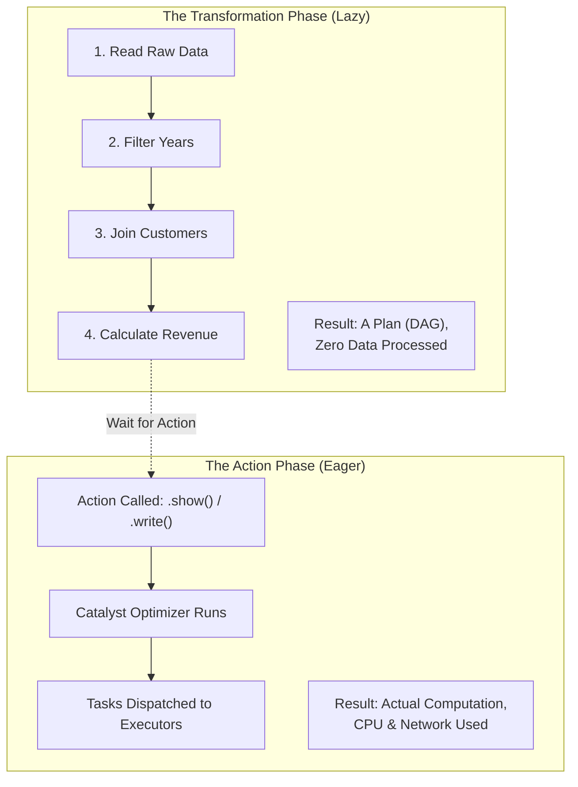

# Lesson 3: PySpark DataFrame CRUD (The Master Guide)

## 🏗️ Phase 1: Absolute Foundations (For Beginners)
Writing your first code on a billion rows.

### 1. What is a "DataFrame"?
A **DataFrame** is just a table (like Excel) that is split across many computers.

### 2. Reading Data
```python
# The "Extract" part of ETL
df = spark.read.csv("data.csv", header=True, inferSchema=True)
```

### 3. Basic Actions
*   `df.show()`: Show me the first 20 rows.
*   `df.printSchema()`: Show me the column names and types.
*   `df.count()`: How many rows are there?

### 4. Lazy Evaluation vs. Eager Execution
Spark doesn't do any work until it absolutely has to. This is called **Lazy Evaluation**.



---

## 🚀 Phase 2: Intermediate (The Developer Level)
### 2. Common Transformations (The Bread & Butter)
```python
from pyspark.sql.functions import col, when, lit, avg

# Adding a new column with logic
df_enriched = df.withColumn("is_vip", when(col("loyalty_points") > 1000, True).otherwise(False))

# Aggregations (Grouping)
df_stats = df_enriched.groupBy("city").agg(
    avg("amount").alias("avg_spend"),
    count("sale_id").alias("total_sales")
)
```

---

## 🎯 Phase 4: Certification & Interview Drill

### 🛡️ Databricks Associate Drill
*   **Narrow vs. Wide Transformations:**
    *   **Narrow:** Each input partition contributes to exactly one output partition. **No Shuffle.** (Examples: `filter`, `select`, `withColumn`, `map`).
    *   **Wide:** Data from multiple input partitions is required to build a single output partition. **Triggers a SHUFFLE.** (Examples: `groupBy`, `join`, `repartition`, `distinct`).
*   **The Drill:** If an interviewer asks "How do I make my job faster?", the answer is usually "Look for Wide transformations and see if they can be minimized or converted to Narrow."

### 🛡️ DP-600 (Microsoft Fabric) Drill
*   **Spark SQL in Fabric:** You don't always need Python. You can create a temporary view and use pure SQL:
    ```python
    df.createOrReplaceTempView("sales_data")
    result = spark.sql("SELECT city, SUM(amount) FROM sales_data GROUP BY 1")
    ```
*   **Save as Table:** In Fabric, use `df.write.format("delta").saveAsTable("gold_sales")`. This registers the data in the **Lakehouse Metadata**, making it instantly available for Power BI.

### 🏢 Consultancy Scenario: "The 500-Line SQL"
**Scenario:** A client has a 500-line SQL query that is unmaintainable. They want it moved to Spark.
*   **Architect Answer:** Don't just paste the SQL into `spark.sql()`. 
*   **The Move:** Break the logic down into multiple **DataFrame steps**. This allows you to:
    1.  Unit test each step.
    2.  Cache intermediate results.
    3.  Follow the "Don't Repeat Yourself" (DRY) principle.

### 🚀 Startup Scenario: "The API Glue"
**Scenario:** You need to extract data from a JSON API, flatten it, and save it to S3.
*   **Answer:** PySpark's `from_json` and `explode` functions are magic for this. You can turn a deeply nested JSON list into a flat table with just 3 lines of code.

### 🏛️ FAANG Scenario: "The Window Function Scale"
**Scenario:** "Calculate the 7-day rolling average of sales for 10 Million unique products."
*   **Answer:** Use `Window` functions with `partitionBy("product_id")`.
*   **The Drill:** Be careful! A large partition (e.g., one product with 100M sales) will cause an OOM. You must ensure your window partitions are small enough to fit into a single executor's memory.

---

### 🧪 Hands-on Labs
- [pyspark_crud_practical.py](pyspark_crud_practical.py) (A full ETL script: Read, Clean, Enrich, and Write)

---

### ✅ Key Takeaways
1. **Narrow Transformations** are fast (no network movement).
2. **Wide Transformations** are slow (requires a Shuffle).
3. **Partitioning on Write** is the most important optimization for the "next person" reading the data.
4. **DataFrames vs SQL:** DataFrames are better for complex, multi-step logic; SQL is better for simple aggregations.
5. **Caching:** If you use a DataFrame more than once, `.cache()` it!

[Next: Lesson 4: Spark Performance (The Optimization Guide) →](../Lesson_4_Spark_Performance/README.md)

---

### 3. Window Functions (The Power Move)
**Concept:** Calculating a value across a group of rows (like an aggregation) but without collapsing the rows.

**Common Use Case:** "Show me the top 3 selling products in each category" or "Calculate the 7-day rolling average."

```python
from pyspark.sql.window import Window
from pyspark.sql.functions import row_number, rank

# Define the "Window"
# Partition by category, Order by sales score
windowSpec = Window.partitionBy("category").orderBy(col("sales_score").desc())

# Apply the Window
df_ranked = df.withColumn("rank", rank().over(windowSpec))

# Filter for the Top 3
df_top3 = df_ranked.filter(col("rank") <= 3)
```

---

## ⚠️ Common Pitfalls (Beginner Mistakes)

1.  **Exploding Joins:** Joining two tables on a key that has `NULL` values on both sides.
    *   **The Issue:** Spark's default behavior will join every `NULL` in Table A to every `NULL` in Table B ($1,000 \text{ nulls} \times 1,000 \text{ nulls} = 1 \text{ Million rows}$ of junk). This can crash your job.
    *   **Fix:** Filter out `NULL`s on your join key before the join, or use `coalesce` to replace them with a dummy value.
2.  **Schema Inference Slowdown:** Using `inferSchema=True` on a 10TB CSV file.
    *   **The Issue:** Spark has to read the **entire file** twice—once to guess the types and once to actually read the data.
    *   **Fix:** Always define your own schema using a `StructType` for large production datasets.
3.  **Overwrite Without Backup:** Using `.mode("overwrite")` on a table that is being used by live dashboards.
    *   **The Issue:** Your dashboard will show "Error: Table not found" during the 5-10 minutes Spark spent overwriting the data.
    *   **Fix:** Use **Delta Lake** which handles overwrites atomically via transaction logs, so the old data remains visible until the new data is 100% ready.
4.  **Misusing `withColumn`:** Calling `.withColumn()` 50 times in a row for minor changes.
    *   **The Issue:** Each call adds a layer to the Catalyst Optimizer's plan. Too many separate calls can lead to a "StackOverflow" error in the driver.
    *   **Fix:** Use `.select()` with multiple expressions to transform multiple columns at once.

---

## 🧪 Practice Exercises

### Exercise 1 — The Schema Builder (Beginner)
**Goal:** Define a StructType.

**You have a file with these columns:** `user_id` (Integer), `name` (String), `joined_at` (Timestamp), `is_active` (Boolean), `balance` (Decimal).

**Your Task:**
Write the Python code to define the `StructType` for this DataFrame so you can read it without using `inferSchema`.

---

### Exercise 2 — The Cleaning Pipeline (Intermediate)
**Goal:** Handle nulls and dates.

**Scenario:** Your `orders` DataFrame has a column `order_date` as a String like `"19-Mar-2024"`. Some `total_amount` values are `None`.

**Your Task:**
1.  Convert `order_date` to a proper Spark Date type.
2.  Fill the `None` values in `total_amount` with the average amount of the whole table.
3.  Add a column `is_high_value` which is True if amount > 1000.

---

### Exercise 3 — Rank the Winners (Architect)
**Goal:** Master Window functions.

**Scenario:** You have a `player_scores` table with `game_id`, `player_name`, and `score`.

**Your Task:**
Write the PySpark code to find the **highest score for each game** and show it in a new column called `max_game_score` alongside every row in the original table. (Hint: Use `partitionBy("game_id")` and `max()`).

---

## 💼 Common Interview Questions

**Q1: What is the difference between `.filter()` and `.where()` in PySpark?**
> There is **no difference**. `.where()` is simply an alias for `.filter()`, provided for developers who are more comfortable with SQL syntax. They both generate the exact same logical plan in Spark.

**Q2: Explain the difference between `repartition()` and `coalesce()`.**
> `repartition(N)` increases or decreases the number of partitions by performing a **Full Shuffle** of the data across the cluster. It ensures partitions are of equal size. `coalesce(N)` can only **decrease** the number of partitions and tries to minimize shuffles by merging local partitions. Use `repartition` when you need to increase parallelism or fix data skew; use `coalesce` when you want to reduce partitions before saving to disk.

**Q3: When should you use Spark SQL vs. the DataFrame API?**
> Use the **DataFrame API** for complex, modular, and reusable code (e.g., building a data framework). It is easier to unit test and refactor. Use **Spark SQL** for simple, one-off aggregations or when working with business analysts who already know SQL. Both perform exactly the same because they are both optimized by the Catalyst engine.

**Q4: How do you handle "Semi-Structured" data (JSON/Nested Arrays) in PySpark?**
> You use the `explode()` function to turn arrays into individual rows, and the `get_json_object()` or `from_json()` functions with a schema to extract fields from JSON strings. This allows Spark to "flatten" complex nested structures into standard tables.

**Q5: What is the risk of using `.collect()` in a Spark script?**
> `.collect()` sends every single row of a distributed DataFrame to the memory of the **Driver** node. If the data is larger than the Driver's RAM (e.g., 100GB of data on a 16GB RAM driver), it will trigger an **OutOfMemory (OOM) error** and crash your entire Spark application. Always aggregate or `.limit()` your data before calling `.collect()`.
