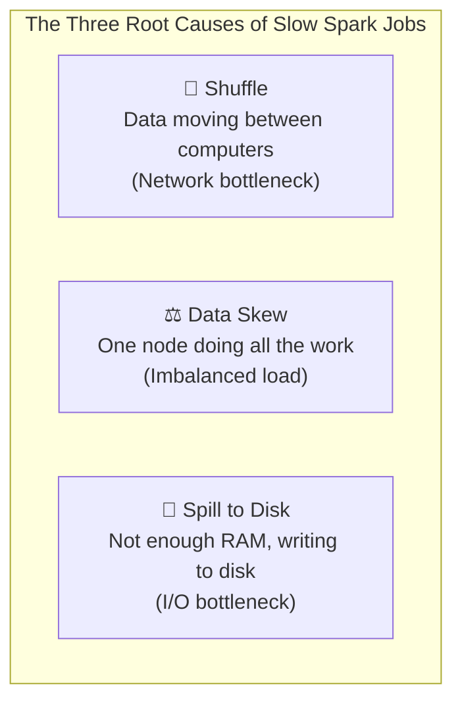

# Lesson 4: Spark Performance Tuning (The Master Guide)

> **Goal:** Turn 3-hour Spark jobs into 3-minute ones. Understand the three root causes of slow Spark jobs (Shuffle, Skew, Spill) and the professional weapons to fight each one.

---

## 🏗️ Phase 1: Absolute Foundations (For Beginners)
Why is my Spark job taking 3 hours?

### 1. The Three Performance Killers



### 2. What is a "Shuffle"?

Imagine a classroom of 100 students. The teacher says: **"Everyone who shares a last name, group up!"**

Every student has to stand up, walk around, and find their group. This chaos is a **Shuffle** in Spark.

In Spark terms: All data with the same **key** (e.g., same `customer_id`) must end up on the **same executor** for operations like `GROUP BY`, `JOIN`, or `DISTINCT`. Moving that data across the network is the shuffle.

```
Without Shuffle:
Executor 1: [CustomerA data] → LocalSum → Done (Fast!)

With Shuffle:
Executor 1: [Some CustomerA data] → NETWORK → Executor 3: [All CustomerA data] → GroupSum (Slow!)
```

### 3. What is "Data Skew"?

Imagine in the classroom, 80 students all have the last name "Sharma" and 20 students each have a unique name.

-  The "Sharma" group takes 1 hour to sort themselves out.
-  All other 20 "unique name" students finish in 5 minutes.
-  **Spark is only as fast as its slowest Executor!**

```python
# You can detect skew by checking partition sizes
# If one partition has 10x more rows than others → SKEW!
df.groupBy(spark_partition_id()).count().orderBy("count", ascending=False).show()
```

---

## 🚀 Phase 2: Intermediate (The Developer Level)

### 1. Broadcast Joins — The #1 Weapon Against Shuffle

**Rule:** If one of your JOIN tables is small (< 10MB by default, up to ~200MB), Spark can **broadcast** (copy) it to every single executor. Now executors join locally and there is **zero network shuffling**.

```python
from pyspark.sql import SparkSession
from pyspark.sql.functions import broadcast, col

spark = SparkSession.builder.getOrCreate()

# Scenario: 100M row fact table joined with a 500-row country lookup table
df_sales = spark.read.parquet("s3://bucket/fact_sales/")   # 100 million rows
df_country = spark.read.parquet("s3://bucket/dim_country/") # 500 rows

# ❌ BAD: Without broadcast hint — Spark shuffles BOTH sides!
df_bad = df_sales.join(df_country, "country_code")   # Expensive shuffle

# ✅ GOOD: With broadcast hint — country table is copied to every node
df_good = df_sales.join(broadcast(df_country), "country_code")   # Zero shuffle!

# You can also configure auto-broadcast threshold
spark.conf.set("spark.sql.autoBroadcastJoinThreshold", 50 * 1024 * 1024)  # 50MB
```

**Impact:** A 60-minute join can become a 60-second join after adding `broadcast()`.

### 2. Salting — The Weapon Against Data Skew

**The Problem:** `customer_id = 9999` appears in 80% of your rows. All those rows go to ONE executor.

**The Fix: Salting** — Add a random "salt" number to create artificial keys that spread the data evenly.

```python
from pyspark.sql.functions import col, concat_ws, lit, rand, floor

# ❌ BEFORE Salting: customer 9999 creates one massive partition
df = df_sales.groupBy("customer_id").sum("amount")
# One executor is processing 80M rows while others process 100 rows each. SLOW!

# ✅ AFTER Salting: Spread the skewed key across N buckets
N_BUCKETS = 10

# Step 1: Add a random salt (0-9) to the fact table's key
df_sales_salted = df_sales.withColumn(
    "salted_customer_id",
    concat_ws("_", col("customer_id"), (floor(rand() * N_BUCKETS)).cast("int"))
    # Creates: "9999_0", "9999_1", ..., "9999_9" — distributes the load!
)

# Step 2: Explode the small dim_ table with all N copies of each key
# (so we can still join correctly after salting)
from pyspark.sql import functions as F
df_customer_exploded = df_customer.withColumn(
    "salt", F.explode(F.array([F.lit(i) for i in range(N_BUCKETS)]))
).withColumn(
    "salted_customer_id",
    concat_ws("_", col("customer_id"), col("salt"))
)

# Step 3: Join on the salted key → now evenly distributed!
df_joined = df_sales_salted.join(df_customer_exploded, "salted_customer_id")

# Step 4: Aggregate normally — customer_id level grouping
df_result = df_joined.groupBy("customer_id").sum("amount")
```

### 3. Partitioning Strategies

**Choosing the right number of partitions is critical:**

```python
# Check current number of partitions
print(f"Number of partitions: {df.rdd.getNumPartitions()}")

# Rule of thumb: 2-3 partitions per CPU core in your cluster
# If you have 100 cores → aim for 200-300 partitions

# Too FEW partitions → Executors are underutilized (some sit idle)
# Too MANY partitions → High overhead from managing thousands of tiny tasks

# Repartition: Increases or decreases partitions (TRIGGERS A SHUFFLE!)
df_repartitioned = df.repartition(200)

# Coalesce: ONLY decreases partitions (NO full shuffle — much cheaper!)
df_smaller = df.coalesce(10)

# Partition by a specific column (great before writing)
df.repartition(col("country_code"))  # All "USA" rows go to same partition

# Check partition size BEFORE writing:
df.rdd.mapPartitions(lambda x: [sum(1 for _ in x)]).collect()
```

---

## 🏛️ Phase 3: Architect (The Professional Level)

### 1. Caching and Persistence — Avoid Re-reading the Same Data

```python
from pyspark import StorageLevel

# Problem: You use df_clean in 5 different transformations
# Without cache: Spark RE-READS the source file 5 times! Very slow.

# Step 1: Cache the DataFrame in memory after first computation
df_clean = (
    df_raw
    .filter(col("amount") > 0)
    .dropna(subset=["customer_id"])
    .withColumn("country_normalized", upper(col("country")))
)
df_clean.cache()             # Default: MEMORY_AND_DISK
df_clean.count()             # ACTION: Forces the cache to materialize now

# Step 2: Now all 5 uses of df_clean read from RAM — not disk!
summary = df_clean.groupBy("country_normalized").count()
top_customers = df_clean.orderBy(col("amount").desc()).limit(100)

# Always unpersist when done (free up memory for other jobs!)
df_clean.unpersist()

# Storage Levels for fine-grained control:
# MEMORY_ONLY         → Fastest, but drops if not enough RAM
# MEMORY_AND_DISK     → Spills to disk if not enough RAM (default)
# DISK_ONLY           → Always on disk (slow but saves RAM for compute)
# MEMORY_ONLY_SER     → Serialized (compressed) in memory — good for large DataFrames
df.persist(StorageLevel.MEMORY_AND_DISK_SER)
```

### 2. Bucketing — Pre-sorting Data to Eliminate Future Shuffles

**Bucketing** is like putting data into labeled bins when you save it. Future joins on the same buckets skip the shuffle entirely.

```python
# Write with bucketing (this is a one-time cost when saving)
df_orders.write \
    .bucketBy(256, "customer_id") \   # Pre-sort into 256 buckets by customer_id
    .sortBy("customer_id") \
    .saveAsTable("warehouse.fact_orders_bucketed")

# When you read AND join on customer_id — NO SHUFFLE!
df_bucketed = spark.table("warehouse.fact_orders_bucketed")
df_customers_also_bucketed = spark.table("warehouse.dim_customers_bucketed")

# This join has ZERO shuffle because both tables are bucketed by customer_id
result = df_bucketed.join(df_customers_also_bucketed, "customer_id")
```

### 3. Dynamic Partition Pruning (DPP)

DPP allows Spark to skip reading entire data folders by pushing filters through joins.

```sql
-- In Databricks SQL, DPP is automatic when:
-- 1. The filter table is smaller (dimension table)
-- 2. The large table is partitioned by the join key

-- Example: fact_sales is partitioned by region
-- dim_region filters to only "APAC" stores

SELECT fs.amount, ds.store_name
FROM fact_sales fs                        -- Partitioned by region_id
JOIN dim_region dr ON fs.region_id = dr.region_id
WHERE dr.region_name = 'APAC';

-- Without DPP: Reads ALL partitions of fact_sales, then filters
-- WITH DPP:    Only reads fact_sales partitions for APAC! Massive savings!
```

### 4. Adaptive Query Execution (AQE) — Spark's Auto-Tuner

In Spark 3.0+, **AQE** automatically optimizes your job MID-EXECUTION based on actual runtime statistics.

```python
# Enable AQE (it's on by default in Spark 3.2+)
spark.conf.set("spark.sql.adaptive.enabled", "true")
spark.conf.set("spark.sql.adaptive.coalescePartitions.enabled", "true")  # Auto-merge small partitions
spark.conf.set("spark.sql.adaptive.skewJoin.enabled", "true")            # Auto-fix skewed joins!

# AQE can:
# 1. Automatically convert a SortMergeJoin to a BroadcastHashJoin mid-run
# 2. Automatically coalesce small partitions after a shuffle
# 3. Automatically detect and handle data skew in joins (without manual salting!)
```

### 5. The Spark UI Survival Guide (The Architect's Console)
The Spark UI (port 4040) is the only way to know what is actually happening "under the hood."

#### A. How to spot SKEW
1. Open the **Stages** tab and click on the slowest stage.
2. Look at the **Summary Metrics** (Tasks) table.
3. **The Tell:** If the **Max** task time is `45 minutes` but the **Median** is only `10 seconds`, you have **SKEW**. One task is holding up the entire stage.

#### B. How to spot DISK SPILL
1. In the **Stages** tab, look for the column labeled **"Spill (Memory)"** and **"Spill (Disk)"**.
2. **The Tell:** If you see any numbers here (e.g., `2.1 GB`), your executors ran out of RAM! Spark had to "spill" that data to the local disk. This makes the stage 5x-10x slower because disk I/O is the ultimate bottleneck.

#### C. How to spot SHUFFLE bottlenecks
1. Look at the **Shuffle Read** and **Shuffle Write** columns.
2. **The Tell:** If you see hundreds of GBs being shuffled for a simple join, you are likely missing a **Broadcast Join** or your partitioning needs optimization. Shuffling data over the network is the most expensive thing Spark does.

#### D. The Timeline View
Use the **Event Timeline** to see if executors are sitting idle. If most executors are "Empty" while one is "Blue" (Processing), you have a parallelism problem.

---

## 🎯 Phase 4: Certification & Interview Drill

### 🛡️ Databricks Associate Drill
*   **Broadcast Join Threshold:** The default is **10MB**. 
    *   **The Drill:** If your table is 50MB, Spark will NOT broadcast it automatically. You must use the `broadcast()` hint.
*   **AQE Skew Join:** In Spark 3.0+, if you set `spark.sql.adaptive.skewJoin.enabled` to `true`, Spark will automatically detect skew and perform "Salting" for you behind the scenes.

### 🛡️ DP-600 (Microsoft Fabric) Drill
*   **Memory Management:** Fabric uses "CU" (Capacity Units). If your Spark job spills to disk, you're not just losing time — you're burning "CUs" which costs more money. 
*   **Persistence:** Use `df.persist()` if you are iterating over the same dataset in multiple Notebook cells.

### 🏢 Consultancy Scenario: "The Cloud Bill"
**Scenario:** A client's AWS bill for Databricks is $50,000/month. They want to cut it in half.
*   **Architect Answer:** Check the **Shuffle** metrics. If they are shuffling 100TB of data daily, suggest **Bucketing** on the join keys. This eliminates the shuffle, reducing cluster uptime and saving thousands of dollars in network and compute costs.

### 🚀 Startup Scenario: "The Manual Salt"
**Scenario:** You're on an old version of Spark (version 2.4) that doesn't have AQE. How do you fix a skewed join?
*   **Answer:** **Manual Salting.** (See the code example in Phase 2 above). Show the interviewer that you understand the "Math" of salting even when the engine doesn't do it for you.

### 🏛️ FAANG Scenario: "The Predicate Pushdown failure"
**Scenario:** You have a 10TB table partitioned by `date`. You filter for `date = '2024-03-19'`, but Spark still reads the entire 10TB. Why?
*   **Answer:** **Data Type Mismatch.** If the column `date` is a STRING and you filter with a DATE object, or vice-versa, the Catalyst optimizer might fail to "Push Down" the filter.
*   **The Drill:** Always ensure your filter constants match the column's data type exactly. Check `df.explain()` to verify.

---

### 🧪 Hands-on Labs
- [spark_performance_optimization.py](spark_performance_optimization.py) (Fixing a skewed join and using Broadcast)

---

### ✅ Key Takeaways
1. **Shuffle** is data moving across the wire (Network bottleneck).
2. **Skew** is one executor doing all the heavy lifting (Imbalanced load).
3. **Spill** is writing RAM data to Disk (I/O bottleneck).
4. **Broadcast Join** skips the shuffle for small tables.
5. **AQE** is your best friend in Spark 3.0+. Turn it on!
6. **explain()** is the only way to know if your optimization actually worked.

[Next Chapter: Phase 4: Databricks Mastery →](../../Phase_4_Databricks_Mastery/README.md)

---

## ⚠️ Common Pitfalls (Beginner Mistakes)

1.  **Broadcasting Too Much:** Forcing a broadcast on a 1GB table when your executors only have 2GB of RAM.
    *   **The Issue:** Spark will try to copy that 1GB to EVERY executor. This will leave no room for the actual join processing or other variables, leading to an immediate **OutOfMemory (OOM)** crash.
    *   **Fix:** Only broadcast tables that are significantly smaller than your available executor memory (usually < 200MB).
2.  **The "Spill" Blindness:** Ignoring the "Spill (Memory)" and "Spill (Disk)" columns in the Spark UI.
    *   **The Issue:** Spill means Spark is having to write temporary data to disk because it ran out of RAM. This makes your job 5-10x slower but it might still "successfully" finish, hiding a massive performance leak.
    *   **Fix:** Increase `spark.executor.memory` or increase the number of partitions to make chunks smaller.
3.  **Caching at the Start:** Caching a raw DataFrame immediately after reading it.
    *   **The Issue:** Why cache the raw data if you are immediately going to filter out 90% of it? You are wasting storage memory on data you'll never use.
    *   **Fix:** Apply your filters and cleaning transformations **first**, then `.cache()` the refined dataset.
4.  **Partitioning by High-Cardinality Columns:** Using `.partitionBy("user_id")` when writing billions of rows to S3/ADLS.
    *   **The Issue:** This will create millions of tiny folders on your file system. Cloud storage is extremely slow at managing "Millions of tiny files," and your next read job will take hours just to list the files.
    *   **Fix:** Partition by low-cardinality columns like `year`, `month`, or `region`.

---

## 🧪 Practice Exercises

### Exercise 1 — The Broadcast Math (Beginner)
**Goal:** Decide if a broadcast is safe.

**Cluster Config:**
- 10 Executors
- Each Executor has 4GB RAM.
- `dim_products` is 500MB (uncompressed in memory).

**Your Task:**
1.  If you broadcast `dim_products`, how much total RAM is used across the cluster for this table?
2.  Would you recommend broadcasting this table? Why or why not?

---

### Exercise 2 — Identifying Skew (Intermediate)
**Goal:** Use the Spark UI conceptualization.

**Scenario:** You look at a finished Stage in the Spark UI.
- **Min Task Time:** 2 seconds
- **Median Task Time:** 5 seconds
- **Max Task Time:** 45 minutes

**Your Task:**
1.  Which of the "Three Performance Killers" (Shuffle/Skew/Spill) is happening here?
2.  Name one technique you would use to fix this if it's happening during a `JOIN`.

---

### Exercise 3 — The Salting Code (Architect)
**Goal:** Implement manual salting.

**Scenario:** You are joining `fact_orders` (Skewed on `store_id`) and `dim_stores`.

**Your Task:**
Write the pseudo-code (or PySpark) to:
1.  Add a random salt column (1-5) to `fact_orders`.
2.  Create 5 duplicate copies of every store in `dim_stores` so the join still works.

---

## 💼 Common Interview Questions

**Q1: What is a Broadcast Join and why is it faster than a Sort-Merge Join?**
> A Broadcast Join copies the entire small table to every executor in the cluster. This allows the join to happen locally on each machine with **zero network movement** (shuffling). A Sort-Merge Join requires both tables to be sorted and shuffled across the network so that matching keys end up on the same machine, which is exponentially slower and more resource-intensive.

**Q2: How do you handle Data Skew in Spark?**
> 1. **AQE (Adaptive Query Execution):** In Spark 3.0+, turn on `skewJoin.enabled` to let Spark handle it automatically.
> 2. **Salting:** Manually add a random prefix to the join keys of the skewed table to spread the data across more partitions, and duplicate the other table's keys to match.
> 3. **Broadcast:** If the other table is small, broadcasting it avoids the join-shuffle entirely, making the skew irrelevant.

**Q3: When would you use `.persist()` instead of `.cache()`?**
> `.cache()` is just a shortcut for `.persist(StorageLevel.MEMORY_AND_DISK)`. Use `.persist()` directly when you need finer control, such as **MEMORY_ONLY_SER** (to save space by compressing data in RAM) or **DISK_ONLY** (when you have a massive intermediate result that you don't want to recompute but it's too big for RAM).

**Q4: What is "Predicate Pushdown" and how does it improve performance?**
> Predicate Pushdown is an optimization where Spark "pushes" your filters (the `WHERE` clause) down to the data source (like Parquet or a SQL DB). This means Spark only reads the specific rows/files it needs, instead of reading the entire table and filtering it in memory. This drastically reduces the amount of I/O and network traffic.

**Q5: What is "Z-Ordering" and how does it relate to Spark performance?**
> Z-Ordering is a technique (often used in Delta Lake) to co-locate related information in the same files. Unlike standard partitioning which is rigid, Z-Ordering maps multiple dimensions into a single one-dimensional space. This makes "Multi-dimensional" queries (e.g., filtering by both `Date` and `ProductID`) much faster because Spark can skip even more files using file-level statistics.
