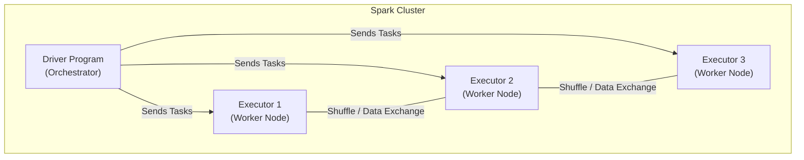

# ⚡ Phase 3: Big Data & PySpark — Processing at Scale

> **Goal:** Standard databases fail when data reaches Terabytes. By the end of this phase, you will master **Apache Spark**, the industry standard for processing massive datasets across clusters of computers.

---

## 🏗️ The Spark Architecture (Driver & Executors)

---

## 📚 Lessons in This Phase

| # | Lesson | Key Concepts | Certification Focus |
|---|--------|-------------|:---:|
| [1](./Lesson_1_Why_Spark/README.md) | **Why Spark?** | Distributed Computing, RDDs vs DataFrames | **All** |
| [2](./Lesson_2_Spark_Architecture/README.md) | **Cluster Internals** | Driver, Executors, Jobs, Stages, Tasks | **Databricks Associate** |
| [3](./Lesson_3_DataFrame_CRUD/README.md) | **Python DataFrames** | Transformations vs Actions, Lazy Evaluation | **Databricks Associate** |
| [4](./Lesson_4_Spark_Performance/README.md) | **Optimization** | Shuffling, Caching, Broadcast Joins | **Expert** |
| [5](./Lesson_5_Shuffle_and_Joins/README.md) | **🔥 Shuffle & Joins Deep Dive** | All 4 join strategies, reduceByKey vs groupByKey, shuffle cost, shuffle.partitions | **Expert / FAANG** |
| [6](./Lesson_6_Memory_Management/README.md) | **🔥 Memory Management** | Executor memory layout, unified pool, off-heap, GC tuning, spill, Kryo | **Expert / FAANG** |
| [7](./Lesson_7_Data_Skew/README.md) | **🔥 Data Skew** | Detecting skew, salting, AQE skew join, isolating hot keys, window OOM | **Expert / FAANG** |
| [8](./Lesson_8_File_Formats_and_Delta_Lake/README.md) | **🔥 File Formats & Delta Lake** | Parquet internals, column pruning, row group stats, Delta ACID, Z-ORDER, MERGE | **Databricks Pro / Expert** |
| [9](./Lesson_9_Catalyst_and_AQE/README.md) | **🔥 Catalyst Optimizer & AQE** | 4 optimization phases, predicate pushdown, AQE features, DPP, Tungsten WSCG | **Expert / FAANG** |
| [10](./Lesson_10_Production_and_Debugging/README.md) | **🔥 Production & Debugging** | Spark UI mastery, OOM decision tree, anti-patterns, Medallion architecture, JDBC reads | **All / Production** |

---

## 🎯 Phase 4: Certification & Interview Drill

### 🛡️ Databricks Associate Drill
*   **Lazy Evaluation:** Spark doesn't run your code immediately. It builds a **Logical Plan** (DAG). It only executes when you call an **Action** (like `.collect()`, `.count()`, or `.save()`).
*   **Partitioning:** Data is split into "Partitions". Each task processes one partition. If your partitions are too big, you'll get `OutOfMemory` errors. If too small, you'll have too much overhead.

### 🛡️ DP-600 (Microsoft Fabric) Drill
*   **Spark in Fabric:** Fabric uses **Spark pools**. You can write PySpark in a **Notebook** and save the results directly as **Delta Tables** in OneLake.
*   **V-Order:** Fabric automatically optimizes Parquet files (V-Order) to make them read faster by Power BI.

### 🏢 Consultancy Scenario: "The Join Killer"
**Scenario:** A client has a Join between two tables. It has been running for 2 hours and hasn't finished.
*   **Architect Answer:** You likely have **Data Skew** (one key has 90% of the data) or you are triggering a massive **Shuffle**.
*   **The Move:** Check if one table is small enough (<10MB) to use a **Broadcast Join**. If both are large, use **Salting** to spread the skewed key across multiple partitions.

### 🚀 Startup Scenario: "The Single Machine"
**Scenario:** You don't have a cluster, but your data is too big for Pandas (8GB CSV on a 16GB RAM laptop).
*   **Answer:** Use **PySpark** on your local machine. It will use all your CPU cores and manage memory much better than Pandas. Or use **DuckDB** for a lighter alternative.

### 🏛️ FAANG Scenario: "The Memory Leak"
**Scenario:** Your Spark job fails with `ExecutorLostFailure` (OOM). How do you debug?
*   **Answer:** Open the **Spark UI**. Look for **Disk Spill**. This means your memory is full and Spark is writing temporary data to disk. 
*   **The Drill:** Increase the number of partitions (to make chunks smaller) or increase the `spark.executor.memory`.

---

### 🏛️ Architect's Tip
> "In Spark, **Network** is your enemy. The fastest query is the one that avoids a **Shuffle**. Filter early, join late, and broadcast small tables."

[Start with Lesson 1: Why Spark? →](./Lesson_1_Why_Spark/README.md)
