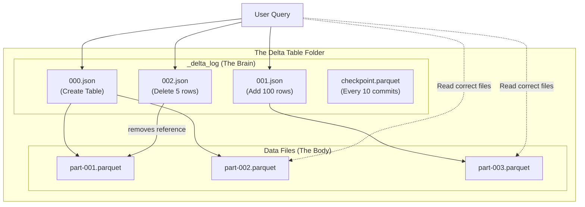

# Lesson 1: Delta Lake Essentials (The Master Guide)

> **Goal:** Understand why traditional data lakes are unreliable, how Delta Lake's transaction log solves every problem, and how to use ACID transactions and Time Travel in production.

---

## 🏗️ Phase 1: Absolute Foundations (For Beginners)

### 1. The Problem with a "Plain" Data Lake

A **Data Lake** (e.g., AWS S3, Azure ADLS) is just a giant folder full of files. It's cheap and flexible — but it has critical problems:

| Problem | What Happens | Why It's Bad |
|---------|-------------|-------------|
| **No Transactions** | Two Spark jobs write simultaneously → files corrupted | You lose data |
| **No Schema Enforcement** | Someone uploads a file with a typo column name | Downstream queries silently return wrong results |
| **No Updates** | To change 1 row, you must rewrite the entire folder | Extremely expensive for corrections |
| **No Deletes** | GDPR says "delete this user's data" → you can't! | Legal liability |
| **Partial Writes** | Job crashes halfway → half the data is missing | Users see half the data (worse than no data) |
| **No History** | Data is overwritten → can't go back | Can't investigate what went wrong |

### 2. What is Delta Lake?

**Delta Lake** is an **open-source storage layer** that adds a brain (the `_delta_log`) on top of your existing Parquet files. It turns a dumb file system into a smart, reliable database.

```
Before Delta Lake (Plain Data Lake):
📁 s3://bucket/fact_sales/
├── part-00001.parquet  (who wrote this? when? is it complete?)
├── part-00002.parquet  (corrupted? complete?)
└── part-00003.parquet  (from two simultaneous writers!)

After Delta Lake:
📁 s3://bucket/fact_sales/
├── _delta_log/              ← THE BRAIN (the transaction log)
│   ├── 00000000000000000000.json  (initial creation)
│   ├── 00000000000000000001.json  (first write: 1M rows added)
│   ├── 00000000000000000002.json  (MERGE: updated 50 rows)
│   └── 00000000000000000003.json  (OPTIMIZE: files compacted)
├── part-00001.parquet
├── part-00002.parquet
└── part-00003.parquet
```

### 3. The Anatomy of a Delta Table
Delta Lake stores metadata and data together in the same directory. The **_delta_log** is the brain, and the **Parquet files** are the body.



### 4. ACID Transactions Explained Simply

| Letter | Property | Example |
|--------|---------|---------|
| **A**tomicity | ALL or NOTHING | Either all 1M rows load, or NONE do. No "half-loaded" tables. |
| **C**onsistency | Rules are always followed | You can't write a string into an INT column. |
| **I**solation | Concurrent writers don't see each other | 10 jobs writing simultaneously don't corrupt each other. |
| **D**urability | Committed data is safe forever | Power cut after COMMIT → data is safe. It was committed. |

---

## 🚀 Phase 2: Intermediate (The Developer Level)

### 1. Working with Delta Tables

```sql
-- CREATE a Delta table (just add FORMAT = DELTA)
CREATE TABLE IF NOT EXISTS silver.fact_sales (
    sale_id        INT,
    customer_id    INT,
    product_id     INT,
    sale_date      DATE,
    amount         DECIMAL(12,2),
    region         STRING
)
USING DELTA
PARTITIONED BY (region, year(sale_date))
LOCATION 'abfss://data@storage.dfs.core.windows.net/silver/fact_sales/';

-- DESCRIBE to inspect a Delta table
DESCRIBE EXTENDED silver.fact_sales;

-- DESCRIBE HISTORY — see every change ever made
DESCRIBE HISTORY silver.fact_sales;
-- Shows: version, timestamp, operation, operationParameters, numOutputRows
```

### 2. Schema Enforcement and Evolution

```python
# Schema Enforcement (the GUARD):
# If you try to write a DataFrame that doesn't match the table schema → BLOCKED!

df_wrong = spark.createDataFrame([(1, "bad_string_in_amount")], ["sale_id", "amount"])

# This FAILS loudly — it won't silently corrupt your data:
df_wrong.write.format("delta").mode("append").saveAsTable("silver.fact_sales")
# AnalysisException: Failed to merge incompatible data types StringType and DecimalType

# Schema Evolution (the DOOR):
# If you need to ADD a new column to an existing Delta table:
df_with_new_col = df_old.withColumn("discount_pct", lit(0.0))

df_with_new_col.write \
    .format("delta") \
    .mode("append") \
    .option("mergeSchema", "true")  # ← Allows adding new columns automatically!
    .saveAsTable("silver.fact_sales")
# Now also works with:
spark.conf.set("spark.databricks.delta.schema.autoMerge.enabled", "true")
```

### 3. Time Travel — Undo Mistakes and Audit History

```sql
-- View the table as it was 5 versions ago
SELECT * FROM silver.fact_sales VERSION AS OF 5;

-- View the table as it was at an exact point in time
SELECT * FROM silver.fact_sales TIMESTAMP AS OF '2024-03-18 14:00:00';

-- RESTORE: Actually roll back the table to a previous version!
RESTORE TABLE silver.fact_sales TO VERSION AS OF 5;
-- or
RESTORE TABLE silver.fact_sales TO TIMESTAMP AS OF '2024-03-18 14:00:00';

-- Real-world use case: A pipeline bug loaded wrong data
-- Step 1: Identify the bad version
DESCRIBE HISTORY silver.fact_sales;

-- Step 2: Verify the good version
SELECT COUNT(*), SUM(amount) FROM silver.fact_sales VERSION AS OF 12;
-- (looks correct)

-- Step 3: Restore to the good version
RESTORE TABLE silver.fact_sales TO VERSION AS OF 12;
-- Done! No data loss, no reprocessing needed.
```

---

## 🏛️ Phase 3: Architect (The Professional Level)

### 1. The `_delta_log` — The Heart of Delta Lake

Every Delta table has a `_delta_log` folder containing JSON files (one per transaction):

```json
// _delta_log/00000000000000000001.json
// This is what a "write" transaction looks like inside:
{
  "add": {
    "path": "part-00001-abc123.parquet",
    "partitionValues": {"region": "APAC", "year": "2024"},
    "size": 104857600,
    "stats": {
      "numRecords": 500000,
      "minValues": {"sale_date": "2024-01-01"},
      "maxValues": {"sale_date": "2024-01-31"}
    }
  }
}

// This is what a "delete" or "update" looks like (the old file is marked REMOVED):
{
  "remove": {
    "path": "part-00001-abc123.parquet",
    "deletionTimestamp": 1710768000000
  }
}
```

**What this gives you:**
-  `add` entries track which files make up the CURRENT table
-  `remove` entries mark files as deleted (but files stay for Time Travel!)
-  Statistics (`minValues`, `maxValues`) enable **Data Skipping** → skip files that can't match your WHERE clause

### 2. Data Skipping — The Secret Weapon

```sql
-- Delta stores min/max stats for every Parquet file in the _delta_log
-- When you query with a filter:
SELECT * FROM silver.fact_sales WHERE sale_date = '2024-03-19';

-- Delta checks the stats for each file:
-- part-00001.parquet: sale_date min=2024-01-01, max=2024-01-31 → SKIP! (can't have March)
-- part-00002.parquet: sale_date min=2024-03-01, max=2024-03-31 → READ (might have March 19)
-- part-00003.parquet: sale_date min=2024-04-01, max=2024-04-30 → SKIP! (no March here)

-- Result: 90% of files skipped automatically → 10x faster query!
-- This is called "Data Skipping" and it's FREE — no extra code needed.
```

### 3. Deletion Vectors — Fast Deletes Without Rewriting Files

In Delta 2.0+ (Databricks Runtime 11.2+), deletes don't rewrite the entire Parquet file. Instead, they write a small **Deletion Vector** — a bitmap marking which rows are deleted.

```sql
-- Enable Deletion Vectors on your table
ALTER TABLE silver.fact_sales
SET TBLPROPERTIES ('delta.enableDeletionVectors' = 'true');

-- GDPR Right to be Forgotten: Delete a specific customer's data
DELETE FROM silver.fact_sales WHERE customer_id = 10001;
-- Without DV: Rewrites ALL Parquet files (very slow for 1 row deletion!)
-- With DV:    Writes a tiny .bin file marking those rows as deleted (instant!)

-- The rows are "soft deleted" immediately (queries skip them automatically)
-- The actual space is freed during the next OPTIMIZE run
```

### 4. OPTIMIZE and Z-ORDER

Over time, small Spark jobs create thousands of tiny Parquet files (the "small file problem"). This makes queries slow because the file system has to open and read metadata for each file.

```sql
-- OPTIMIZE: Merge small files into optimal-sized files (target: 256MB each)
OPTIMIZE silver.fact_sales;

-- Z-ORDER: Sort data within files by commonly-filtered columns
-- Combines data skipping with physical co-location
OPTIMIZE silver.fact_sales ZORDER BY (customer_id, sale_date);
-- Now data is sorted: all customer 101's records are in the same file(s)
-- When you filter WHERE customer_id = 101, only 1-2 files need to be read!

-- In Databricks, set AUTO OPTIMIZE to run automatically:
ALTER TABLE silver.fact_sales
SET TBLPROPERTIES (
    'delta.autoOptimize.optimizeWrite' = 'true',   -- Optimize during every write
    'delta.autoOptimize.autoCompact'   = 'true'    -- Compact after writes automatically
);
```

### 5. VACUUM — Cost Management

Time Travel is useful, but old file versions cost money. `VACUUM` permanently deletes old versions.

```sql
-- Default: Keep 7 days of history (168 hours)
VACUUM silver.fact_sales;

-- Custom: Keep only 3 days
VACUUM silver.fact_sales RETAIN 72 HOURS;

-- ⚠️ WARNING: After VACUUM, you can't Time Travel to deleted versions!
-- Before vacuuming, set an appropriate retention period:
-- For GDPR: keep 30 days (need to prove deletion)
-- For cost: keep 7 days (standard)
-- For compliance: keep 90 days (some regulations require it)

-- Check how much space you'll free BEFORE running:
VACUUM silver.fact_sales DRY RUN;
```

### 6. Delta Lake vs. Apache Iceberg vs. Apache Hudi

| Feature | Delta Lake | Apache Iceberg | Apache Hudi |
|---------|-----------|---------------|-------------|
| **Primary Backer** | Databricks | Netflix/Apple | Uber/AWS |
| **Time Travel** | Yes | Yes | Yes |
| **ACID** | Yes | Yes | Yes |

---

## 🎯 Phase 4: Certification & Interview Drill

### 🛡️ Databricks Associate Drill
*   **The Log Checkpoint:** Every 10 commits, Delta creates a **Checkpoint** (.parquet) file in the `_delta_log`. This prevents Spark from having to read thousands of JSON files to understand the current state of a table.
*   **Version History:** You can query `version_as_of` or `timestamp_as_of`. These are core certification questions.

### 🛡️ DP-600 (Microsoft Fabric) Drill
*   **OneLake Shortcuts:** In Fabric, you can create a "Shortcut" to a Delta table living in Databricks (AWS/Azure). This allows Power BI to read Databricks data WITHOUT moving it. This is the **Zero-ETL** future.

### 🏢 Consultancy Scenario: "The Multi-Cloud Client"
**Scenario:** A client uses AWS Databricks for processing but wants to use Google BigQuery for BI. They are worried about "Vendor Lock-in" with Delta.
*   **Architect Answer:** Delta Lake is **Open Source (Linux Foundation)**. BigQuery, Snowflake, and Synapse can all read Delta files natively. You are not locked into Databricks; you are simply using an open standard that all clouds support.

### 🚀 Startup Scenario: "The Fatal Update"
**Scenario:** A junior developer accidentally ran `UPDATE users SET email = 'DELETED'` without a WHERE clause. The production user table is ruined.
*   **Answer:** **Time Travel to the rescue.**
*   **The Command:** `RESTORE TABLE users TO VERSION AS OF <last_good_version>`. The startup is back online in 30 seconds.

### 🏛️ FAANG Scenario: "The Metadata Bottleneck"
**Scenario:** You have a table with 10 Million small files. Even with Delta, the `DESCRIBE HISTORY` and `SELECT` are slow because the `_delta_log` JSON files are too many.
*   **Answer:** You have a **Metadata Problem**.
*   **The Drill:** Run `OPTIMIZE` to compact the data files. Then, adjust the `delta.checkpointInterval` and run `VACUUM` to clean up the old transaction logs. At FAANG scale (Petabytes), managing the log is as important as managing the data.

---

### 🧪 Hands-on Labs
- [delta_acid_lab.py](delta_acid_lab.py) (Demonstrating ACID and Time Travel)

---

### ✅ Key Takeaways
1. **Delta Log (`_delta_log`)** is the source of truth for every Delta table.
2. **ACID transactions** make data lakes behave like a professional database.
3. **Time Travel** allows you to query any previous version of your data.
4. **Schema Enforcement** prevents "Garbage In, Garbage Out".
5. **Medallion Architecture** (Bronze/Silver/Gold) is the best practice for organizing a Lakehouse.
6. **Open Standard:** Delta is not a Databricks-only feature; it belongs to the Linux Foundation.

[Next: Lesson 2: Advanced Delta (Optimize, Z-Order, and CDC) →](../Lesson_2_Advanced_Delta/README.md)

---

## ⚠️ Common Pitfalls (Beginner Mistakes)

1.  **Thinking `DELETE` frees up disk space immediately:** Running a `DELETE` command and then being surprised that your S3/Azure storage bill didn't go down.
    *   **The Issue:** Delta Lake keeps the old files for **Time Travel**.
    *   **Fix:** You must run `VACUUM` to physically delete files from disk.
2.  **Vacuuming Too Aggressively:** Running `VACUUM RETAIN 0 HOURS`.
    *   **The Issue:** This deletes all files not used by the current version. If a Spark job has been running for 2 hours and you run `VACUUM 0`, you will delete the files that the running job is trying to read, causing it to crash.
    *   **Fix:** Never vacuum with less than 7 days of retention unless you have a critical legal reason (GDPR).
3.  **Manual File Deletion:** Going into the S3 bucket and deleting Parquet files manually because they look "old."
    *   **The Issue:** This breaks the **Transaction Log**. When Spark tries to read the table, it will look for those missing files and throw an error.
    *   **Fix:** Always use Delta commands (`DELETE`, `VACUUM`) to manage files. NEVER touch the physical files through the cloud console.
4.  **Partitioning on High-Cardinality Columns:** Partitioning by `order_id`.
    *   **The Issue:** You will have 1 file per folder. Delta Log will become massive and slow.
    *   **Fix:** Use **Z-Ordering** for high-cardinality columns and **Partitioning** only for columns with < 10,000 unique values (like `date` or `region`).

---

## 🧪 Practice Exercises

### Exercise 1 — The Time Travel Audit (Beginner)
**Goal:** Restore a deleted table.

**Scenario:** You accidentally ran `DROP TABLE sales_data`.

**Your Task:**
1.  Can you use the `RESTORE` command to get back a dropped table? (Hint: Check if the underlying files are still on S3/ADLS).
2.  Write the SQL to recreate the table pointing to the same location, and then use `DESCRIBE HISTORY` to find the last good version.

---

### Exercise 2 — Schema Evolution Logic (Intermediate)
**Goal:** Update a production table.

**Scenario:** Your `dim_customers` table has 3 columns. You receive a new file with 5 columns (2 are new).

**Your Task:**
Write the PySpark code to append this new data while automatically adding the 2 new columns to the table schema without crashing the pipeline.

---

### Exercise 3 — The Data Skipping Math (Architect)
**Goal:** Understand how statistics work.

**Table `fact_sales`:**
- File A: `sale_date` Min: 2024-01-01, Max: 2024-01-15
- File B: `sale_date` Min: 2024-01-16, Max: 2024-01-31

**Your Task:**
1.  If you run `SELECT * FROM fact_sales WHERE sale_date = '2024-01-20'`, which files will Spark actually open?
2.  Where is this "Min/Max" info stored exactly? (Give the file path).

---

## 💼 Common Interview Questions

**Q1: What is the single biggest difference between a Parquet table and a Delta table?**
> The **Transaction Log** (the `_delta_log` folder). A Parquet table is just a collection of files with no "brain." A Delta table uses the log to track which files are valid, enabling ACID transactions, time travel, and schema enforcement.

**Q2: How does Delta Lake achieve "ACID" transactions on a file system like S3?**
> It uses **Optimistic Concurrency Control**. When a job starts, it records the current version. When it finishes, it tries to write its new files and a new JSON log entry. If another job wrote a new version in the meantime, Spark checks if the two changes conflict. If they don't, it proceeds; if they do, it fails or retries. All of this is coordinated through the atomic creation of JSON files in the `_delta_log`.

**Q3: What is "Vacuuming" and why is it dangerous if done incorrectly?**
> Vacuuming is the process of physically deleting files that are no longer needed by the current version of the table or any version within the retention period. It is dangerous because if you set the retention to 0 hours, you might delete files that are currently being read by an active Spark job, leading to job failure or data corruption for that reader.

**Q4: Explain "Schema Enforcement" vs "Schema Evolution".**
> **Schema Enforcement** prevents "Garbage In" by rejecting any write that doesn't match the table's defined column names or data types. **Schema Evolution** allows you to explicitly add new columns to a table over time by using the `mergeSchema` option during a write, which updates the metadata to include the new fields.

**Q5: When should you use Z-Ordering instead of Partitioning?**
> Use **Partitioning** for columns you always filter by that have **Low Cardinality** (e.g., Year, Month, Country). Use **Z-Ordering** for columns with **High Cardinality** (e.g., UserID, ProductID, Timestamp) that you filter by frequently. Z-Ordering co-locates related data within files without creating the "millions of folders" problem that high-cardinality partitioning causes.
