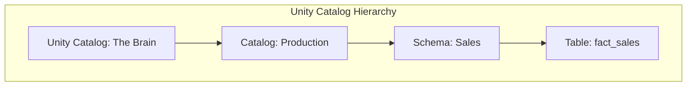

# Lesson 3: Unity Catalog (The Master Guide)

## 🏗️ Phase 1: Absolute Foundations (For Beginners)
Who is allowed to see the data?

### 1. What is "Governance"?
Governance is just a fancy word for "Rules".
*   **The Problem:** Without a central brain, every database has its own passwords and permissions. It's a mess.
*   **The Fix:** Unity Catalog is the "One Brain" for the whole company.

### 2. The Hierarchy (Like Folders)
*   **Catalog:** The highest level (e.g., "Production", "Marketing").
*   **Schema:** The middle level (e.g., "Sales", "HR").
*   **Table:** The low level (The actual data).



## 🚀 Phase 2: Intermediate (The Developer Level)
### 1. Data Lineage
Unity Catalog shows you a "Map" of where data came from. If a dashboard is wrong, you can trace it back to the exact Spark job that caused the error.

### 2. Simple Permissions
`GRANT SELECT ON TABLE sales TO finance_team;` (One line of code secures the data).

### 3. External Locations & Managed Tables
*   **Managed Table:** Unity Catalog manages both the metadata AND the data files. If you `DROP TABLE`, the data is deleted.
*   **External Table:** Unity Catalog manages the metadata, but the files live in your own S3/ADLS bucket. If you `DROP TABLE`, the data STAYS (only metadata is deleted).

---

## 🎯 Phase 4: Certification & Interview Drill

### 🛡️ Databricks Associate Drill
*   **The Metastore:** In Unity Catalog, there is ONE Metastore per region. It connects to multiple Workspaces.
    *   **The Drill:** For the exam, know that permissions are **Inherited**. If you have `SELECT` on a Catalog, you automatically have `SELECT` on all its schemas and tables.
*   **Information Schema:** Use standard SQL to query who has access to what: `SELECT * FROM system.information_schema.table_privileges`.

### 🛡️ DP-600 (Microsoft Fabric) Drill
*   **OneSecurity vs. Unity Catalog:** Microsoft Fabric is building **OneSecurity** to mimic Unity Catalog's features. The logic is the same: centrally manage row-level filters and column-level masking across the entire Lakehouse.

### 🏢 Consultancy Scenario: "The Governance Audit"
**Scenario:** A client is using standard Databricks Workspaces without Unity Catalog. They want to know "Who changed this table 3 months ago?"
*   **Architect Answer:** Without Unity Catalog, this is very hard to track. You'd have to dig through cluster logs.
*   **The Solution:** Migrate to **Unity Catalog**. It provides an automated **Audit Log** and **Lineage Graph**. You can see exactly which user ran which command on which table at what time.

### 🚀 Startup Scenario: "The Developer Silo"
**Scenario:** You have 3 developers. They keep overwriting each other's tables in the "default" database.
*   **Answer:** Create a separate **Catalog** for each developer (e.g., `dev_amol`, `dev_priya`). This provides a clean sandbox for everyone to work in without stepping on each other's toes, while still being able to query the `prod` catalog.

### 🏛️ FAANG Scenario: "The PII Breach"
**Scenario:** A data scientist accidentally puts a user's credit card number into a Gold-layer table. How do you find out where else that data has leaked?
*   **Answer:** **Automated Column-Level Lineage.**
*   **The Drill:** In Unity Catalog, open the Table's "Lineage" tab. It will show you a graph of every downstream table or dashboard that was built using that specific "Credit Card" column. This allows for instant cleanup across the entire enterprise.

---

### 🧪 Hands-on Labs
- [unity_catalog_security.sql](unity_catalog_security.sql) (Creating Catalogs, Schemas, and granting permissions)

---

### ✅ Key Takeaways
1. **Unity Catalog** is the central "Brain" for security and governance.
2. **Three-Level Namespace:** `catalog.schema.table` is the standard way to address data.
3. **Data Lineage** is automatic and critical for impact analysis.
4. **Managed Tables** are for when you want Databricks to handle cleanup; **External Tables** are for when you want to keep the data files.
5. **Security Inheritance** means you manage permissions once at a high level, rather than table-by-table.

[Next: Lesson 4: Workflows & DLT (Orchestration and Automation) →](../Lesson_4_Workflows_Automation/README.md)

---

### 4. Row & Column Level Security (Masking)
**Concept:** Hiding sensitive data from certain users without creating duplicate tables.

```sql
-- Column Masking: Only users in the 'HR' group can see the Salary
CREATE MASK salary_mask AS (val DOUBLE) -> 
    CASE WHEN is_account_group_member('hr_dept') THEN val ELSE NULL END;

ALTER TABLE silver.employees ALTER COLUMN salary SET MASK salary_mask;

-- Row Filtering: Users can only see data from their own country
CREATE FUNCTION region_filter(region_name STRING)
    RETURN is_account_group_member(region_name);

ALTER TABLE silver.fact_sales SET ROW FILTER region_filter ON (region);
```

---

## ⚠️ Common Pitfalls (Beginner Mistakes)

1.  **Direct Workspace Access:** Granting permissions at the workspace level instead of through Unity Catalog.
    *   **The Issue:** Unity Catalog is meant to be central. If you bypass it, your "Governance" is broken and you lose lineage.
    *   **Fix:** Always use the 3-level namespace (`catalog.schema.table`) and manage permissions in the Catalog Explorer.
2.  **Dropping Managed Tables by Accident:** Dropping a managed table thinking the files will stay.
    *   **The Issue:** Managed tables are owned by Databricks. If you `DROP`, the physical data files are deleted from the disk too.
    *   **Fix:** Use **External Tables** if you want to keep the data files even if the table is removed from metadata.
3.  **Metastore Mismatch:** Trying to join a Unity Catalog table to a non-Unity Catalog "Legacy" table.
    *   **The Issue:** These exist in two different "worlds" (Metastores). You cannot join them directly using standard SQL.
    *   **Fix:** Upgrade the legacy table to Unity Catalog or use a temporary view (though this is a messy workaround).
4.  **Managing Users individually:** Running `GRANT SELECT TO 'amol@company.com'`.
    *   **The Issue:** If Amol leaves the company, you have to manually find every table he had access to.
    *   **Fix:** Always grant permissions to **Groups** (e.g., `finance_team`). Add/remove users from the group, not the table.

---

## 🧪 Practice Exercises

### Exercise 1 — Hierarchy Navigation (Beginner)
**Goal:** create the structure.

**Your Task:**
Write the 3 SQL commands to:
1.  Create a Catalog named `marketing`.
2.  Create a Schema named `social_media`.
3.  Create a Table named `twitter_clicks` inside that schema.

---

### Exercise 2 — Lineage Impact Analysis (Intermediate)
**Goal:** Track dependencies.

**Scenario:** You need to rename a column `cust_name` to `customer_full_name` in the `bronze.users` table.

**Your Task:**
Explain how you would use Unity Catalog to find every **downstream** Silver table, Gold table, and Dashboard that will break if you make this change.

---

### Exercise 3 — Data Masking Logic (Architect)
**Goal:** Secure PII.

**Scenario:** You have a table `customers` with a column `credit_card_number`. Only the `payments_admin` group should see the full number. All other users should see `****-****-****-1234`.

**Your Task:**
Write the SQL logic for a **Dynamic View** or **Masking Function** that implements this rule.

---

## 💼 Common Interview Questions

**Q1: What is Unity Catalog and how is it different from the Hive Metastore?**
> Unity Catalog is an enterprise-wide governance layer. The standard Hive Metastore is per-workspace, meaning permissions don't transfer across different environments. Unity Catalog is **cross-workspace**, providing a central place for identity management, access control, audit logs, and automated data lineage for all workspaces in a region.

**Q2: Explain the "Three-Level Namespace" in Unity Catalog.**
> It is the standard `Catalog . Schema . Table` naming convention. The **Catalog** represents a functional area or environment (e.g., `Prod`), the **Schema** represents a database or department (e.g., `Sales`), and the **Table** is the actual dataset. This structure allows for better organization and granular permission inheritance.

**Q3: What is the difference between an "External Location" and a "Managed Storage"?**
> **Managed Storage** is a location owned and managed by Unity Catalog. When you drop a table here, the data files are deleted too. **External Locations** are cloud storage paths (S3/ADLS) that Unity Catalog has permission to access. Tables created here are usually "External Tables," meaning if you drop the table in Databricks, the files remain safely in your S3/ADLS bucket.

**Q4: How does Unity Catalog track Data Lineage?**
> Unity Catalog captures lineage automatically for all Spark and SQL queries executed in its environment. It records which source tables were read to create a destination table. This includes both table-level and column-level lineage, allowing you to see exactly how a single column of data moves from the landing zone to the final report.

**Q5: What is "Searchable Metadata"?**
> It is the ability to add descriptions (`COMMENT ON TABLE ...`) and tags to tables and columns within Unity Catalog. This metadata is indexed, allowing business users to search for "User Revenue" or "Customer ID" and find the exact table they need across the entire enterprise, including its ownership and quality status.
