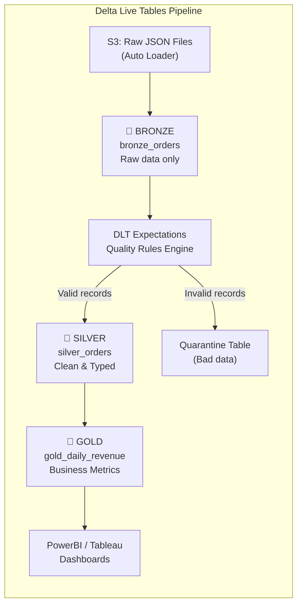

# Lesson 4: Databricks Workflows & Automation (The Master Guide)

> **Goal:** Build fully automated, production-grade data pipelines on Databricks — from scheduling Notebook jobs to building declarative Delta Live Tables pipelines with built-in quality gates and monitoring.

---

## 🏗️ Phase 1: Absolute Foundations (For Beginners)

### 1. The Problem: Manual Pipelines are a Career Risk
A Data Engineer who manually runs scripts every morning is:
- Unreliable (What if they're sick? On vacation? Sleeping?)
- Unscalable (Can manually run 3 scripts; can't run 300)
- Unprofessional (Production pipelines must run themselves)

**The Solution: Databricks Workflows** — a fully managed job scheduler inside Databricks.

### 2. What is a Databricks Job?
A **Job** is a scheduled unit of work in Databricks. A job can run:
-  A **Notebook** (most common)
-  A **Python Script**
-  A **JAR file** (for Scala/Java)
-  A **dbt project**
-  A **Delta Live Tables pipeline**

### 3. Basic Job Anatomy

```
Databricks Job: "Daily Sales Pipeline"
│
├── Schedule: Every day at 2:00 AM UTC
├── Cluster: Job Compute (auto-starts, auto-terminates after job)
│
└── Tasks (in order):
    ├── Task 1: ingest_raw_sales     (Notebook: /notebooks/01_ingest)
    ├── Task 2: clean_data            (Notebook: /notebooks/02_clean)   → depends on Task 1
    ├── Task 3: enrich_with_dims      (Notebook: /notebooks/03_enrich) → depends on Task 2
    └── Task 4: aggregate_to_gold    (Notebook: /notebooks/04_gold)    → depends on Task 3
```

---

## 🚀 Phase 2: Intermediate (The Developer Level)

### 1. Task Types and Dependencies

```python
# You can create and manage jobs using the Databricks REST API or dbutils
# In a notebook, you reference parameters passed by the workflow:

# In your notebook:
customer_segment = dbutils.widgets.get("customer_segment")   # Passed by Workflow
date_to_process  = dbutils.widgets.get("run_date")

print(f"Processing: segment={customer_segment}, date={date_to_process}")

# Pass data between tasks using Task Values (XCom-like feature)
# In Task 1: Compute a value and publish it
record_count = df.count()
dbutils.jobs.taskValues.set(key="record_count", value=record_count)

# In Task 2: Read the value published by Task 1
count_from_task1 = dbutils.jobs.taskValues.get(
    taskKey="ingest_raw_sales",
    key="record_count",
    default=0
)
print(f"Task 1 ingested {count_from_task1} records")
```

### 2. Triggering and Scheduling Options

| Trigger Type | Use Case | Example |
|-------------|---------|---------|
| **Scheduled** (Cron) | Regular daily/hourly jobs | `0 2 * * *` = 2 AM every day |
| **File Arrival** | Trigger when a new file lands in S3 | New CSV from partner system |
| **Manual** | One-off runs | Ad-hoc backfill, testing |
| **API Trigger** | CI/CD or external system triggers | After dbt model runs |
| **Continuous** | Keep a Streaming job alive | Kafka streaming pipeline |

```json
// Cron schedule examples
"quartz_cron_expression": "0 0 2 * * ?"   // 2:00 AM every day
"quartz_cron_expression": "0 */15 * * * ?" // Every 15 minutes
"quartz_cron_expression": "0 0 8 ? * MON"  // 8 AM every Monday
```

### 3. Retry Logic and Error Handling

```python
# Task-level retry configuration (set in Workflows UI or JSON):
# max_retries: 3 → Try 3 more times if the task fails
# min_retry_interval_millis: 300000 → Wait 5 minutes between retries

# In your notebook: Write idempotent code (safe to re-run!)
# BAD: Not idempotent — running twice creates duplicates
df.write.format("delta").mode("append").save("/mnt/gold/sales")

# GOOD: Idempotent — running twice produces the same result
df.write.format("delta").mode("overwrite").save("/mnt/gold/sales")

# BETTER: Idempotent with MERGE (inserts new, updates existing)
df.createOrReplaceTempView("new_data")
spark.sql("""
    MERGE INTO gold.fact_sales AS target
    USING new_data AS source
    ON target.sale_id = source.sale_id
    WHEN MATCHED THEN UPDATE SET *
    WHEN NOT MATCHED THEN INSERT *
""")
```

### 4. Alerting and Notifications

```yaml
# In Job configuration (via UI or Terraform):
notifications:
  on_failure:
    - email: "data-engineering-team@company.com"
    - slack_webhook: "https://hooks.slack.com/services/..."
  on_success:
    - email: "dashboard-owner@company.com"
  on_start: []

# Or programmatically with dbutils:
try:
    process_data()
except Exception as e:
    # Send to PagerDuty, Slack, etc.
    import requests
    requests.post(
        "https://hooks.slack.com/services/...",
        json={"text": f"🚨 Pipeline FAILED: {str(e)}"}
    )
    raise  # Re-raise so the job still shows as FAILED
```

---

## 🏛️ Phase 3: Architect (The Professional Level)

### 1. Delta Live Tables (DLT) — Declarative Pipelines

**DLT** is the "next generation" way to build pipelines on Databricks. Instead of writing imperative code (HOW to do things), you declare WHAT you want. Databricks manages:
-  Dependency resolution (which table to compute first)
-  Infrastructure (cluster management)
-  Error recovery (automatic retries)
-  Data quality monitoring (built-in expectations)

```python
import dlt
from pyspark.sql import functions as F

# === BRONZE LAYER: Raw ingestion ===
@dlt.table(
    name="bronze_orders",
    comment="Raw orders from S3, no transformation",
    table_properties={"delta.enableChangeDataFeed": "true"}
)
def bronze_orders():
    return (
        spark.readStream
            .format("cloudFiles")            # Auto Loader: scalable file ingestion
            .option("cloudFiles.format", "json")
            .load("s3://my-bucket/landing/orders/")
    )

# === SILVER LAYER: Cleaning + Validation ===
@dlt.table(
    name="silver_orders",
    comment="Cleaned orders with business rule validation"
)
@dlt.expect_or_drop("valid_order_id", "order_id IS NOT NULL")
@dlt.expect_or_drop("positive_amount", "amount > 0")
@dlt.expect("valid_date", "order_date >= '2020-01-01'")  # Log but don't drop
def silver_orders():
    return (
        dlt.read_stream("bronze_orders")   # Auto-reads from bronze!
        .filter(F.col("status") != "CANCELLED")
        .withColumn("amount", F.col("amount").cast("double"))
        .withColumn("order_year", F.year(F.col("order_date")))
        .withColumn("ingested_at", F.current_timestamp())
    )

# === GOLD LAYER: Business Metrics ===
@dlt.table(
    name="gold_daily_revenue",
    comment="Daily revenue aggregated by region"
)
def gold_daily_revenue():
    return (
        dlt.read("silver_orders")           # Batch read from silver
        .groupBy("order_year", F.month("order_date").alias("order_month"), "region")
        .agg(
            F.sum("amount").alias("total_revenue"),
            F.count("order_id").alias("order_count"),
            F.avg("amount").alias("avg_order_value")
        )
    )
```



### 2. DLT Expectations — Built-in Data Quality Gates

```python
# Expectation types:
#   @dlt.expect()             → Log violation, keep the row
#   @dlt.expect_or_drop()     → Drop violating rows from the output
#   @dlt.expect_or_fail()     → STOP the entire pipeline if violation found

@dlt.table
@dlt.expect_or_fail("schema_check", "customer_id IS NOT NULL AND amount IS NOT NULL")
@dlt.expect_or_drop("positive_amounts", "amount > 0")
@dlt.expect("future_date_warning", "order_date <= current_date()")   # Soft warning
def silver_orders():
    return dlt.read_stream("bronze_orders")

# You can view expectation metrics in the DLT Pipeline UI:
# - Rows passed: 9,850,000
# - Rows dropped: 1,200 (positive_amounts violation)
# - Rows quarantined: 45 (invalid schema)
```

### 3. Job Orchestration Patterns

#### Pattern 1: Fan-Out (Parallel Processing)
```
[Bronze Job] → runs first
    ↓
[Silver Sales Job] [Silver Inventory Job] [Silver HR Job]  ← all run in PARALLEL
    ↓                     ↓                     ↓
[Gold Summary] ←──────────┤ (waits for all silver jobs)
```

#### Pattern 2: Backfill / Recovery Pattern
```python
# Backfill a specific date range without touching current data
dbutils.widgets.text("start_date", "2024-01-01")
dbutils.widgets.text("end_date", "2024-01-31")

start = dbutils.widgets.get("start_date")
end   = dbutils.widgets.get("end_date")

delta_table = DeltaTable.forPath(spark, "/mnt/gold/fact_sales")

delta_table.alias("target").merge(
    spark.read.parquet(f"s3://source/sales/{start}/to/{end}/").alias("source"),
    "target.sale_id = source.sale_id"
).whenMatchedUpdateAll() \
 .whenNotMatchedInsertAll() \
 .execute()

print(f"Backfill complete for {start} to {end}")
```

### 4. Infrastructure as Code — Managing Jobs with Terraform

```hcl
# terraform/databricks_jobs.tf

resource "databricks_job" "daily_sales_pipeline" {
  name = "Daily Sales Pipeline"

  schedule {
    quartz_cron_expression = "0 0 2 * * ?"
    timezone_id            = "UTC"
  }

  new_cluster {
    num_workers   = 4
    spark_version = "13.3.x-scala2.12"
    node_type_id  = "i3.xlarge"
  }

  task {
    task_key = "ingest"
    notebook_task {
      notebook_path = "/Repos/pipeline/01_ingest"
    }
  }

  task {
    task_key = "clean"
    depends_on { task_key = "ingest" }
    notebook_task {
      notebook_path = "/Repos/pipeline/02_clean"
    }
  }

  email_notifications {
    on_failure = ["data-team@company.com"]
    on_success = ["stakeholder@company.com"]
  }
}
```

### 5. Monitoring and Observability

```python
# Use Databricks SDK to monitor job runs programmatically
from databricks.sdk import WorkspaceClient

w = WorkspaceClient()

# Get the last 10 runs of your job
runs = w.jobs.list_runs(job_id=123456789, limit=10)
for run in runs:
    print(f"Run ID: {run.run_id} | Status: {run.state.life_cycle_state} | Duration: {run.run_duration}ms")

# Alert if p95 duration exceeds SLA
import statistics
durations = [run.run_duration for run in runs]
p95_duration_minutes = statistics.quantiles(durations, n=20)[18] / 60000
if p95_duration_minutes > 30:
    send_alert(f"Pipeline SLA breach! P95 runtime is {p95_duration_minutes:.1f} minutes (SLA: 30 minutes)")
```

---

### 5. Job Clusters vs. All-Purpose Clusters
*   **Job Cluster:** Created specifically for a job run. **Highly recommended.** 
    *   **Cost:** Much cheaper (Job SKU).
    *   **Isolation:** One job doesn't affect another.
*   **All-Purpose Cluster:** Always running or manually started.
    *   **Cost:** Expensive (All-Purpose SKU).
    *   **Use Case:** Development and ad-hoc testing ONLY.

---

## 🎯 Phase 4: Certification & Interview Drill

### 🛡️ Databricks Associate Drill
*   **DLT Syntax:** Be able to identify the `@dlt.table` decorator and the difference between `dlt.read()` (Batch) and `dlt.read_stream()` (Streaming).
*   **Cluster Types:** You will almost certainly be asked why you should use a **Job Cluster** for production workloads (Cost and isolation).
*   **Expectations:** Know the three levels: `expect`, `expect_or_drop`, and `expect_or_fail`.

### 🛡️ DP-600 (Microsoft Fabric) Drill
*   **Fabric Data Factory:** Microsoft Fabric uses **Data Factory Pipelines** for orchestration. While different in UI, the concepts of "Task Dependencies," "Parameters," and "Schedules" are identical to Databricks Workflows.

### 🏢 Consultancy Scenario: "DLT vs. Workflows"
**Scenario:** A client asks, "Should we use Delta Live Tables (DLT) or stick with standard Databricks Workflows for our new project?"
*   **Architect Answer:**
    -  **Use DLT if:** You need high data quality (Expectations), you want to build a streaming lakehouse, and you prefer a declarative "low-code" approach to dependencies.
    -  **Use Workflows if:** You have complex Python logic that doesn't fit into a SQL/DataFrame table definition, or you need to integrate with external tools (like an API call that doesn't result in a table).

### 🚀 Startup Scenario: "Self-Healing Pipelines"
**Scenario:** "Our pipeline fails every Sunday because the source API is down for maintenance. I'm tired of waking up at 4 AM to restart it."
*   **Answer:** **Use Workflows Retry Logic.**
*   **The Move:** Set `max_retries: 5` and `min_retry_interval_millis: 600000` (10 minutes). The job will now auto-retry while the API is down and eventually succeed at 6 AM without you waking up.

### 🏛️ FAANG Scenario: "The DAG of 1000 Tasks"
**Scenario:** You have 1,000 tasks linked together. One fail. How do you re-run without starting from zero?
*   **Answer:** **Repair and Resubmit.**
*   **The Drill:** Databricks Workflows allows you to "Repair" a run. It identifies which tasks failed and only re-runs those and their downstream dependents. This saves thousands of dollars in compute costs and hours of time at FAANG scale.

---

### 🧪 Hands-on Labs
- [dlt_pipeline_example.py](dlt_pipeline_example.py) (A complete DLT script with Expectations)

---

### ✅ Key Takeaways
1. **Never run production manually.** Automation is the mark of a Senior Data Engineer.
2. **Job Clusters** save 50% on Databricks costs vs. All-Purpose clusters.
3. **Idempotency** is mandatory. A job should be safe to run 10 times without doubling data.
4. **DLT** is the gold standard for declarative, quality-checked pipelines.
5. **Expectations** are the "Unit Tests" for your data.
6. **Repair and Resubmit** is your secret weapon for fixing large, complex pipeline failures.

[Next Phase: Phase 5: Cloud & Orchestration →](../../Phase_5_Cloud_and_Orchestration/README.md)

---

## ⚠️ Common Pitfalls (Beginner Mistakes)

1.  **Hardcoded Paths:** Using `/Users/my_name@company.com/notebook` as the path in a production job.
    *   **The Issue:** When you move to a production environment or if you leave the company, that path will break for everyone else.
    *   **Fix:** Use **Workspace Repo** paths (e.g., `/Repos/Production/ETL/Main`) which are consistent for all users.
2.  **Using All-Purpose Clusters for Jobs:** Running scheduled jobs on a "Development" cluster that is always on.
    *   **The Issue:** All-Purpose clusters cost **2x more** per DBU than Job clusters, and they don't auto-terminate properly if other users are using them.
    *   **Fix:** Always select "New Job Cluster" in the job configuration.
3.  **Non-Idempotent Logic:** Writing a job that simply `df.write.mode("append")` to a table.
    *   **The Issue:** If the job fails at 90% and you restart it, you will have duplicate data for that 90%.
    *   **Fix:** Use **MERGE** or **Overwrite** based on a specific partition to ensure re-runs don't duplicate data.
4.  **DLT "Fail-Silence":** Using `@dlt.expect()` for critical data (like `user_id is not null`) and then wondering why your Gold table has corrupt data.
    *   **The Issue:** `@dlt.expect()` only logs the error; it doesn't stop the bad data from moving forward.
    *   **Fix:** Use `@dlt.expect_or_drop()` for dirty data and `@dlt.expect_or_fail()` for critical schema breaks.

---

## 🧪 Practice Exercises

### Exercise 1 — The Parallel Design (Beginner)
**Goal:** Design a workflow.

**Scenario:** You need to ingest data from 3 sources: `Sales`, `HR`, and `Inventory`. Once all 3 are done, you need to run a `Company_Dashboard` report.

**Your Task:**
1.  Draw the DAG (Directed Acyclic Graph) for this job.
2.  Which tasks can run in parallel?
3.  Which task has a "Wait for All" dependency?

---

### Exercise 2 — The DLT Integrity Rule (Intermediate)
**Goal:** Write custom expectations.

**Scenario:** You are building a Silver table for `bank_transactions`.
- Requirement 1: `amount` must be between -10,000 and 10,000.
- Requirement 2: `transaction_type` must be one of ['DEBIT', 'CREDIT'].

**Your Task:**
Write the `@dlt.expect...` decorators for these two rules. Decide whether to `drop` or `fail` for each.

---

### Exercise 3 — The Repair Logic (Architect)
**Goal:** Manage production failures.

**Scenario:** A 50-task job failed at Task #45 because the Gold warehouse was offline. You have fixed the warehouse.

**Your Task:**
1.  Explain how you would use the "Repair Run" feature to finish the job.
2.  Will Tasks #1 through #44 be re-executed? Why is this important?

---

## 💼 Common Interview Questions

**Q1: What is the difference between a "Job Cluster" and an "All-Purpose Cluster"?**
> A **Job Cluster** is created specifically for a single job run and is terminated immediately after the job finishes. It is billed at a much lower rate (roughly half the cost). An **All-Purpose Cluster** is used for interactive development and is billed at a higher rate. In production, 100% of your automated workflows should use Job Clusters.

**Q2: Explain "Idempotency" in the context of Data Engineering.**
> Idempotency means that running the same operation multiple times produces the same result. For a data pipeline, this means if a job fails halfway and you re-run it, you shouldn't end up with duplicate rows or corrupted data. This is typically achieved using `MERGE` statements or by overwriting specific partitions.

**Q3: What are Delta Live Tables (DLT) and why use them over standard Notebook jobs?**
> DLT is a declarative framework for building reliable data pipelines. Unlike standard Notebook jobs where you write the `HOW` (e.g., `df.write...`), in DLT you write the `WHAT` (the table definition). DLT automatically handles task orchestration, cluster sizing, and built-in data quality monitoring (Expectations), making it much faster to develop and maintain.

**Q4: How do "Expectations" work in DLT?**
> Expectations are data quality constraints defined directly on your tables. There are three types: `expect` (logs metrics only), `expect_or_drop` (logs metrics and removes the bad rows), and `expect_or_fail` (logs metrics and stops the entire pipeline immediately if a bad row is found). This provides built-in validation for every step of your ETL.

**Q5: What is a "Task Value" in Databricks Workflows?**
> Task Values are a mechanism to pass small amounts of metadata (like a folder path, a row count, or a status flag) between different tasks in a single workflow run. One task uses `dbutils.jobs.taskValues.set()` and a downstream task uses `get()` to retrieve it. This is essential for creating dynamic, data-driven pipelines.
