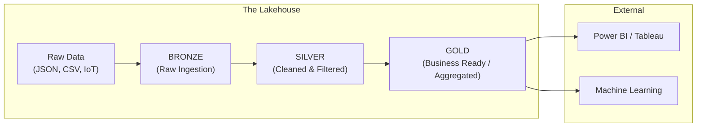

# 🧊 Phase 4: Databricks Mastery — The Lakehouse Revolution

> **Goal:** Master the world's leading data platform. By the end of this phase, you will be able to design, build, and govern a production-grade **Lakehouse** that combines the power of Data Warehouses with the flexibility of Data Lakes.

---

## 🏗️ The Medallion Architecture (The Industry Standard)

---

## 📚 Lessons in This Phase

| # | Lesson | Key Concepts | Certification Focus |
|---|--------|-------------|:---:|
| [1](./Lesson_1_Delta_Lake_Essentials/README.md) | **Delta Essentials** | ACID, Time Travel, Versioning | **Databricks Associate** |
| [2](./Lesson_2_Advanced_Delta/README.md) | **Advanced Delta** | Optimize, Z-Order, Vacuum, CDC | **Expert** |
| [3](./Lesson_3_Unity_Catalog_Governance/README.md) | **Unity Catalog** | Governance, Lineage, Security | **Databricks Associate** |
| [4](./Lesson_4_Workflows_Automation/README.md) | **Workflows & DLT** | Orchestration, Delta Live Tables | **Databricks Associate** |

---

## 🎯 Phase 4: Certification & Interview Drill

### 🛡️ Databricks Associate Drill
*   **Delta Lake Table Properties:** Know what happens when you run `DESCRIBE HISTORY table_name`. This is how you perform **Time Travel**.
*   **Unity Catalog Permissions:** Understand the difference between `GRANT SELECT` on a Table vs. a Schema vs. a Catalog.

### 🛡️ DP-600 (Microsoft Fabric) Drill
*   **OneLake vs. Delta:** Microsoft Fabric uses **OneLake** as a storage layer, but the data itself is stored in **Delta Parquet** format. This means your Databricks skills are 100% transferable to Fabric.

### 🏢 Consultancy Scenario: "The Migration"
**Scenario:** A client wants to move from a legacy SQL Server to Databricks. They ask, "Why shouldn't I just use a Data Lake with Parquet files?"
*   **Architect Answer:** Parquet files don't support **Updates** or **Transactions**. If a job fails halfway, your Parquet files are corrupted. **Delta Lake** adds a transaction log on top of Parquet, giving you ACID guarantees, high-speed updates, and auditability.

### 🚀 Startup Scenario: "The Lean Lakehouse"
**Scenario:** You have $0 budget for governance tools like Collibra. How do you track data lineage?
*   **Answer:** Use **Unity Catalog**. It's built into Databricks and automatically tracks which Notebook created which table (Data Lineage) for free.

### 🏛️ FAANG Scenario: "The 100-Year History"
**Scenario:** "We need to keep every version of our user data for 7 years for compliance, but our storage costs are exploding."
*   **Answer:** Use **Delta Time Travel** but manage it with **VACUUM**.
*   **The Drill:** Set a `RETAIN 7 YEARS` policy. However, warn the manager that Delta's `VACUUM` only deletes files, not transaction log entries. To save space, you might need to "Archive" older versions to cold storage (S3 Glacier).

---

### 🏛️ Architect's Tip
> "The Medallion Architecture is not just about folders. It's about **Trust**. Bronze is where we keep everything (just in case), Silver is where Data Engineers live, and Gold is where the CEO lives. Never let a CEO query a Bronze table."

[Start with Lesson 1: Delta Lake Essentials →](./Lesson_1_Delta_Lake_Essentials/README.md)
