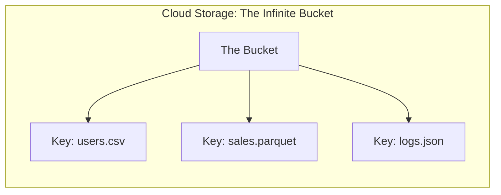

# Lesson 1: Cloud Storage Foundations (The Master Guide)

## 🏗️ Phase 1: Absolute Foundations (For Beginners)
Where do the files actually "live"?

### 1. What is "Object Storage"?
In the cloud (AWS S3 or Azure ADLS), we don't have a "Hard Drive" with folders. We have **Buckets**.
*   **The "Key":** The name of the file (e.g., `sales/2024/data.parquet`).
*   **The "Value":** The actual data inside.

### 2. Why is it better than a computer?
*   **Infinite Space:** You can save 1 Petabyte (1,000,000 GB) and it never gets full.
*   **Durability:** The cloud copies your data to 3 different cities so it's never lost.

## 🚀 Phase 2: Intermediate (The Developer Level)
### 1. Partition Pruning
As a developer, you organize your bucket like this:
`/mnt/data/year=2024/month=03/data.parquet`
*   **The Magic:** When you run a query for "March 2024", Spark literally **Doesn't Even Look** at the 2023 or 2022 folders. This saves 90% of your time.

## 🏛️ Phase 3: Architect (The Professional Level)
### 2. Storage Classes (The Cost Ladder)
Cloud storage isn't one-price-fits-all. You pay for access speed:
*   **Standard:** Immediate access to all data.
*   **Nearline/Infrequent Access:** Cheaper storage, but you pay a "Retrieval Fee" to read it.
*   **Archive/Glacier:** Dirt cheap ($1 per TB), but takes minutes or hours to "rehydrate" the data before you can read it.

---

## 🎯 Phase 5: Certification & Interview Drill

### 🛡️ Cloud Associate Drill
*   **Eventual Consistency:** In the past, if you updated a file, you might still read the old version for a few seconds. **Modern clouds (S3/ADLS) are now strongly consistent**, but you should know the history for exams.
*   **Bucket Versioning:** If you enable this, even if you "Delete" a file, you can restore it from the "Version History".

### 🛡️ DP-600 (Microsoft Fabric) Drill
*   **OneLake Shortcuts:** Microsoft Fabric's biggest feature. You can "Shortcut" to an AWS S3 bucket. The data stays in S3, but looks like a folder in your Fabric Lakehouse. This is how you avoid **Egress Fees**.

### 🏢 Consultancy Scenario: "The Security Audit"
**Scenario:** A client is worried about their data living in the public cloud. They ask, "How do I know my data is safe?"
*   **Architect Answer:** You must implement **Encryption at Rest** (using KMS keys) and **Encryption in Transit** (HTTPS/TLS).
*   **The Drill:** Suggest adding a **Bucket Policy** that explicitly denies any connection that is not encrypted via SSL.

### 🚀 Startup Scenario: "The Runaway Bill"
**Scenario:** A startup's S3 bill jumped from $100 to $5,000 in one month. They are only storing 10GB of data.
*   **Answer:** **API Request Spm.**
*   **The Move:** Check the logs. Likely, a Spark job was configured with too many tiny partitions, causing millions of small `GET/PUT` requests. Each request costs money. Fix the partition size!

### 🏛️ FAANG Scenario: "The S3 Throttle"
**Scenario:** You are trying to read 100,000 files/second from a single S3 bucket, but AWS is throttling you.
*   **Answer:** **S3 Prefixing.**
*   **The Drill:** S3 scales throughput per **Prefix** (folder). If all your files are in `/data/`, you are bottlenecked. If you spread them out into `/data/a/`, `/data/b/`, etc., S3 provides dedicated throughput for each sub-folder.

---

### 🧪 Hands-on Labs
- [s3_lifecycle_lab.py](s3_lifecycle_lab.py) (Simulating lifecycle moves and security policies)

---

### ✅ Key Takeaways
1. **Object Storage** is the foundation of the modern Data Lake.
2. **Partitioning** (folder structure) is the #1 performance optimizer for storage.
3. **IAM Roles** are better than Access Keys (Keys get leaked, Roles are temporary).
4. **Lifecycle Policies** save 90% on storage costs for old data.
5. **Request Costs** can be higher than storage costs if your jobs are poorly tuned.
6. **Shortcuts** allow for multi-cloud data access without expensive "Export/Import" jobs.

[Next: Lesson 2: Intro to Airflow (The Conductor) →](../Lesson_2_Intro_to_Airflow/README.md)

---

### 4. IAM & Service Principals (The Security Guard)
**The Problem:** You want Spark to read a private S3 bucket. You **could** use an Access Key/Secret Key, but if you check that key into GitHub, a hacker will spend $50,000 on your AWS account in 1 hour.

**The Solution:**
*   **AWS IAM Roles:** You "attach" a role to your EC2/Databricks cluster. The cluster gets temporary, auto-rotating credentials. No keys to leak!
*   **Azure Service Principals:** An "identity" for your application (ADF or Databricks) that is managed in Microsoft Entra ID (formerly Azure AD).
*   **Principle of Least Privilege:** Never give a Spark job "AdministratorAccess". Only give it `s3:Read` on the specific bucket it needs.

---

## ⚠️ Common Pitfalls (Beginner Mistakes)

1.  **Public Buckets:** Leaving an S3 bucket open to the public internet because "it was easier for testing."
    *   **The Issue:** Your company's private customer data is now indexed by Google and available to hackers. This is the #1 cause of data breaches.
    *   **Fix:** Use **Block Public Access** settings at the account level and use IAM roles for all access.
2.  **Hardcoding Access Keys:** Writing `spark.conf.set("fs.s3a.access.key", "AKIA...")` inside a Notebook.
    *   **The Issue:** Anyone with access to the workspace can see your master keys.
    *   **Fix:** Use **Secrets Management** (Databricks Secrets or Azure Key Vault).
3.  **Ignoring Egress Fees:** Copying 100TB of data from an AWS S3 bucket in Virginia to a Google Cloud bucket in Oregon.
    *   **The Issue:** Clouds are "Free to ingress" (moving data in) but charge a fortune for "Egress" (moving data out).
    *   **Fix:** Always process data in the same region where it is stored.
4.  **No Lifecycle Cleanup:** Storing "Temporary" staging files (CSV dumps) for 3 years.
    *   **The Issue:** You are paying millions for data that was only needed for 24 hours.
    *   **Fix:** Set a **Lifecycle Policy** to "Permanently Delete" files in the `/staging/` folder after 7 days.

---

## 🧪 Practice Exercises

### Exercise 1 — The Policy JSON (Beginner)
**Goal:** Write a basic permission policy.

**Scenario:** You need to allow a Spark job to **only read** (no write, no delete) from `s3://company-datalake/silver/`.

**Your Task:**
Identify which "Actions" should be included in the IAM Policy. (Hint: `s3:GetItem`, `s3:ListBucket`).

---

### Exercise 2 — Cost Strategy (Intermediate)
**Goal:** Mix storage classes.

**Scenario:** You have a Audit log table.
- Data from the last **3 months** is used daily for reports.
- Data from the last **2 years** is needed only if there is a legal audit (once a year).

**Your Task:**
Describe a **Lifecycle Rule** that uses "Infrequent Access" and "Glacier" to save money.

---

### Exercise 3 — Prefix Optimization (Architect)
**Goal:** Fix a throttling issue.

**Scenario:** Your storage bucket has 10 million files all stored in:
`s3://my-bucket/v1/data/part-1.parquet`, `s3://my-bucket/v1/data/part-2.parquet`, etc.

**Your Task:**
AWS S3 throttles per **Prefix**. How would you change your "Key" structure (the file path) to allow for 10x more parallel reads?

---

## 💼 Common Interview Questions

**Q1: What is the difference between Object Storage and a standard File System?**
> A standard File System (like your laptop) is "Hierarchical" (folders inside folders) and is designed for low latency on local machines. **Object Storage** (like S3) is a "Flat" structure where every file is an addressable "Object" with metadata. Object storage is designed for massive scale (Petabytes) and high durability, but has higher latency than a local disk.

**Q2: How do you secure data in a Cloud Storage Bucket?**
> 1. **Encryption:** Use Server-Side Encryption (SSE-KMS).
> 2. **Authentication:** Use IAM Roles and Policies (Principle of Least Privilege).
> 3. **Networking:** Use Private Links or Service Endpoints so the data never travels over the public internet.
> 4. **Monitoring:** Enable Storage Lens or CloudTrail to audit "Who touched what file?".

**Q3: Explain "Lifecycle Management" for Data Engineers.**
> Lifecycle Management is a set of automated rules that move data between storage "tiers" based on age. For example, moving data from "Standard" (expensive/fast) to "Archive/Glacier" (cheap/slow) after 90 days. This allows a Data Engineer to keep massive amounts of historical data without bankrupting the company.

**Q4: What are "Egress Fees" and why are they a nightmare for Data Architects?**
> Egress fees are charges applied by cloud providers when you move data **out** of their network. While moving data into a cloud is usually free, moving it out (to another provider or on-premise) can cost $0.05 to $0.09 per GB. For a Petabyte-scale company, moving data for a "one-off" test could cost $90,000 in network fees alone.

**Q5: How does "Strong Consistency" in modern S3 help Data Engineers?**
> In the past, S3 was "Eventually Consistent," meaning if you wrote a file and immediately tried to read it, you might get a "404 Not Found." Modern S3 provides "Strong Consistency," which means as soon as a `PUT` operation finishes, all subsequent `GET` operations will see the new data. This eliminates many "race condition" bugs in Spark ETL pipelines.
