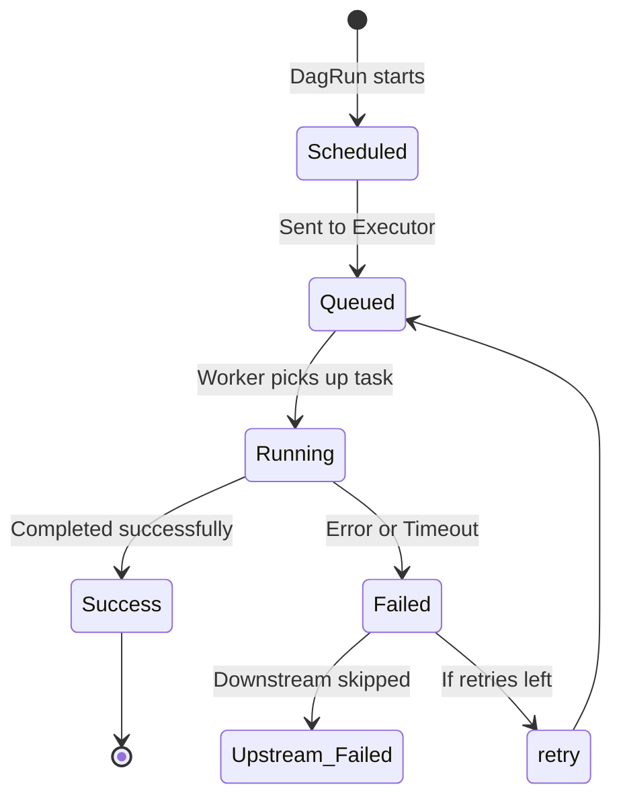
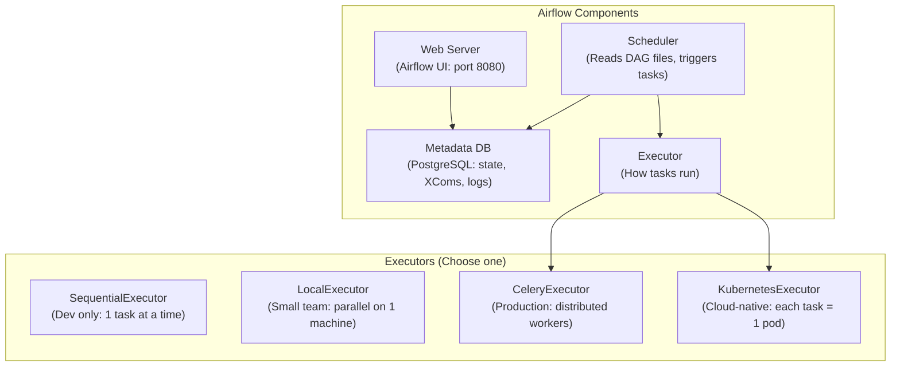

# Lesson 2: Introduction to Apache Airflow (The Master Guide)

> **Goal:** Build production-grade data pipelines with Apache Airflow — from simple scheduled tasks to complex dependency graphs with error handling, monitoring, and the modern TaskFlow API.

---

## 🏗️ Phase 1: Absolute Foundations (For Beginners)

### 1. What is an "Orchestrator"?
Imagine you are baking a cake. You must:
1. Pre-heat the oven (FIRST — can't skip this!)
2. Mix the batter (AFTER pre-heat)
3. Pour into pan (AFTER mixing)
4. Bake for 30 minutes (AFTER pouring)
5. Let cool before eating (AFTER baking)

**Problem:** Each step depends on the previous one. If you could do them in parallel (mix AND pre-heat simultaneously), you should!

**Airflow** is the conductor that manages all these steps for your data pipelines:
-  Ensures the right order
-  Runs independent tasks in parallel
-  Retries failed tasks automatically
-  Alerts you when something breaks
-  Shows you a visual dashboard of what's running

### 2. The Three Core Concepts

```
DAG (Directed Acyclic Graph)
= Your entire workflow / pipeline
= "Do these tasks in this order"

    [extract_from_api]
           ↓
    [validate_data]
         ↙       ↘
[clean_sales]   [clean_inventory]   ← These two run in PARALLEL!
         ↘       ↙
    [load_to_warehouse]
           ↓
    [send_success_email]
```

| Concept | What It Is | Analogy |
|---------|-----------|---------|
| **DAG** | The entire workflow definition | Your recipe card |
| **Task** | One single step | One cooking step |
| **Schedule** | When to run | "Every day at 2 AM" |
| **DAG Run** | One execution of the DAG | One baking session |
| **Task Instance** | One execution of one task | Mixing the batter on Tuesday |

### 3. The Task Lifecycle (State Machine)
Every task in Airflow moves through a specific set of states. Understanding these is key to debugging.



---

## 🚀 Phase 2: Intermediate (The Developer Level)

### 1. Your First Production DAG (Classic Style)

```python
# dags/daily_sales_pipeline.py
from datetime import datetime, timedelta
from airflow import DAG
from airflow.operators.python import PythonOperator
from airflow.operators.empty import EmptyOperator
from airflow.providers.postgres.operators.postgres import PostgresOperator
from airflow.utils.dates import days_ago

# ========================================
# STEP 1: Define default arguments
# These apply to ALL tasks in this DAG
# ========================================
default_args = {
    "owner": "data-engineering-team",
    "depends_on_past": False,       # Don't wait for yesterday's run to succeed
    "start_date": days_ago(1),
    "email": ["data-eng@company.com"],
    "email_on_failure": True,
    "email_on_retry": False,
    "retries": 3,                   # Retry up to 3 times on failure
    "retry_delay": timedelta(minutes=5),  # Wait 5 minutes between retries
    "execution_timeout": timedelta(hours=2),  # Kill task if it runs > 2 hours
}

# ========================================
# STEP 2: Create the DAG
# ========================================
with DAG(
    dag_id="daily_sales_pipeline",
    description="Ingests and processes daily sales data into the warehouse",
    default_args=default_args,
    schedule_interval="0 2 * * *",    # Cron: 2:00 AM every day
    catchup=False,                     # Don't run historical missed runs
    tags=["sales", "production"],
    max_active_runs=1,                 # Only ONE run at a time (prevents overlaps)
) as dag:

    # ========================================
    # STEP 3: Define Tasks
    # ========================================

    # Dummy start/end for clarity in the UI
    start = EmptyOperator(task_id="start")
    end   = EmptyOperator(task_id="end")

    def extract_sales_data(execution_date, **context):
        """Pull data from source API for the execution date."""
        import requests
        date_str = execution_date.strftime("%Y-%m-%d")
        print(f"Extracting sales for date: {date_str}")

        response = requests.get(
            f"https://api.company.com/sales?date={date_str}",
            headers={"Authorization": "Bearer {{ var.value.api_token }}"}
        )
        response.raise_for_status()
        records = response.json()
        print(f"Extracted {len(records)} records.")
        return len(records)    # Return value is pushed to XCom automatically!

    def validate_data(**context):
        """Pull record count from XCom and validate."""
        ti = context["ti"]    # Task Instance
        record_count = ti.xcom_pull(task_ids="extract_sales", key="return_value")

        if record_count is None or record_count == 0:
            raise ValueError(f"No records extracted! Expected > 0, got: {record_count}")
        if record_count < 1000:
            print(f"WARNING: Low record count ({record_count}). Expected ~50,000. Continuing...")

        print(f"Validation passed: {record_count} records ready to process.")

    extract_task = PythonOperator(
        task_id="extract_sales",
        python_callable=extract_sales_data,
        provide_context=True,
    )

    validate_task = PythonOperator(
        task_id="validate_data",
        python_callable=validate_data,
        provide_context=True,
    )

    # Run SQL transformation in the warehouse
    transform_task = PostgresOperator(
        task_id="transform_in_warehouse",
        postgres_conn_id="warehouse_prod",    # Stored in Airflow Connections (secure!)
        sql="""
            INSERT INTO gold.fact_daily_sales
            SELECT
                order_date,
                region,
                SUM(amount) AS total_revenue
            FROM silver.orders
            WHERE order_date = '{{ ds }}'    -- Airflow templates the execution date!
            GROUP BY order_date, region
            ON CONFLICT (order_date, region) DO UPDATE
            SET total_revenue = EXCLUDED.total_revenue;
        """,
    )

    # ========================================
    # STEP 4: Define the Dependencies
    # ========================================
    start >> extract_task >> validate_task >> transform_task >> end
```

### 2. Variables and Connections — Secrets Management

```python
# ❌ NEVER hardcode secrets in your DAG!
# password = "my_db_password_123"  ← Anyone with repo access sees this!

# ✅ Store all secrets in Airflow Connections (encrypted in Airflow's backend)
# Add via:  Airflow UI → Admin → Connections → + Button
# Or via CLI: airflow connections add 'warehouse_prod' \
#               --conn-type 'postgres' \
#               --host 'prod-db.internal.com' \
#               --port 5432 \
#               --login 'pipeline_svc' \
#               --password 'secret' \
#               --schema 'warehouse'

# ✅ Store non-secret config in Airflow Variables
# Add via: Airflow UI → Admin → Variables
# Or via CLI: airflow variables set MAX_RETRIES 3

from airflow.models import Variable

max_retries = int(Variable.get("MAX_RETRIES", default_var=3))
api_base_url = Variable.get("SALES_API_URL")

# Jinja templating in SQL/Bash pulls variables at runtime:
# {{ var.value.SALES_API_URL }}
```

### 3. XCom — Passing Data Between Tasks

```python
# XCom = Cross-Communication: the mechanism for tasks to share small data

# Push data from Task A:
def task_a(**context):
    result = {"record_count": 50000, "source": "api", "date": "2024-03-19"}
    context["ti"].xcom_push(key="extraction_result", value=result)

# Pull data in Task B:
def task_b(**context):
    result = context["ti"].xcom_pull(task_ids="task_a", key="extraction_result")
    print(f"Records extracted: {result['record_count']}")

# ⚠️ IMPORTANT: XComs are stored in Airflow's metadata database.
# Use XComs for SMALL data only (counts, file paths, status flags).
# NEVER push a DataFrame or large dataset through XCom!
# For large data, write to S3/GCS and pass the PATH through XCom.
```

---

## 🏛️ Phase 3: Architect (The Professional Level)

### 1. TaskFlow API (Modern Airflow — The Right Way)

The **TaskFlow API** (Airflow 2.0+) uses Python decorators to create cleaner, more readable DAGs.

```python
# dags/taskflow_pipeline.py
from airflow.decorators import dag, task
from datetime import datetime
from typing import Dict, List
import logging

logger = logging.getLogger(__name__)

@dag(
    dag_id="taskflow_sales_pipeline",
    schedule_interval="@daily",
    start_date=datetime(2024, 1, 1),
    catchup=False,
    tags=["sales", "taskflow"],
)
def sales_pipeline():
    """
    Modern Airflow DAG using the TaskFlow API.
    Tasks are Python functions decorated with @task.
    XComs are handled automatically — just return and accept values.
    """

    @task(retries=3, retry_delay=300)
    def extract(run_date: str) -> Dict:
        """Extract sales data from the source API."""
        import requests
        r = requests.get(f"https://api.company.com/sales", params={"date": run_date})
        r.raise_for_status()
        data = r.json()
        logger.info(f"Extracted {len(data)} records for {run_date}")
        return {"records": data, "count": len(data), "date": run_date}

    @task()
    def validate(extracted: Dict) -> Dict:
        """Validate extracted data meets minimum quality thresholds."""
        count = extracted["count"]
        if count == 0:
            raise ValueError(f"Zero records extracted for {extracted['date']}! Aborting.")

        MINIMUM_EXPECTED = 1000
        if count < MINIMUM_EXPECTED:
            logger.warning(f"Low record count: {count} < expected {MINIMUM_EXPECTED}")

        # Return only validated, needed data → smaller XCom payload
        return {"count": count, "date": extracted["date"]}

    @task()
    def transform(validated: Dict) -> str:
        """Apply business transformations and save to staging."""
        records_path = f"s3://bucket/staging/sales/{validated['date']}/data.parquet"
        # ... transformation logic ...
        logger.info(f"Transformed {validated['count']} records → {records_path}")
        return records_path    # Pass S3 path (not the data!) through XCom

    @task()
    def load(staging_path: str) -> None:
        """Load from staging into the final warehouse table."""
        # Run MERGE SQL to load the staged data
        logger.info(f"Loading from {staging_path} into warehouse")
        # ... load logic ...

    @task()
    def notify(run_date: str) -> None:
        """Send success notification to Slack."""
        import requests
        requests.post(
            "https://hooks.slack.com/services/...",
            json={"text": f"✅ Daily sales pipeline succeeded for {run_date}!"}
        )

    # =====================================
    # Wire the tasks together:
    # =====================================
    from airflow.operators.python import get_current_context

    # Get the execution date from context
    ctx = get_current_context()
    run_date = ctx["ds"]    # "2024-03-19" (data interval start date)

    # The dependency chain — clean and readable!
    extracted  = extract(run_date)
    validated  = validate(extracted)
    staged     = transform(validated)
    load(staged)
    notify(run_date)

# Instantiate the DAG
sales_pipeline_dag = sales_pipeline()
```

### 2. Dynamic DAGs — Generating Tasks Programmatically

```python
# Use case: You have 50 data sources, each needing the same pipeline
# Instead of copy-pasting 50 DAGs, generate them dynamically!

from airflow.decorators import dag, task
from datetime import datetime

DATA_SOURCES = [
    {"name": "sales_api",      "url": "https://api1.company.com", "frequency": "@daily"},
    {"name": "inventory_db",   "url": "jdbc:postgres://db1",      "frequency": "@hourly"},
    {"name": "erp_system",     "url": "ftp://erp.company.com",    "frequency": "@weekly"},
]

for source in DATA_SOURCES:
    # Dynamically create a DAG for each source
    @dag(
        dag_id=f"ingest_{source['name']}",
        schedule_interval=source["frequency"],
        start_date=datetime(2024, 1, 1),
        catchup=False,
        tags=["ingestion", source["name"]]
    )
    def create_ingestion_dag(source=source):  # Capture by value!

        @task()
        def extract():
            print(f"Extracting from {source['url']}")

        @task()
        def load():
            print(f"Loading {source['name']} to warehouse")

        extract() >> load()

    # Register the DAG in Airflow's global scope
    globals()[f"dag_{source['name']}"] = create_ingestion_dag()
```

### 3. Sensors — Wait for External Events

```python
from airflow.sensors.s3_key_sensor import S3KeySensor
from airflow.sensors.external_task import ExternalTaskSensor

# Wait for a file to arrive in S3 before processing
wait_for_file = S3KeySensor(
    task_id="wait_for_partner_file",
    bucket_name="my-data-bucket",
    bucket_key="incoming/partner_data_{{ ds_nodash }}.csv",     # Templated!
    aws_conn_id="aws_default",
    poke_interval=300,       # Check every 5 minutes
    timeout=60 * 60 * 6,     # Give up after 6 hours
    mode="reschedule",        # Don't occupy a worker slot while waiting!
)

# Wait for a DIFFERENT DAG to complete first
wait_for_upstream = ExternalTaskSensor(
    task_id="wait_for_dim_pipeline",
    external_dag_id="daily_dimension_pipeline",
    external_task_id="load_complete",
    timeout=60 * 60 * 2,     # Wait up to 2 hours
    mode="reschedule",
)
```

### 4. Airflow Architecture (Understanding What's Running)



> 💡 **Production Standard:** Use **CeleryExecutor** (Redis/RabbitMQ backend) for on-premise, or **KubernetesExecutor** for cloud-native deployments where each task runs in an isolated pod.

### 5. Troubleshooting the "Infinite Loop"
If your DAG file has a loop (Task A >> Task B >> Task A), Airflow will fail to parse it. 
*   **The Check:** Use `airflow dags list-import-errors` to find issues quickly.

---

## 🎯 Phase 4: Certification & Interview Drill

### 🛡️ Airflow Associate Drill
*   **Catchup vs. Backfill:** 
    *   **Catchup:** If `catchup=True`, Airflow automatically runs all missed intervals between `start_date` and today as soon as you turn the DAG on.
    *   **Backfill:** A manual command used to run a DAG for a specific historical period (e.g., "Run for all of 2023").
*   **Schedule Interval:** Be able to differentiate between `0 2 * * *` (Daily at 2 AM) and `@daily`.

### 🛡️ DP-600 (Microsoft Fabric) Drill
*   **Fabric Notebook Orchestration:** In Fabric, you use "Pipelines" to link Notebooks. While UI-based, it follows the same logic as Airflow DAGs. The key is understanding that "Airflow is Code," while "Fabric/Data Factory is Config."

### 🏢 Consultancy Scenario: "The Modern Orchestrator"
**Scenario:** A client asks, "Why should we use Airflow when we could just use Prefect or Dagster?"
*   **Architect Answer:**
    -  **Airflow:** The industry standard. Most documentation, largest community, easiest to hire for. Best for massive, static DAGs.
    -  **Prefect/Dagster:** Better for dynamic workflows where the graph changes at runtime. 
*   **The move:** "Stick with Airflow unless you have a specific need for dynamic graphs, as it ensures long-term support and easier talent acquisition."

### 🚀 Startup Scenario: "MWAA vs. DIY"
**Scenario:** "Should we install Airflow on our own EC2 server or use AWS MWAA (Managed Workflows for Apache Airflow)?"
*   **Answer:** **Use MWAA (Managed).** 
*   **The Drill:** For a startup, your time is $1,000/hour. Spending 2 days configuring a database and celery workers for Airflow is a waste. MWAA handles the scaling, database, and security patches for you, allowing you to focus on writing DAGs.

### 🏛️ FAANG Scenario: "The K8s Executor Scale"
**Scenario:** "We run 10,000 tasks every hour. Each task needs different amounts of memory. How do we configure this?"
*   **Answer:** **KubernetesExecutor.**
*   **The Drill:** In the `KubernetesExecutor`, each task starts as its own **Pod**. You can use the `executor_config` parameter to request "10GB RAM" for a Spark job and "500MB" for a simple API call. This ensures no resource waste at FAANG scale.

---

### 🧪 Hands-on Labs
- [production_dag_example.py](production_dag_example.py) (A complete, documented DAG with retry logic and Slack alerts)

---

### ✅ Key Takeaways
1. **DAG = The Map.** Airflow only knows what you tell it.
2. **Idempotency** is your #1 protection against duplicate data.
3. **TaskFlow API** is the modern way to write Airflow code.
4. **Airflow UI** is a diagnostic tool, not just a dashboard. Check the "Gantt" chart for bottlenecks.
5. **Secrets Management:** Use Connections and Variables. Never hardcode passwords.
6. **Managed Services (MWAA/Cloud Composer)** are the standard for most companies in 2024.

[Next: Lesson 3: DataOps & IaC (Terraform and CI/CD) →](../Lesson_3_DataOps_IaC/README.md)

---

## ⚠️ Common Pitfalls (Beginner Mistakes)

1.  **Top-Level Code in DAG Files:** Writing heavy logic (like `df = pd.read_csv(...)`) outside of a task (at the top level of the Python file).
    *   **The Issue:** Airflow parses every DAG file once every 30 seconds. If your file has high-latency code at the top level, you will crash the **Scheduler**.
    *   **Fix:** Put all data processing logic inside a function decorated with `@task` or inside a `PythonOperator`.
2.  **Using `datetime.now()` as `start_date`:** Setting `start_date=datetime.now()`.
    *   **The Issue:** Airflow only triggers a DAG when the first "Data Interval" has finished. If the start date is "Now," it becomes a moving target, and the DAG may never run.
    *   **Fix:** Use a static start date like `datetime(2024, 1, 1)`.
3.  **Confusion between `execution_date` and `now`:** Assuming `execution_date` is the time the job started.
    *   **The Issue:** `execution_date` (now called `logical_date`) refers to the **start** of the period being processed. A job running at 2 AM on Tuesday might have an `execution_date` of 2 AM on Monday.
    *   **Fix:** Always use the templated variables `{{ ds }}` or `{{ logical_date }}` for filtering your data.
4.  **Zombie Tasks:** Forgetting to set a `timeout` on tasks that call external APIs.
    *   **The Issue:** If the API hangs, the task will sit in "Running" state forever, occupying an Airflow worker slot and blocking other jobs.
    *   **Fix:** Always set an `execution_timeout` in your `default_args`.

---

## 🧪 Practice Exercises

### Exercise 1 — Dependency Mapping (Beginner)
**Goal:** Define relationships.

**Tasks:** `t1`, `t2`, `t3`, `t4`.
**Requirement:** `t1` runs first. Then `t2` and `t3` run in parallel. `t4` runs only after both `t2` and `t3` finish.

**Your Task:**
Write the single line of Airflow "Bitshift" operators (`>>`) that implements this logic.

---

### Exercise 2 — The Sensor Trap (Intermediate)
**Goal:** Optimize resource usage.

**Scenario:** You have a `FileSensor` waiting for a file that only arrives at 5 PM. It is currently 9 AM.

**Your Task:**
1.  Explain why `mode="poke"` is bad for this scenario.
2.  What mode should you use to free up the worker slot while waiting?

---

### Exercise 3 — The Backfill Command (Architect)
**Goal:** Manage historical data.

**Scenario:** You have a new DAG that calculates monthly bonuses. You need to run it for every month in the year 2023.

**Your Task:**
Write the Airflow CLI command (pseudo-code) to perform a **backfill** for this DAG from Jan 1st to Dec 31st, 2023.

---

## 💼 Common Interview Questions

**Q1: What is a DAG in Airflow and why must it be "Acyclic"?**
> A DAG (Directed Acyclic Graph) is the collection of all tasks you want to run, organized in a way that reflects their relationships and dependencies. It must be **Acyclic** (no cycles) because a task cannot depend on itself, either directly or indirectly. If a cycle existed (A -> B -> A), Airflow would enter an infinite loop and the job would never complete.

**Q2: Explain the difference between `schedule_interval` and `logical_date` (execution_date).**
> The `schedule_interval` is how often the DAG runs (e.g., `@daily`). The `logical_date` is the timestamp for the interval the DAG is processing. Crucially, a daily DAG scheduled for Jan 2nd is actually processing the data for Jan 1st. In Airflow, a DAG run triggered at time **T** is usually processing data for the interval ending at **T**.

**Q3: What are XComs and when should you avoid them?**
> XComs (Cross-Communications) allow tasks to exchange small amounts of metadata, like a record count or a file path. You should avoid them for **large data** (like DataFrames or bulky JSON lists) because XComs are stored in the Airflow Metadata Database (Postgres/MySQL). Passing large objects through XCom will bloat the database and slow down the entire Airflow instance.

**Q4: What is the benefit of the "TaskFlow API" over traditional Operators?**
> The TaskFlow API (introduced in 2.0) simplifies DAG development by allowing you to use standard Python decorators (`@task`). It handles XComs automatically—you just return a value from one function and pass it as an argument to another. This makes the code much cleaner, easier to type-hint, and reduces the "boilerplate" code needed for traditional operators.

**Q5: How does Airflow handle "Retries" and why is it important for Data Engineering?**
> Airflow allows you to define `retries` and `retry_delay` at the task or DAG level. This is critical because data pipelines often fail due to transient issues (e.g., a network flicker, an API rate limit, or a database being busy). Auto-retries allow these small issues to resolve themselves without a human engineer needing to log in at 3 AM to click "Restart."
