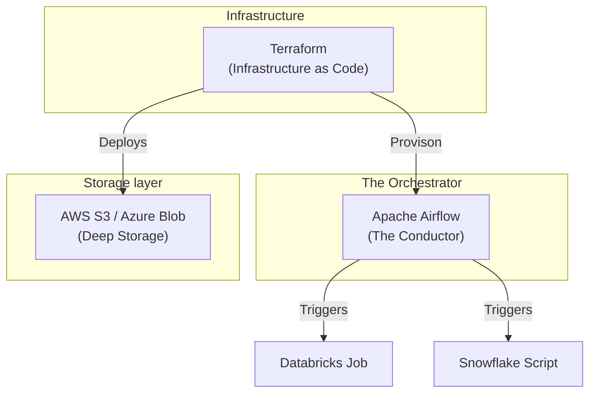

# ☁️ Phase 5: Cloud & Orchestration — The Production Engine

> **Goal:** Take your models and code into the real world. Learn how to store petabytes of data in the Cloud and how to use **Apache Airflow** to orchestrate complex dependencies so they run reliably while you sleep.

---

## 🏗️ The Cloud Data Ecosystem

---

## 📚 Lessons in This Phase

| # | Lesson | Key Concepts | Industry Focus |
|---|--------|-------------|:---:|
| [1](./Lesson_1_Cloud_Storage/README.md) | **Cloud Storage** | S3, ADLS, LifeCycle, Security | **All Clouds** |
| [2](./Lesson_2_Intro_to_Airflow/README.md) | **Airflow Mastery** | DAGs, Operators, XComs, Backfills | **FAANG / Consultancy** |
| [3](./Lesson_3_DataOps_IaC/README.md) | **DataOps & IaC** | Terraform, CI/CD, GitOps | **Startup / Architect** |
| [4](./Lesson_4_Data_Quality_Observability/README.md) | **Data Quality** | Great Expectations, SLAs, Observability | **Architect** |

---

## 🎯 Phase 5: Certification & Interview Drill

### 🛡️ Cloud Digital Leader / Associate Drill
*   **Object Storage (S3/ADLS):** Understand that it is "Eventually Consistent" (though most are now strongly consistent) and that you pay for **Storage** + **Requests** (GET/PUT).
*   **IAM Roles:** NEVER use Root access. Use the "Principle of Least Privilege".

### 🛡️ Airflow Certification Drill
*   **DAGs (Directed Acyclic Graphs):** Be able to explain why a DAG cannot have a loop (it's "Acyclic").
*   **Idempotency:** A DAG should be safe to run multiple times for the same date.

### 🏢 Consultancy Scenario: "The Cloud Migration Cost"
**Scenario:** A client currently has 500TB of data on-premise. They want to move to AWS S3. They ask, "Will it just cost me $23/TB per month?"
*   **Architect Answer:** No. You must also factor in **API Request Costs** (PUT/GET) and **Data Transfer (Egress)** costs. If your app reads the data 1,000 times a day, your request bill might be higher than your storage bill.

### 🚀 Startup Scenario: "The Lean Ingestion"
**Scenario:** You need to ingest 100 CSVs daily from an SFTP. You don't have time to set up a full Airflow server.
*   **Answer:** Use **GitHub Actions** or **AWS Lambda**. For simple, linear jobs, you don't always need a heavy orchestrator. Start simple, then move to Airflow when you have dependencies (e.g., Table A must finish before Table B starts).

### 🏛️ FAANG Scenario: "The Backfill Nightmare"
**Scenario:** "Our logic was wrong for the last 6 months. We need to re-run the pipeline for 180 days without breaking current production runs."
*   **Answer:** **Airflow Backfill.**
*   **The Drill:** Explain the `catchup=True` setting vs. manual backfill via CLI. Show the interviewer you understand how to manage "Max Active Runs" so you don't crash the database by running 180 days all at once.

---

### 🏛️ Architect's Tip
> "Orchestration is the difference between a collection of scripts and a **Data Platform**. If you have to manually check if Step 1 finished before running Step 2, you are not a Data Engineer; you are a human scheduler."

[Start with Lesson 1: Cloud Storage →](./Lesson_1_Cloud_Storage/README.md)
