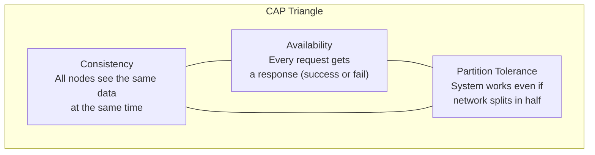

# Lesson 1: System Design for Data Architects (The Master Guide)

> **Goal:** Think like an architect. Understand the non-functional requirements (reliability, scalability, security) that separate enterprise systems from hobby projects, and be able to make and defend technical design decisions.

---

## 🏗️ Phase 1: Absolute Foundations (For Beginners)

### 1. What is "System Design"?
System Design is the process of answering the question: **"How do we build this so it works for 1 million users, not just 10?"**

It's not about code. It's about **Architecture** — the skeleton and muscles of a system.

An architect thinks about:
-  What happens if the database goes down?
-  What happens if we get 10x the usual traffic?
-  What happens if a developer pushes bad code?
-  What happens if a hurricane hits our data center?

### 2. Vertical vs. Horizontal Scaling

| | Vertical Scaling (Scale Up) | Horizontal Scaling (Scale Out) |
|--|--|--|
| **What?** | Get a bigger/faster single machine | Get more machines |
| **Example** | Upgrade from 16GB RAM to 128GB RAM | Add 10 more servers to the cluster |
| **Analogy** | Buy a faster car | Buy more cars (fleet) |
| **Limit** | Hard physical limit (you can only go so big) | Theoretically infinite |
| **Cost** | Exponentially expensive at the top | Linear cost |
| **Failure** | One point of failure | Distributes risk across machines |
| **Used by** | Small OLTP databases | Spark clusters, Kafka, distributed DWs |

### 3. What is "Availability"?

```
Availability % = Uptime / Total Time × 100%

"Five Nines" (99.999%) = System is down for only 5.26 MINUTES per year
"Four Nines" (99.99%)  = System is down for only 52.6 MINUTES per year
"Three Nines" (99.9%)  = System is down for 8.76 HOURS per year ← Common enterprise SLA

How to achieve high availability:
1. Redundancy: Run multiple copies (active-active or active-passive)
2. Auto-failover: If one node dies, traffic moves to another automatically
3. Health checks: Monitor every node, remove unhealthy ones automatically
```

---

## 🚀 Phase 2: Intermediate (The Developer Level)

### 1. CAP Theorem — The Fundamental Trade-off

In a distributed system (any system with multiple servers), you can only guarantee **two out of three** properties:



**Why can't you have all three?**

Imagine a network split (Partition) — Server A can't talk to Server B.
-  **Preserve Consistency:** Refuse to answer until the network heals (lose Availability).
-  **Preserve Availability:** Answer with potentially stale data (lose Consistency).
-  Partition Tolerance is **not optional** — networks DO fail. You must choose between C and A.

**Real-world choices:**

| System | Trade-off | Why |
|--------|---------|-----|
| PostgreSQL / MySQL | **CP** (Consistent) | Banks can't show wrong account balances |
| Cassandra / DynamoDB | **AP** (Available) | Amazon can't show 503 errors during Black Friday |
| MongoDB | **CP** (default) / **AP** (configurable) | |
| Kafka | **AP** (messages may be slightly delayed) | Streaming must be always up |

### 2. SLA, SLO, and SLI — The Reliability Hierarchy

These three terms are always confused. Learn the difference:

```
SLI (Service Level Indicator)
= What we MEASURE
= A specific, quantifiable metric
= "Latency of the API response"
= "% of successful pipeline runs"
= "Data freshness lag in minutes"

         ↓ TARGET SET ON EACH SLI

SLO (Service Level Objective)
= Our INTERNAL TARGET (not customer-facing)
= "API latency should be < 500ms for 99% of requests"
= "Pipeline should succeed 99.5% of the time"
= "Data should be < 30 minutes old"

         ↓ EXTERNAL COMMITMENT

SLA (Service Level Agreement)
= Our LEGAL CONTRACT with the customer
= "If API latency exceeds 1 second for > 0.1% of requests in a month,
   we owe you a 10% service credit"
= Weaker than the SLO — you need a buffer between SLO and SLA!
```

**Why have both SLO and SLA?**
If your SLO = 99.5% and your SLA = 99%, you have a **0.5% error budget**. You can spend this error budget on planned maintenance, deployments, or experiments without breaking customer agreements.

```
Error Budget = 1 - SLO = 1 - 99.5% = 0.5% of requests allowed to fail
= 0.5% of 1 million requests = 5,000 errors allowed per month

If you're burning your error budget too fast → slow down releases, prioritize reliability
If you have budget to spare → can ship faster, take more risks
```

### 3. High Availability Patterns

#### Active-Passive (Failover)
```
NORMAL:
[Requests] → [Primary DB] (Active)
             [Replica DB] (Passive: syncing continuously)

ON FAILURE:
[Primary DB] CRASHES
[Replica DB] gets promoted to Primary automatically (< 30 seconds)
```

#### Active-Active (Load Balanced)
```
[Requests] → [Load Balancer]
             ↙              ↘
    [Server A]            [Server B]
   (Both active,          (Both active,
    sharing load)         sharing load)

If Server A dies → Load Balancer routes all traffic to Server B
```

---

## 🏛️ Phase 3: Architect (The Professional Level)

### 1. The PACELC Theorem (Beyond CAP)

CAP only considers failures. **PACELC** extends it to also consider the latency trade-off even when the system is healthy:

```
IF Partition (P):   choose between Availability (A) or Consistency (C)
ELSE (E):           choose between Latency (L) or Consistency (C)

Example:
- DynamoDB (PA/EL): During partition → prioritize availability. During normal → prioritize low latency.
- HBase (PC/EC):    During partition → prioritize consistency. During normal → prioritize consistency.
```

### 2. Data Engineering System Design — The Framework

When asked "Design a data pipeline for Company X," use this framework:

```
Step 1: Clarify Requirements (5 minutes)
├── Scale: How many events/requests per day? (1M? 1B?)
├── Latency: Real-time (<1s), Near-real-time (<5min), Batch (daily OK)?
├── Consistency: Can we serve stale data? How stale?
├── Cost: Is this budget-sensitive?
└── History: How many years of data to store?

Step 2: Estimate the Scale
├── Events per day: 100M events/day
├── Event size: ~1KB each
├── Daily data: 100GB/day
├── Yearly: ~36TB/year
└── Peak traffic: 10x average = burst handling needed

Step 3: Draw the High-Level Architecture
├── Sources (APIs, DB, Files)
├── Ingestion Layer (Kafka, Kinesis, Auto Loader)
├── Storage Layer (S3, ADLS, Delta Lake)
├── Processing Layer (Spark, Flink, dbt)
├── Serving Layer (Warehouse, API, Cache)
└── Consumers (Dashboards, ML models, APIs)

Step 4: Deep Dive on Key Components
├── What format? Parquet (batch) or Avro (streaming)?
├── What partitioning strategy? By date? Region?
├── How to handle schema changes? Schema registry?
└── How to handle late-arriving data?

Step 5: Address Non-Functional Requirements
├── Reliability: What if Kafka goes down?
├── Scalability: What at 10x the load?
├── Security: Who can access what data?
├── Cost: How much per month? Where to optimize?
└── Observability: How do we know if it's broken?
```

### 3. Data Quality Dimensions — The 6 Pillars

An architect designs systems that guarantee data quality across 6 dimensions:

| Dimension | Definition | How to Check |
|-----------|-----------|---|
| **Completeness** | Are all expected records present? | Row count checks, NULL counts |
| **Accuracy** | Is the data correct? | Cross-validate against source |
| **Consistency** | Does it agree with other data? | Join across systems, check totals |
| **Timeliness** | Is it fresh enough? | Max(ingestion_timestamp) lag check |
| **Uniqueness** | No duplicate records? | Primary key uniqueness check |
| **Validity** | Does it conform to schema/rules? | Type checks, range checks, regex |

```python
# Example: Automated data quality checks in an Airflow task
def run_quality_checks(**context):
    from datetime import datetime, timedelta

    checks = {
        # Completeness: At least 95% of expected records
        "completeness": """
            SELECT COUNT(*) >= 0.95 * (
                SELECT AVG(daily_count) FROM daily_summary WHERE date >= CURRENT_DATE - 30
            )
            FROM fact_sales
            WHERE order_date = CURRENT_DATE - 1
        """,
        # Uniqueness: No duplicate sale IDs
        "no_duplicates": """
            SELECT COUNT(*) = COUNT(DISTINCT sale_id)
            FROM fact_sales
            WHERE order_date = CURRENT_DATE - 1
        """,
        # Validity: All amounts are positive
        "positive_amounts": """
            SELECT COUNT(*) FILTER (WHERE amount <= 0) = 0
            FROM fact_sales
            WHERE order_date = CURRENT_DATE - 1
        """,
        # Timeliness: Data loaded within 1 hour of source
        "freshness": """
            SELECT MAX(source_timestamp) >= NOW() - INTERVAL '2 hours'
            FROM fact_sales
            WHERE order_date = CURRENT_DATE - 1
        """,
    }

    failed_checks = []
    for check_name, query in checks.items():
        result = run_query(query)
        if not result:
            failed_checks.append(check_name)

    if failed_checks:
        raise ValueError(f"Data quality checks FAILED: {failed_checks}")

    print("All data quality checks PASSED! ✅")
```

### 4. Fault Tolerance Patterns

```
Circuit Breaker Pattern:
━━━━━━━━━━━━━━━━━━━━━━━━━━━━━━━━━━━━━━━━━━━━━━━━━━━━━━
CLOSED (Normal): All requests pass through
    ↓ If 5 consecutive failures occur
OPEN (Tripped): All requests fail immediately (no waiting!)
    ↓ After 30 seconds timeout
HALF-OPEN (Testing): Let ONE request through to test recovery
    ↓ If that request succeeds
CLOSED (Reset): Back to normal!

Why? Without a circuit breaker:
- Upstream service goes down
- Your service waits 30 seconds per request (timeout)
- Your queue fills up → cascading failure
- Your entire platform is down now!

With a circuit breaker:
- After 5 failures → open the circuit
- All subsequent requests fail instantly (no 30s wait)
- User sees a friendly "Service temporarily unavailable" message
- Your queue stays empty → only THIS feature is broken, not the whole platform
```

### 5. Cost Optimization Framework

An architect always thinks about cloud cost:

```
Compute Cost Reduction:
├── Use Spot/Preemptible VMs for batch jobs (70-80% cheaper)
├── Right-size clusters: Start small, scale based on data volume
├── Auto-terminate clusters after pipeline completes
└── Use job clusters (not always-on interactive clusters)

Storage Cost Reduction:
├── Parquet > CSV (3-10x compression)
├── Delta Lake compaction (fewer small files = faster reads + less cost)
├── Lifecycle policies: Move cold data to Archive storage (90% cheaper)
└── Partition pruning: Read only the partitions you need

Query Cost Reduction (Snowflake/BigQuery):
├── Always add LIMIT in development
├── Use clustering/partitioning keys in WHERE clauses
├── Avoid SELECT * (read only needed columns → columnar storage wins)
└── Materialize expensive CTEs as tables (cache the result)
```

---

### ❓ Why this matters for Data Engineers?
At the senior/architect level, you are no longer just writing code. You are:
- **Making decisions** that affect data quality for thousands of users
- **Designing systems** that run for months or years without manual intervention
- **Defending choices** to your CTO with cost and reliability reasoning

A developer who can't explain CAP Theorem, SLA vs SLO, or fault tolerance patterns will always be limited to junior/mid roles.

### 🏛️ Architect's Design Principles
1. **The Simplest Solution First:** Don't build a complex streaming system if batch works perfectly.
2. **Design for Failure:** Assume every component WILL fail. Design the recovery.
3. **Observability First:** If you can't measure it, you can't fix it when it breaks.
4. **Cost-Aware Design:** Cloud is pay-per-use. Every unnecessary read costs money.
5. **Security by Default:** Encrypt at rest and in transit. Least-privilege access.
6. **Idempotency Always:** Every pipeline must be safe to re-run without side effects.

---
### 6. Disaster Recovery (DR) Patterns
*   **RTO (Recovery Time Objective):** How much time can we be down? (Goal: 1 hour).
*   **RPO (Recovery Point Objective):** How much data can we lose? (Goal: last 5 minutes of data).
*   **The Move:** Hot-Standby (Instant failover) vs. Cold-Standby (Restore from backup).

---

## 🎯 Phase 4: Certification & Interview Drill

### 🛡️ Google Professional Data Engineer Drill
*   **Storage Choice:**
    *   **Cloud SQL:** Relational/OLTP (Small scale).
    *   **BigQuery:** Analytical/OLAP (Warehouse).
    *   **Bigtable:** NoSQL/Wide-column (High throughput, low latency apps).
    *   **Cloud Storage:** Object store (Data Lake).
*   **The Drill:** If you need to store petabytes of time-series data for a real-time graph, choose **Bigtable**.

### 🛡️ DP-600 (Microsoft Fabric) Drill
*   **Fabric Capacity (F-SKU):** Microsoft Fabric uses a shared pool of compute. How do you ensure one team doesn't hog all the "Capacity"? 
*   **The Answer:** Use **Capcity Governance** and **Workspace isolation**. Assign different capacities to production vs. development.

### 🏢 Consultancy Scenario: "The Missing Requirements"
**Scenario:** A client says, "Build us a data lake." They don't give you any more info.
*   **Architect Answer:** **Clarify before you build.**
*   **The Questions:** 
    1.  What is the daily volume? 
    2.  Who are the consumers (BI, DS, or Users)? 
    3.  What is the required freshness?
    4.  What is the budget limit?
*   **The move:** "Build a small pilot (MVP) to prove the value before committing to a $1M architecture."

### 🚀 Startup Scenario: "The Multi-Tenant Trap"
**Scenario:** Your startup has 100 customers. You want to store their data in one S3 bucket.
*   **Answer:** **Use Row-Level Security (RLS) or Separate Folders.**
*   **The Drill:** If you put all data in one folder and filter in code, you are one bug away from showing Customer A's data to Customer B. Use **Unity Catalog** or **IAM Policies** to enforce isolation at the storage level.

### 🏛️ FAANG Scenario: "The Notification Firehose"
**Scenario:** "Design a system to send push notifications to 100 Million users within 5 minutes of a sports goal."
*   **Answer:** **Pub-Sub (Kafka/Kinesis) + Distributed Workers.**
*   **The Drill:** You can't use a standard database for this; it will lock up. You need a highly available queue (Kafka) and a fleet of horizontal-scaled workers (Kubernetes) that process the goal event and blast the notifications in parallel.

---

### 🧪 Hands-on Labs
- [system_design_interview_template.md](system_design_interview_template.md) (A step-by-step guide to passing an SDI at FAANG)

---

### ✅ Key Takeaways
1. **Vertical Scaling** has a roof; **Horizontal Scaling** is limitless.
2. **CAP Theorem** is the law of the land. Pick your trade-off early.
3. **SLOs** are your internal compass; **SLAs** are your legal shield.
4. **Data Quality** is a 6-dimensional problem. Check all of them.
5. **Circuit Breakers** prevent total system collapse when one API fails.
6. **System Design** is 10% technology and 90% trade-off analysis.

[Next: Lesson 2: Architectural Patterns (Lambda, Kappa, and Lakehouse) →](../Lesson_2_Architectural_Patterns/README.md)

---

## ⚠️ Common Pitfalls (Beginner Mistakes)

1.  **Over-Engineering for DAY 1:** Building a multi-region, active-active, Kafka-streaming-into-Delta-Live-Tables system for a prototype.
    *   **The Issue:** You will spend 6 months building it only to realize the business requirements changed. The complexity will kill your speed.
    *   **Fix:** Build the "Simplest Possible Architecture" first. Use easy-to-manage batch jobs before jumping into streaming.
2.  **Ignoring the "Cold Start" for Availability:** Having a backup system that takes 4 hours to "Turn on" and "Load data" before it can take traffic.
    *   **The Issue:** Your SLA says you can be down for 5 minutes. Your recovery takes 4 hours. You have effectively zero availability during a crash.
    *   **Fix:** Regularly test your **Disaster Recovery (DR)** plans using "Game Days."
3.  **Measuring the Wrong SLIs:** Measuring "CPU Usage" instead of "Data Freshness."
    *   **The Issue:** Your CPU looks fine (10%), but your pipeline has been stuck in a loop for 5 hours and users are seeing yesterday's data. High CPU % isn't a problem for users; stale data is.
    *   **Fix:** Always define SLIs based on **User Experience** (Latency, Freshness, Correctness).
4.  **No Cost Alerts:** Scaling a system to handle 10x traffic but forgetting to set a budget alert.
    *   **The Issue:** One small bug in your code might trigger an infinite loop that spins up 1,000 executors, costing $20,000 in one night.
    *   **Fix:** Always set **Quotas** and **Budget Alerts** at the cloud account level.

---

## 🧪 Practice Exercises

### Exercise 1 — Scalability Calculation (Beginner)
**Goal:** Distinguish between throughput and latency.

**Scenario:** An API takes 200ms to process one record.
**Your Task:**
1.  What is the **Latency** for one record?
2.  If you have only 1 machine (Serial), what is the maximum **Throughput** (records per second)?
3.  If you have 10 machines (Parallel), what is the new throughput?

---

### Exercise 2 — Choosing the CAP Core (Intermediate)
**Goal:** Apply the CAP theorem.

**Scenario:** You are building the "Like Counter" for a massive social network.
- Requirement: If a user clicks "Like," they should see the count go up, but it's okay if their friend across the ocean doesn't see the update for 5 seconds. The system must NEVER stop working.

**Your Task:**
Identify whether this system should be **CP** (Consistent) or **AP** (Available) and justify your choice.

---

### Exercise 3 — Data Quality Dashboard (Architect)
**Goal:** Define quality checks.

**Scenario:** A CEO says "The reports are always wrong." You need to build an automated DQ (Data Quality) dashboard.

**Your Task:**
Choose 3 of the **6 Pillars of Data Quality** and write one specific "Business Rule" for each that would apply to a `Sales` table (e.g., "Amount cannot be negative").

---

## 💼 Common Interview Questions

**Q1: What is the difference between Scalability and Availability?**
> **Scalability** is the ability of a system to handle an increasing amount of work by adding resources (Vertical or Horizontal). **Availability** is the percentage of time the system is operational and able to respond to requests. A system can be highly scalable but have low availability (e.g., it scales to 1B users but crashes once a day).

**Q2: In the CAP Theorem, why is "Partition Tolerance" not something you can choose to give up?**
> In modern distributed systems, network failures (partitions) are a physical reality—routers fail, cables get cut, or cloud regions go dark. Since you cannot prevent partitions from happening, you are forced to choose how the system behaves **during** that partition: either sacrifice **Consistency** (allow stale data) or sacrifice **Availability** (stop responding until the network is fixed).

**Q3: Explain the "Circuit Breaker" pattern in the context of a Data Pipeline.**
> A Circuit Breaker prevents a single failing component (like a slow external API) from causing a cascading failure across the whole pipeline. If a task fails multiple times, the "circuit opens," and all future requests fail immediately without waiting for a timeout. This protects your system's resources (like Airflow workers) and allows you to fail gracefully instead of hanging the entire platform.

**Q4: What is the difference between an SLO and an SLA?**
> An **SLO (Service Level Objective)** is an internal target for reliability (e.g., "99.9% uptime"). An **SLA (Service Level Agreement)** is a legal commitment to customers (e.g., "99.5% uptime"). The gap between the two (the 0.4%) is your **Error Budget**, allowing you to deploy new features or perform maintenance without legal consequences.

**Q5: How do you design for "Idempotency" in a data ingestion job?**
> Idempotency ensures that running a job twice doesn't create duplicate data. This is achieved by: 1. Using **MERGE** (Upsert) instead of simple Appends, 2. Using **Overwrites** on specific partitions (e.g., `REPLACE WHERE date = '2024-01-01'`), or 3. Generating a unique **Deterministic ID** for every row based on the source data so that the database can automatically reject duplicates.
