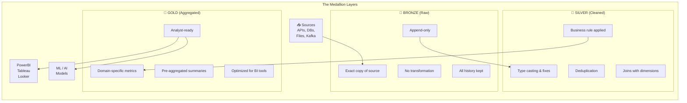
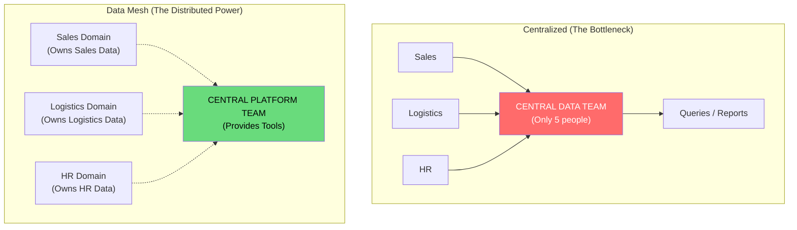
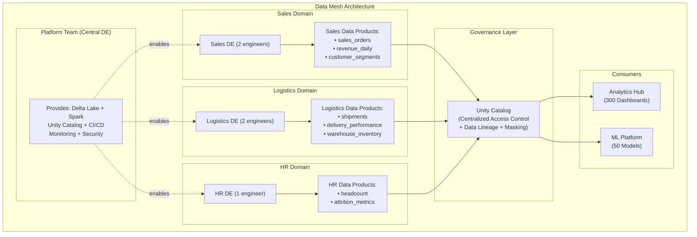

# Lesson 2: Modern Architectural Patterns (The Master Guide)

> **Goal:** Master the four major data architectural patterns — Medallion, Lambda, Kappa, and Data Mesh — understand the trade-offs of each, and know how to choose the right one for a given business problem.

---

## 🏗️ Phase 1: Absolute Foundations (For Beginners)

### 1. Why Do We Need Architectural Patterns?

Without a pattern, data systems grow organically and become "spaghetti" — pipelines that nobody fully understands, data quality issues nobody can trace, and teams stepping on each other's work.

An **Architectural Pattern** is a proven, reusable blueprint for organizing your data system. It defines:
-  Where raw data lives
-  How it gets cleaned
-  Who owns what
-  How different teams share data

### 2. The Medallion Architecture (The Industry Gold Standard)

The **Medallion Architecture** (also called Bronze/Silver/Gold) is the single most widely adopted data lakehouse pattern in 2024. Used by Databricks, Netflix, Uber, Shopify, and thousands of other companies.

**The Core Idea:** Data flows through three layers, getting progressively cleaner and more valuable.



**Rule for Each Layer:**

```python
# ============================================================
# BRONZE LAYER: Raw, exact copy of the source
# Rule: NEVER transform data in Bronze. Just ingest perfectly.
# ============================================================
@dlt.table(name="bronze_orders")
def bronze_orders():
    return (
        spark.readStream
            .format("cloudFiles")
            .option("cloudFiles.format", "json")
            .load("abfss://landing@storage.dfs.core.windows.net/orders/")
            # Add metadata columns so we know WHERE and WHEN each row came from
            .withColumn("_source_file",     input_file_name())
            .withColumn("_ingested_at",     current_timestamp())
            .withColumn("_processing_date", current_date())
    )
    # Bronze stores EVERYTHING — even bad records. The point is perfect fidelity.
    # If downstream fails, we can re-process from Bronze without re-hitting the source.

# ============================================================
# SILVER LAYER: Cleaned, typed, validated
# Rule: One canonical, trusted version of each business entity
# ============================================================
@dlt.table(name="silver_orders")
@dlt.expect_or_drop("valid_order_id",    "order_id IS NOT NULL")
@dlt.expect_or_drop("positive_amounts",  "amount > 0")
@dlt.expect("reasonable_date",           "order_date BETWEEN '2020-01-01' AND current_date()")
def silver_orders():
    return (
        dlt.read_stream("bronze_orders")
            # TYPE CASTING (Bronze stores everything as strings from raw JSON)
            .withColumn("order_id",    col("order_id").cast("int"))
            .withColumn("amount",      col("amount").cast("decimal(12,2)"))
            .withColumn("order_date",  to_date(col("order_date_raw"), "yyyy-MM-dd"))
            # CLEANING
            .withColumn("customer_email", lower(trim(col("customer_email"))))
            .withColumn("region",         upper(col("region")))
            # DEDUPLICATION (in streaming: use watermark)
            .withWatermark("order_date", "24 hours")
            .dropDuplicates(["order_id"])
            # SELECT only the columns that downstream cares about
            .select("order_id", "customer_id", "amount", "order_date", "region", "status")
    )

# ============================================================
# GOLD LAYER: Business-ready aggregations
# Rule: One Gold table per business question / BI report
# ============================================================
@dlt.table(name="gold_daily_revenue")
def gold_daily_revenue():
    return (
        dlt.read("silver_orders")
            .filter(col("status") == "COMPLETED")
            .groupBy(
                date_trunc("day", "order_date").alias("report_date"),
                "region"
            )
            .agg(
                sum("amount").alias("total_revenue"),
                count("order_id").alias("total_orders"),
                countDistinct("customer_id").alias("unique_buyers"),
                avg("amount").alias("avg_order_value"),
                max("amount").alias("max_order_value")
            )
    )
```

---

## 🚀 Phase 2: Intermediate (The Developer Level)

### 1. Lambda Architecture — Batch + Speed Layers

The **Lambda Architecture** solves a specific problem: How do you get both **accurate historical results** (from batch) AND **low-latency real-time results** (from streaming)?

**The Three Layers:**
```
                ┌──────────────────────────────────┐
                │         Batch Layer               │
Source Data ──▶ │  (Spark Batch: recomputes         │
                │   everything, perfectly accurate)  │
                └──────────────────────┬────────────┘
                                       │
                ┌──────────────────────▼────────────┐
Source Data ──▶ │      Serving Layer                 │◀── Query API
(same data)     │  (Merged results from both layers) │
                └──────────────────────▲────────────┘
                                       │
                ┌──────────────────────┴────────────┐
                │        Speed Layer                 │
Source Data ──▶ │  (Kafka + Spark Streaming:         │
                │   fast but approximate)             │
                └──────────────────────────────────┘
```

**Example use case:**
-  A user asks: "What is today's total revenue?"
-  Speed Layer answers instantly: "$2.3M" (approximate, last 5-minute refresh)
-  Batch Layer answers at midnight: "$2.31M" (exact, full recompute)
-  Serving layer merges them: For today → use Speed. For yesterday and before → use Batch.

**Pros:**
-  Very accurate historical data (full re-computation)
-  Low latency for current data

**Cons:**
-  **Two separate code paths** for batch and streaming — must keep in sync!
-  If you change business logic, you must update BOTH paths
-  More infrastructure, more operational complexity

### 2. Kappa Architecture — Streaming Only

The **Kappa Architecture** (proposed by LinkedIn's Jay Kreps) simplifies Lambda by removing the Batch Layer entirely.

**The Core Idea:** If you make streaming powerful enough, you don't need a batch layer.

```
Source Data ──▶ Kafka (Infinite Retention) ──▶ Streaming Engine ──▶ Serving Layer
                     (The "Source of Truth")       (Flink / Spark Streaming)
```

**The Key Insight:** Store **all events** in Kafka indefinitely. To recompute history, just **replay** from the beginning of Kafka.

```python
# Kappa: Any "batch" job is just a streaming job that starts from offset 0
def reprocess_all_history():
    # Start streaming from the very BEGINNING of the Kafka topic
    df = spark.readStream \
        .format("kafka") \
        .option("kafka.bootstrap.servers", "kafka:9092") \
        .option("subscribe", "orders_events") \
        .option("startingOffsets", "earliest")  # From the beginning!
    
    # The SAME code as your real-time pipeline — no separate batch code!
    process_and_write(df)
```

**Pros:**
-  One codebase (no sync problem between batch and streaming code)
-  Simpler infrastructure
-  Natural audit trail (Kafka is the immutable log)

**Cons:**
-  Requires Kafka to store ALL history (expensive for very long retention)
-  Streaming engines can be complex for certain operations (e.g., full recounts)
-  Not suitable when you need very complex batch aggregations (e.g., ML features across all history)

### 3. Lambda vs. Kappa Decision Matrix

| Factor | Choose Lambda | Choose Kappa |
|--------|-------------|-------------|
| **Data volume** | Petabytes of history (too expensive for Kafka) | Terabytes (Kafka can hold it) |
| **Team size** | Large team (can maintain 2 code paths) | Small/medium team |
| **Latency** | Need P99 < 1 second | Near-real-time (minutes) is OK |
| **Reprocessing** | Happens rarely | Happens often |
| **Batch complexity** | Very complex ML/batch needed | Streaming can express all logic |
| **Tooling preference** | Separate batch + streaming | Unified streaming (Flink/Spark) |

---

## 🏛️ Phase 3: Architect (The Professional Level)

### 1. Data Mesh — Organizational Architecture

Unlike Lambda/Kappa (technical patterns), **Data Mesh** is an **organizational architecture** — it changes WHO owns the data, not just HOW it's processed.

**The Problem Data Mesh Solves:**

At large companies (100+ engineers, 50+ data sources), a central Data Engineering team becomes a bottleneck:
```
Sales wants a new report → submit ticket → wait 3 weeks → get it → wait, the data is wrong → wait 3 more weeks
```
The central team has 50 things to do. No one truly understands the data better than the domain teams.

**The Four Data Mesh Principles:**

```
Principle 1: Domain Ownership
  Each business domain (Sales, HR, Logistics) OWNS its own data.
  They are responsible for quality, freshness, and schema.
  NOT the central Data Engineering team.

Principle 2: Data as a Product
  Each domain treats its data like a product with:
  - An owner (accountable person)
  - An SLA (data freshness guarantee)
  - Documentation (what it means)
  - Quality metrics (is it accurate?)

Principle 3: Self-Serve Data Platform
  The central PLATFORM team provides the TOOLS
  (Delta Lake, Unity Catalog, Spark clusters, CI/CD)
  so domain teams can build their own pipelines WITHOUT asking for help.

Principle 4: Federated Computational Governance
  One common catalog (Unity Catalog) enforces global policies:
  - GDPR compliance (data masking, right to be forgotten)
  - Access control (who can see what)
  - Data lineage (where does data come from?)
  
But domains keep their autonomy within those guardrails.
```

**Ownership Comparison: Centralized vs. Decentralized**





### 2. Data Lakehouse — The Unified Architecture (Where It All Comes Together)

The **Lakehouse** combines the cost of a Data Lake (cheap object storage) with the reliability of a Data Warehouse (ACID, schema, governance).

```
Data Lake (AWS S3 / Azure ADLS / GCP GCS)
+
Delta Lake (ACID transactions, Schema enforcement, Time Travel)
+
Databricks (Unified compute: Spark batch + Streaming + SQL + ML)
+
Unity Catalog (Governance, security, lineage)
=
The Modern Lakehouse
```

**Why the Lakehouse wins over traditional Data Warehouses:**

| Feature | Traditional DW (Snowflake alone) | Lakehouse (Delta Lake) |
|---------|----------------------------------|----------------------|
| ML/AI workloads | Limited | Native (notebooks, MLflow) |
| Streaming | Separate tool needed | Built-in (Spark Streaming) |
| Storage cost | High (proprietary format) | Low (open Parquet) |
| Vendor lock-in | High | Low (open source Delta) |
| Schema flexibility | Rigid | Schema evolution supported |
| Time Travel | Limited | Full (RESTORE TABLE, TIME TRAVEL) |
| Semi-structured data | Difficult | Native JSON/array support |

### 3. Choosing the Right Pattern — The Decision Tree

```
START HERE: What is your team size?
│
├── Small (1-5 DE)
│   └── Use: Medallion Architecture
│         Simple Batch pipelines (Airflow + Spark)
│         Single centralized warehouse (Databricks)
│
├── Medium (5-20 DE)
│   ├── Near-real-time latency needed?
│   │   ├── YES → Kappa Architecture (streaming-first)
│   │   └── NO  → Lambda Architecture or Medallion + batch
│   └── Multiple departments fighting over data ownership?
│       └── YES → Consider Data Mesh (with team training)
│
└── Large (20+ DE, 10+ domains)
    └── Use: Data Mesh + Medallion + Unity Catalog
          Each domain follows Medallion internally
          Unity Catalog provides federated governance
          Central Platform team provides the tools
```

---

### ❓ Why this matters for Data Engineers?
Senior Data Engineers and architects are expected to **recommend and defend** architectural patterns. In interviews for senior roles, questions like:
-  "How would you design a real-time revenue dashboard?"
-  "How would you handle data ownership across 20 teams?"
-  "When would you use Kappa over Lambda?"

...are standard. These patterns are your vocabulary.

### ⚡ Pattern Trade-off Summary

| Pattern | Latency | Complexity | Best For |
|---------|---------|-----------|---------|
| **Medallion** | Batch (hours) | Low | 90% of companies |
| **Lambda** | Real-time + Batch | High | Financial markets, logistics |
| **Kappa** | Near-real-time | Medium | Event-driven companies |
| **Data Mesh** | Varies | Very High | 50+ data producers |
| **Lakehouse** | All of the above | Medium | Modern cloud companies (2024 standard) |

---
### 4. Comparison Summary
| Feature | Medallion | Lambda | Kappa | Data Mesh |
|---------|-----------|--------|-------|-----------|
| **Core Idea** | Refined layers | Batch + Speed | Stream only | Domain ownership |
| **Setup Cost**| Low | High | Medium | Very High |
| **Use Case**| General BI | Near-real-time | Real-time apps | Massive Enterprise |

---

## 🎯 Phase 4: Certification & Interview Drill

### 🛡️ Databricks Architect Drill
*   **ACID in Medallion:** Understand how Delta Lake provides ACID transactions across the Bronze/Silver/Gold layers. If a Silver job fails halfway, the table is not corrupted.
*   **The Drill:** Why use Bronze at all? "To have a single source of truth that can be replayed if business logic in Silver/Gold changes."

### 🛡️ DP-600 (Microsoft Fabric) Drill
*   **OneLake and Data Mesh:** OneLake allows different teams to have their own "Workspaces" (Domain Ownership) while sharing data across the company via **Shortcuts**. This is the literal implementation of the **Self-Serve Platform** principle.

### 🏢 Consultancy Scenario: "The Data Spaghetti"
**Scenario:** A client has 500 SQL scripts running on no particular schedule. They want "Modern Architecture".
*   **Architect Answer:** Propose a **Medallion Architecture migration**.
*   **The Roadmap:** 
    1.  Ingest all scripts' raw outputs into **Bronze**.
    2.  Standardize the logic into **Silver** tables.
    3.  Create business-friendly views in **Gold**.
    4.  Introduce **Data Quality Gateways** (DLT Expectations) between layers.

### 🚀 Startup Scenario: "MVP Architecture"
**Scenario:** "We have 1 week to build a dashboard for our investors. Should we set up a Data Mesh?"
*   **Answer:** **No. Use Medallion.** 
*   **The Drill:** Data Mesh is an organizational pattern for 100+ people. For a startup, keep it simple. Build a single Medallion pipeline. Speed of delivery is your only priority.

### 🏛️ FAANG Scenario: "The 1PB Reality Check"
**Scenario:** "We need to recompute 1PB of historical data for a new ML feature. We use Kappa architecture. Can we just replay Kafka?"
*   **Answer:** **Only if you have the budget.**
*   **The Drill:** Replaying 1PB from Kafka is extremely expensive in terms of compute and storage. In this case, even a "Kappa" team might temporarily use a **Batch job** on the underlying S3/Parquet files to save money, then switch back to the stream for new data.

---

### 🧪 Hands-on Labs
- [medallion_architecture_diagram.md](medallion_architecture_diagram.md) (Interactive diagram explaining each layer)

---

### ✅ Key Takeaways
1. **Medallion** is the "Lakehouse" standard. Bronze → Silver → Gold.
2. **Lambda** is for when you need perfect batch accuracy + high-speed streams.
3. **Kappa** is for when "Everything is a Stream".
4. **Data Mesh** is for fixing **People/Process** problems in large companies.
5. **Architectural Patterns** are tools, not religions. Pick the one that fits the scale.
6. The goal of every pattern is **Reliability, Scalability, and Visibility**.

[Next: Lesson 3: Real World Case Studies (Uber, Netflix, Shopify) →](../Lesson_3_Real_World_Case_Studies/README.md)

---

## ⚠️ Common Pitfalls (Beginner Mistakes)

1.  **Skipping the Bronze Layer:** Merging raw ingestion and cleaning into one step to "save time."
    *   **The Issue:** If your cleaning logic has a bug and you already deleted the source files, you have **lost data**. Without Bronze, you can't "replay" the ingestion to fix historical errors.
    *   **Fix:** Always store an identical copy of the raw source data in Bronze before any transformation.
2.  **Code Inconsistency in Lambda:** Writing one logic in Java for the Speed Layer and the same logic in Python for the Batch Layer.
    *   **The Issue:** Over time, the two versions of the logic will "drift" (e.g., one rounds up, the other rounds down). Users will see inconsistent numbers between real-time and historical dashboards.
    *   **Fix:** Use a unified engine like **Apache Spark** or **Apache Flink** that can run the *same* code in both batch and streaming modes.
3.  **Data Mesh Without Autonomy:** Implementing "Data Mesh" but still requiring the central platform team to approve every new table or schema change.
    *   **The Issue:** This isn't a Mesh; it's a "Centralized team with more paperwork." You still have the same bottleneck but with more meetings.
    *   **Fix:** Provide self-serve tooling (Terraform, CI/CD) so domains can deploy their own infrastructure safely.
4.  **Over-complicating the Gold Layer:** Creating hundreds of Gold tables that are nearly identical (e.g., `gold_revenue_by_day` and `gold_revenue_by_week`).
    *   **The Issue:** High maintenance cost. If the logic for "Revenue" changes, you have to update 100 tables.
    *   **Fix:** Create a few "Generic" Gold tables (e.g., `gold_fact_sales`) and use **Views** or a **BI Layer** (like Power BI / Looker) to handle different aggregations.

---

## 🧪 Practice Exercises

### Exercise 1 — The Medallion Logic (Beginner)
**Goal:** Map transformations to layers.

**Scenario:** You have the following tasks:
- A: Filter out orders with negative amounts.
- B: Calculate "Top 5 Customers of the Month."
- C: Import raw JSON from an S3 bucket.
- D: Rename `cust_id` to `customer_id`.

**Your Task:**
Identify which task belongs in **Bronze**, **Silver**, and **Gold**.

---

### Exercise 2 — Architecting for Real-Time (Intermediate)
**Goal:** Choose between Lambda and Kappa.

**Scenario:** A massive sports betting company needs to update odds every second. They have 10 years of historical betting data (100 Petabytes). They rarely need to re-scan the historical data, but they need the "Speed Layer" to be 100% reliable.

**Your Task:**
1.  Would you choose **Lambda** or **Kappa**?
2.  Justify your choice based on the **Petabyte-scale history** and the **one-second latency** requirement.

---

### Exercise 3 — Data Mesh Ownership (Architect)
**Goal:** Define domain boundaries.

**Scenario:** The "Mobile App Team" generates logs. The "Marketing Team" uses these logs to send coupons. The logs are currently broken (missing `user_id`).

**Your Task:**
In a **Data Mesh** architecture, who is responsible for fixing the logs? Why? (Hint: Principle 1: Domain Ownership).

---

## 💼 Common Interview Questions

**Q1: What is the primary benefit of the Medallion Architecture (Bronze/Silver/Gold)?**
> The Medallion architecture provides a clear "Data Lineage" and "Trust Hierarchy." **Bronze** ensures data fidelity (recovery), **Silver** provides a single source of truth for business entities (reliability), and **Gold** provides optimized, business-ready metrics (performance). It prevents "data spaghetti" by ensuring every transformation has a specific, documented place.

**Q2: When should you choose Lambda Architecture over Kappa Architecture?**
> Choose **Lambda** when you have extremely complex batch calculations (like ML training or multi-year trend analysis) that are difficult to express in a streaming engine, or when your historical data volume is so massive (Petabytes) that storing it in Kafka (required for Kappa) is physically or financially impossible.

**Q3: Explain the concept of "Data as a Product" in a Data Mesh.**
> "Data as a Product" means domain teams treat their datasets like an external software product. This includes having a dedicated **Data Product Owner**, defined **SLAs** for freshness and quality, comprehensive **Documentation**, and **Discoverability** (tags/search). The goal is to make data easy to find and trust for other teams without needing a central coordinator.

**Q4: How does a "Data Lakehouse" eliminate the need for two separate systems (Data Lake and Data Warehouse)?**
> A Lakehouse uses open file formats (like Parquet) stored on cheap object storage (Lake) but adds a **Transactional Metadata Layer** (like Delta Lake) on top. This metadata layer provides the ACID compliance, indexing, and schema enforcement typical of a Warehouse. Thus, you get the low cost of a Lake and the high performance/reliability of a Warehouse in a single system.

**Q5: What is a "Single Source of Truth" (SSOT) and which layer in the Medallion architecture represents it?**
> A Single Source of Truth is a dataset that is universally agreed upon as the "Correct" version of a business entity across the whole company. In the Medallion architecture, the **Silver Layer** is the SSOT. While Bronze is raw and Gold is aggregated/filtered, Silver contains the cleaned, deduplicated, and validated records that everyone (Marketing, Finance, Ops) can trust for their reports.
