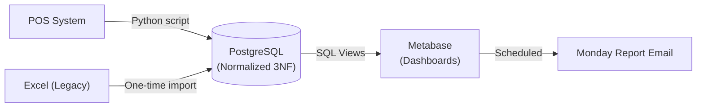
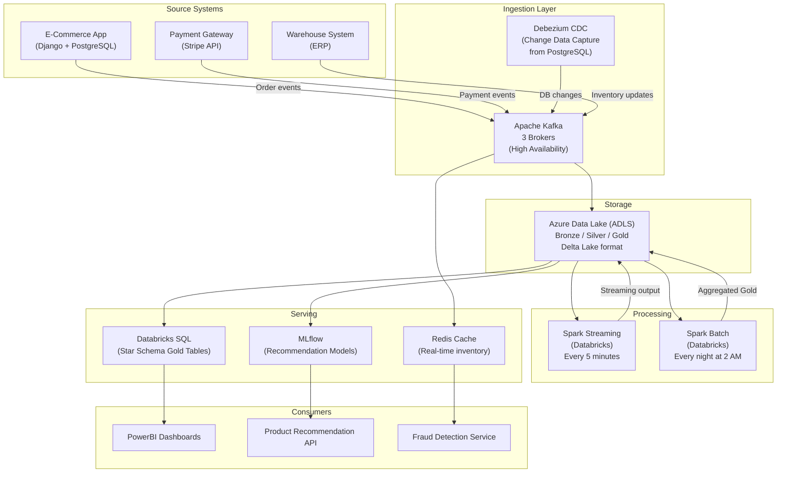
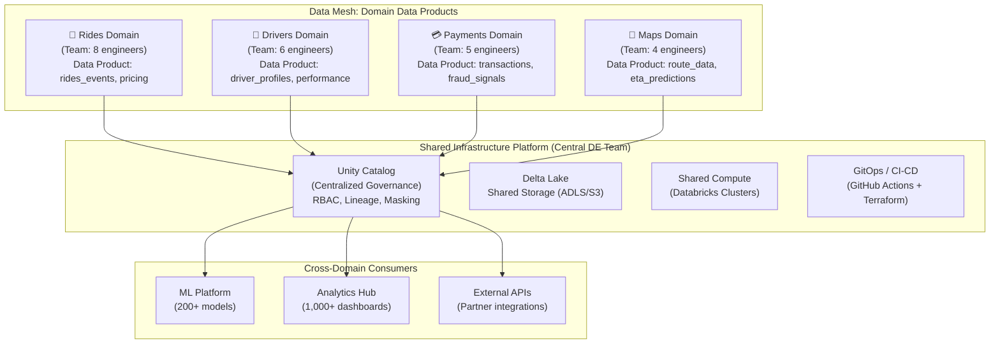

# Lesson 3: Real-World Data Engineering Case Studies

> **Goal:** Apply all concepts from the roadmap to real-world system designs. See how small companies, mid-size e-commerce platforms, and enterprise-scale systems are actually built.

---

## 🏗️ Phase 1: The Foundation (Starting Small)

### Case Study 1: The Small Business — From Excel Chaos to SQL Order

**The Problem:**
A 50-person retail company has:
-  Sales tracked in 5 different Excel files (one per salesperson)
-  No way to answer "What is our total revenue this month?"
-  Managers spending every Monday morning combining Excel files manually

**The Data Engineering Solution:**

```
Phase 1: Central Database (Week 1-2)
├── Set up PostgreSQL on a small cloud server (~₹1,500/month)
├── Design a simple normalized schema (Customers, Products, Orders)
├── Write a Python script to import all the Excel files
└── Give all salespeople access to input directly (no more Excel!)

Phase 2: Basic Reporting (Week 3-4)
├── Connect Metabase (free BI tool) to PostgreSQL
├── Build 5 key dashboards: Revenue, Top Products, Customer Growth, Regional, Monthly Trend
└── Set up automated email reports every Monday morning

Phase 3: Automation (Month 2)
├── Write Python scripts to auto-import data from the company's POS system
├── Set up nightly data refresh (cron job at 2 AM)
└── Add basic data validation (no nulls in critical fields, amounts > 0)

Result:
✅ Monday morning manual work: ELIMINATED
✅ "What is our total revenue?" answered in 2 seconds, not 2 hours
✅ One Source of Truth: Everyone sees the same numbers
```

**Architecture:**


**What a Data Engineer delivers here:**
-  Schema design (Lesson 2.2: Normalization)
-  Python ETL scripts (Lesson 1.3: Python Glue)
-  SQL dashboards (Lesson 1.2: SQL Mastery)
-  Automation (Linux cron jobs — Lesson 1.1: Linux)

---

## 🚀 Phase 2: Intermediate Scale — The E-Commerce Lakehouse

### Case Study 2: Mid-Size E-Commerce Platform (5M users, 100K orders/day)

**The Business:**
An online marketplace with 5 million customers. They need:
-  Real-time inventory updates (something sold → show "out of stock" immediately)
-  Daily performance reports (revenue by category, top sellers, customer segments)
-  Historical customer behavior analysis for personalization
-  Fraud detection signals for the payments team

**The Architecture Decision:**

```
Data Volume:
• 100,000 orders/day × 365 = 36.5M orders/year
• Each order: 5 line items → 182.5M order_items/year
• User events (clicks, views): 50M events/day → 18.25B events/year
• Storage: ~500GB/year for orders, ~5TB/year for events

Latency Requirements:
• Inventory updates: Real-time (< 1 second)    → Kafka + OLTP
• Business reports:  Near-real-time (< 1 hour) → Spark Streaming
• Historical analysis: Batch (daily OK)         → Spark Batch on Delta Lake
```

**The Full System Design:**



**The Star Schema Design:**

```sql
-- Core fact tables
CREATE TABLE IF NOT EXISTS gold.fact_orders (
    order_key        BIGINT GENERATED ALWAYS AS IDENTITY PRIMARY KEY,
    order_id         VARCHAR(50),
    customer_key     BIGINT REFERENCES gold.dim_customer(customer_key),
    product_key      BIGINT REFERENCES gold.dim_product(product_key),
    date_key         INT    REFERENCES gold.dim_date(date_key),
    time_key         INT    REFERENCES gold.dim_time(time_key),
    payment_key      BIGINT REFERENCES gold.dim_payment(payment_key),

    -- Measures (The Numbers)
    quantity         INT,
    unit_price       DECIMAL(12,2),
    discount_amount  DECIMAL(12,2),
    shipping_cost    DECIMAL(12,2),
    total_amount     DECIMAL(12,2),
    gross_margin     DECIMAL(12,2),

    -- Degenerate dimensions (IDs that don't need their own table)
    order_number     VARCHAR(50),
    invoice_id       VARCHAR(50)
);

-- Key dimension tables (denormalized for performance)
CREATE TABLE gold.dim_product (
    product_key       BIGINT GENERATED ALWAYS AS IDENTITY PRIMARY KEY,
    product_id        VARCHAR(50),        -- Natural key from source
    product_name      VARCHAR(200),
    sub_category      VARCHAR(100),       -- Denormalized from categories table
    category          VARCHAR(100),       -- Denormalized from categories table
    department        VARCHAR(100),       -- Denormalized from departments table
    brand             VARCHAR(100),
    supplier_name     VARCHAR(200),       -- Denormalized from suppliers table
    cost_price        DECIMAL(12,2),
    list_price        DECIMAL(12,2),
    is_active         BOOLEAN,

    -- SCD Type 2 columns
    effective_start   DATE,
    effective_end     DATE,
    is_current        BOOLEAN
);
```

**Key Technical Decisions Explained:**

| Decision | Chosen | Alternatives | Reason |
|---------|--------|------------|------|
| Streaming ingestion | Kafka | Kinesis, Pub/Sub | Multi-consumer, replay, high throughput |
| Storage format | Delta Lake | Parquet, Iceberg | ACID + Time Travel + MERGE support |
| Batch compute | Databricks Spark | EMR, Dataproc | Best Delta Lake native integration |
| Change capture | Debezium CDC | Full extracts | Reduces load on source DB |
| Real-time cache | Redis | Memcached | Supports sorted sets for inventory |
| SCD strategy | Type 2 (products) | Type 1 | Price history matters for margin analysis |

---

## 🏛️ Phase 3: Enterprise Scale — The Modern Lakehouse Architecture

### Case Study 3: Enterprise Conglomerate (Uber/Airbnb Scale)

**The Business:**
A company like Uber with:
-  1 Billion rides/year
-  50+ source systems (Driver App, Rider App, Payments, Maps, Support, ...)
-  500+ data consumers (1,000 dashboards, 200 ML models, 50 teams)
-  Strict compliance: GDPR (EU), CCPA (US), PCI-DSS (payments)

**The Architecture: Data Mesh + Medallion + Unity Catalog**

At this scale, a central Data Engineering team **cannot** own all data. The solution is a **Data Mesh** — each domain team owns their own data products.



**Data Quality at Scale — Great Expectations:**

```python
# At enterprise scale, manual quality checks don't work.
# Use Great Expectations (GX) for automated, version-controlled checks.

import great_expectations as gx

context = gx.get_context()

# Define a suite of quality rules for the fact_rides table
suite = context.suites.add(gx.ExpectationSuite(name="fact_rides_quality"))

# Define each expectation
suite.expect_column_values_to_not_be_null("ride_id")
suite.expect_column_values_to_be_unique("ride_id")
suite.expect_column_values_to_be_between("distance_km", min_value=0.1, max_value=500)
suite.expect_column_values_to_be_between("fare_amount", min_value=1.00, max_value=10000.00)
suite.expect_column_pair_values_to_be_in_set(
    "driver_rating", "rider_rating",
    value_pairs_set=[(r1, r2) for r1 in range(1,6) for r2 in range(1,6)]
)

# Run the checkpoint (integrated with your Airflow/Databricks pipeline)
checkpoint = context.checkpoints.add(gx.Checkpoint(
    name="daily_rides_checkpoint",
    validation_definitions=[gx.ValidationDefinition(
        data_source_name="delta_lake",
        batch_definition_name="daily_batch",
        suite=suite
    )]
))

result = checkpoint.run()
if not result.success:
    # Quarantine the failed batch, send alert, don't load to Gold!
    logger.error("Quality check FAILED. Data quarantined.")
    send_pagerduty_alert("Data Quality Failure: fact_rides")
```

**GDPR Compliance — Unity Catalog Column Masking:**

```sql
-- In Unity Catalog (Databricks): Protect sensitive columns automatically
-- Only HR team sees real SSN; everyone else sees XXX-XX-XXXX

CREATE FUNCTION mask_ssn(ssn STRING)
RETURNS STRING
LANGUAGE SQL
RETURN CASE
    WHEN is_member('hr_team') THEN ssn
    ELSE 'XXX-XX-' || SUBSTR(ssn, 8, 4)
END;

ALTER TABLE dim_customer
ALTER COLUMN social_security_number
SET MASK mask_ssn;

-- Row-level security: Each regional manager sees only their region
CREATE ROW FILTER rides_region_filter ON fact_rides
AS (region_code) →
    region_code IN (SELECT allowed_region FROM user_permissions WHERE user = current_user());
```

**The Full Technology Stack:**

```
Data Sources:
├── Kafka (real-time events: 10M events/hour)
├── Debezium CDC (database changes from 50+ PostgreSQL/MySQL instances)
├── Auto Loader (file uploads: partner data, batch feeds)
└── REST APIs (third-party integrations: maps, payments)

Storage:
├── Azure Data Lake Gen2 (ADLS) - Exabyte-scale object storage
├── Delta Lake - ACID transactions, Time Travel, Schema evolution
└── Unity Catalog - Central governance, lineage, access control

Processing:
├── Databricks Workflows - Orchestration (replacing Airflow for Spark jobs)
├── Databricks Delta Live Tables - Streaming Medallion pipelines
├── Apache Spark 3.4 - Batch and streaming compute engine
└── dbt (data build tool) - SQL transformations with version control, tests, docs

Serving:
├── Databricks SQL Warehouses - BI-facing queries (PowerBI, Tableau, Looker)
├── MLflow - ML model registry and serving
├── Databricks Feature Store - Shared ML features across 200+ models
└── External tables (for low-latency APIs) - Cosmos DB, Redis

Orchestration:
├── Databricks Workflows (Spark jobs, DLT pipelines)
├── Apache Airflow (for non-Databricks tasks: API calls, Terraform, dbt)
└── GitHub Actions (CI/CD: testing, deployment)

Monitoring:
├── Databricks Observability: Pipeline run history, DQ metrics
├── Great Expectations: Automated data quality gates
├── Grafana + Prometheus: Infrastructure metrics
└── PagerDuty: On-call alerting for SLA breaches
```

**The Medallion Architecture in Practice:**

```python
# Bronze: Raw, unmodified data from source
# Silver: Cleaned, typed, deduplicated
# Gold: Business-level aggregated metrics

# === BRONZE: Auto Loader (streaming ingestion) ===
bronze_rides = (
    spark.readStream
        .format("cloudFiles")
        .option("cloudFiles.format", "json")
        .option("cloudFiles.schemaLocation", "/mnt/schema/rides_bronze")
        .load("abfss://landing@storage.dfs.core.windows.net/rides/")
        .withColumn("_ingested_at", current_timestamp())
        .withColumn("_source_file", input_file_name())
)
bronze_rides.writeStream \
    .format("delta") \
    .outputMode("append") \
    .option("checkpointLocation", "/mnt/checkpoints/bronze_rides") \
    .toTable("bronze.rides_raw")

# === SILVER: Cleaning + Deduplication + Schema enforcement ===
silver_rides = (
    spark.readStream.table("bronze.rides_raw")
        # Deduplicate by ride_id (watermark: ignore very late arrivals)
        .withWatermark("event_timestamp", "2 hours")
        .dropDuplicates(["ride_id"])

        # Cast and clean
        .withColumn("fare_amount", col("fare_amount").cast("decimal(12,2)"))
        .withColumn("distance_km", col("distance_km").cast("double"))
        .filter(col("fare_amount") > 0)
        .filter(col("distance_km") > 0.1)

        .select(
            "ride_id", "driver_id", "rider_id",
            "pickup_timestamp", "dropoff_timestamp",
            "fare_amount", "distance_km", "region_code",
            "driver_rating", "rider_rating",
            "_ingested_at"
        )
)
silver_rides.writeStream \
    .format("delta") \
    .outputMode("append") \
    .option("checkpointLocation", "/mnt/checkpoints/silver_rides") \
    .toTable("silver.rides")

# === GOLD: Business-level aggregations (batch, run nightly) ===
gold_daily_metrics = (
    spark.table("silver.rides")
        .groupBy(
            date_trunc("day", "pickup_timestamp").alias("ride_date"),
            "region_code"
        )
        .agg(
            count("ride_id").alias("total_rides"),
            sum("fare_amount").alias("gross_revenue"),
            avg("fare_amount").alias("avg_fare"),
            avg("distance_km").alias("avg_distance"),
            avg("driver_rating").alias("avg_driver_rating"),
            countDistinct("driver_id").alias("active_drivers"),
            countDistinct("rider_id").alias("active_riders"),
        )
)
# MERGE into Gold (idempotent!)
DeltaTable.forName(spark, "gold.daily_ride_metrics").alias("target").merge(
    gold_daily_metrics.alias("source"),
    "target.ride_date = source.ride_date AND target.region_code = source.region_code"
).whenMatchedUpdateAll() \
 .whenNotMatchedInsertAll() \
 .execute()
```

---

### 5. Summary Matrix for Interviews
| Case | Scale | Key Choice | Why? |
|---|---|---|---|
| **Retailer** | MBs | Postgres | Simple, relational, low cost. |
| **Marketplace** | TBs | Kafka + Spark | High velocity, needs streaming + batch. |
| **Enterprise** | PBs | Data Mesh + UC | Organizational complexity > Technical complexity. |

---

## 🎯 Phase 4: Certification & Interview Drill

### 🛡️ Cloud Architect Certification Drill
*   **The "Migration" Question:** You have 1PB of data in a local data center and want to move to the cloud in 24 hours. A 1Gbps connection is not enough. What do you do?
    *   **Answer:** You use a **Physical Migration Device** (AWS Snowball, Azure Data Box, Google Transfer Appliance). You physically mail the hard drives to the cloud provider.
*   **Cost Optimization:** If a client wants to save money on a massive data lake, suggest **Tiered Storage** (Glacier) and **Reserved Instances** for their always-on Spark clusters.

### 🏢 Consultancy Scenario: "The Post-Mortem"
**Scenario:** A critical production pipeline failed at 2 AM. It's now 9 AM. The business lost $50,000 in revenue because the dashboard showed zero sales.
*   **Architect Answer:** **Root Cause Analysis (RCA).**
    1.  **Identify the break:** Was it an API change? A Spark OOM? Or a network partition?
    2.  **Fix and Replay:** Use Delta Lake **Time Travel** or your **Bronze layer** to re-process the missing 7 hours of data.
    3.  **Prevention:** Add a **Data Quality Test** (Gx/DLT) to catch this early and an **Alert** (PagerDuty) to wake you up at 2:05 AM next time.

### 🚀 Startup Scenario: "The Real-Time Leaderboard"
**Scenario:** You are building a game. 1 Million players are playing. You need a leaderboard that updates "In Real Time".
*   **Answer:** **Kafka + Redis.**
*   **The Drill:** Spark Streaming or dbt are too slow (minutes/seconds). Use a stream processor (Flink or Spark Streaming with <1s trigger) and write the results to **Redis (In-Memory)** for microsecond serving.

### 🏛️ FAANG Scenario: "The 10PB Migration"
**Scenario:** "We are moving 10 Petabytes of data from an old HDFS cluster to S3. How do you ensure not a single row is lost during the move?"
*   **Answer:** **Checksum Validation at Scale.**
*   **The Drill:** You can't manually count rows in 10PB. You must write a script that calculates a **MD5/SHA Hash** for every file on HDFS, moves the file, then calculates it again on S3. Any mismatch = re-transfer.

---

### 🧪 Hands-on Labs
- [case_study_design.md](case_study_design.md) (Design your own architecture for a "Food Delivery App")

---

### ✅ Key Takeaways
1. **Architecture** starts with a question, not a tool.
2. **Small Scale** = Focus on simplicity and cost.
3. **Mid Scale** = Focus on performance and streaming.
4. **Enterprise Scale** = Focus on governance and organization.
5. **Always have a rollback plan.** An architect’s value is shown when things break, not just when they work.

# 🎉 End of Chapter 6: Architect Mindset
You have now completed the core technical and architectural phases of the roadmap. You are ready to build, lead, and design production-grade data systems at any scale.

[Next Chapter: Phase 7: Databricks In-Depth (Technical Deep Dive) →](../../Phase_7_Databricks_In_Depth/README.md)

---

## ⚠️ Common Pitfalls (Beginner Mistakes)

1.  **The "Resume-Driven Development" (RDD) Trap:** Implementing a complex tool like Kafka or Kubernetes for a small business that only has 1GB of data.
    *   **The Issue:** You will spend 100% of your time managing the complex infrastructure and 0% of your time delivering business value. The "Small Business" case study proves that sometimes PostgreSQL is all you need.
    *   **Fix:** Always match the tool to the **Scale** of the problem, not the buzzwords on your LinkedIn.
2.  **Neglecting the "Operational" Cost:** Calculating the cost of cloud storage ($0.02/GB) but forgetting the cost of the 4 engineers needed to maintain a custom-built processing engine.
    *   **The Issue:** Your "Free Open Source" solution might end up costing $400,000/year in salaries, while a managed service (SaaS) might have cost $50,000/year.
    *   **Fix:** Calculate **Total Cost of Ownership (TCO)**, including staff time.
3.  **Data Mesh Without Governance:** Decentralizing data ownership but not enforcing a central catalog (like Unity Catalog).
    *   **The Issue:** Every team builds their own "Silo." Sales has a `customer` table, and HR has a `customer` table, but the columns are different and they can't be joined.
    *   **Fix:** Implement **Federated Governance**—autonomy for teams, but strict global standards for common schemas and security.
4.  **No "Data Lifecycle" Plan in Startups:** In the "Startup" case study, keeping every click event from 5 years ago in a high-cost database.
    *   **The Issue:** As the startup grows, the database bill will grow exponentially until it consumes all the company's profit.
    *   **Fix:** Move old, cold data to "Archive" storage (S3 Glacier) early in the project.

---

## 🧪 Practice Exercises

### Exercise 1 — Scalability Proposal (Beginner)
**Goal:** Recommend a tool for a specific scale.

**Scenario:** A company has 500 orders per day. They want a basic dashboard.
**Your Task:**
Identify which case study architecture (Retailer, Marketplace, or Enterprise) they should follow and explain why.

---

### Exercise 2 — Failure Recovery (Intermediate)
**Goal:** Use Delta Lake features.

**Scenario:** In the "E-Commerce" case study, a bug in the Spark Batch job accidentally deleted all `customer_email` values for the last 24 hours in the Silver table.

**Your Task:**
Explain how you would use **Delta Lake Time Travel** to restore the data without re-ingesting everything from the source.

---

### Exercise 3 — Mesh Domain Design (Architect)
**Goal:** Define a "Data Product."

**Scenario:** You are implementing a Data Mesh for a "Food Delivery" app (like Uber Eats).
- Domain 1: **Restaurants** (Menu, Opening hours).
- Domain 2: **Logistics** (Delivery riders, GPS locations).
- Domain 3: **Customers** (Profiles, Order history).

**Your Task:**
Choose **one** domain and list 3 "Data Products" (tables/views) that this domain should provide to the rest of the company.

---

## 💼 Common Interview Questions

**Q1: How does a "Data Mesh" differ from a traditional "Centralized Data Lake"?**
> A centralized Data Lake is managed by a single team of Data Engineers who ingest and transform data for the whole company. A **Data Mesh** is a decentralized approach where business domains (like Sales or HR) own their own data end-to-end. The central team only provides the "Platform" (tooling) and "Governance" (rules). This prevents the central team from becoming a bottleneck as the company scales.

**Q2: What is "Change Data Capture" (CDC) and why was it used in the E-Commerce case study?**
> CDC is a technique that monitors a database's "Transaction Log" and streams every insert, update, or delete as an event. It was used in the e-commerce case study (via Debezium) to capture order changes without putting heavy "SELECT *" load on the production database. This allows for near-real-time updates in the Data Lakehouse without slowing down the website.

**Q3: Why did Netflix create Apache Iceberg?**
> Netflix created Iceberg because traditional Hive-based data lakes had a catastrophic problem with "Consistent Reads." In the old Hive way, if one user was writing to a table while another was reading, the reader might see half-written data or crash. Iceberg (like Delta Lake) introduced a **Snapshot-based Manifest** system that allows for ACID transactions and safe schema evolution at the Petabyte scale.

**Q4: How would you handle a "GDPR Right to be Forgotten" request in a Petabyte-scale Delta Lake?**
> In a standard Parquet/CSV lake, deleting one user's data is nearly impossible because it's spread across millions of files. In Delta Lake, you use the `DELETE WHERE user_id = '123'` command. Delta Lake uses a "Merge-on-Read" or "Copy-on-Write" mechanism to rewrite only the specific files containing that user's data while keeping the rest of the table online and consistent.

**Q5: What are the three most important metrics to monitor for a production data pipeline?**
> 1. **Data Freshness (SLA/SLO):** Is the data current? (e.g., lag < 1 hour).
> 2. **Data Volatility:** Are we getting the expected number of rows? (e.g., if we usually get 10M rows and today we got 100, something is wrong).
> 3. **Infrastructure Health:** Is the cluster failing with OOM (Out of Memory) or are there frequent retries?
