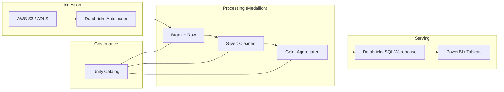

# Case Study: Modern Lakehouse Architecture

## The Blueprint for Success
This is how most modern companies (like Uber, Airbnb) design their data systems using Databricks.

## 🏛️ Architect's Tip
"Notice the **Unity Catalog** sitting across all layers. Governance isn't an afterthought; it's a foundation. Without it, your Lakehouse becomes a 'Data Swamp' where no one knows which table to trust."
