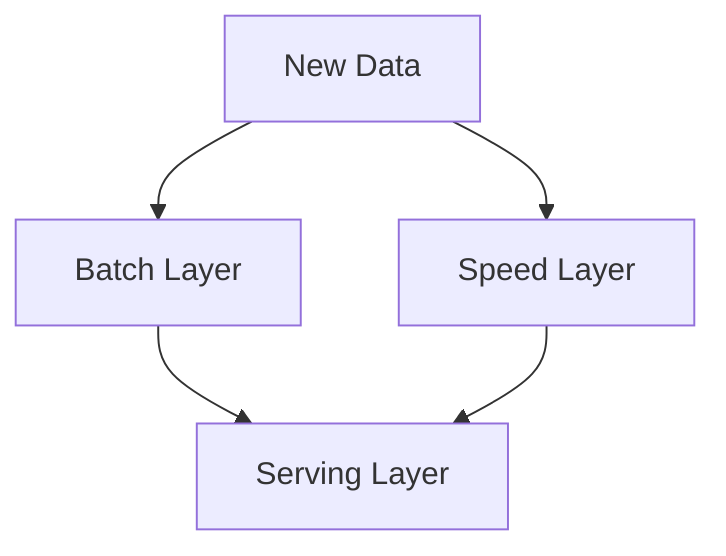

# Case Study: Lambda vs. Kappa Architecture

## 1. Lambda Architecture
The "Double Path" approach.
*   **Batch Layer:** Processes all historical data (Slow but accurate).
*   **Speed Layer:** Processes new data in real-time (Fast but less accurate).
*   **Serving Layer:** Combines both results for the user.

## 2. Kappa Architecture
The "Single Path" approach.
*   **Everything is a Stream.** We treat historical data as just a long stream from the past.
*   **Pros:** Much simpler to maintain (only one codebase).

---
### 🏛️ Architect's Tip
"In the Databricks world, the **Medallion Architecture** (Bronze > Silver > Gold) is essentially a Kappa Architecture. It simplifies your life tremendously."
