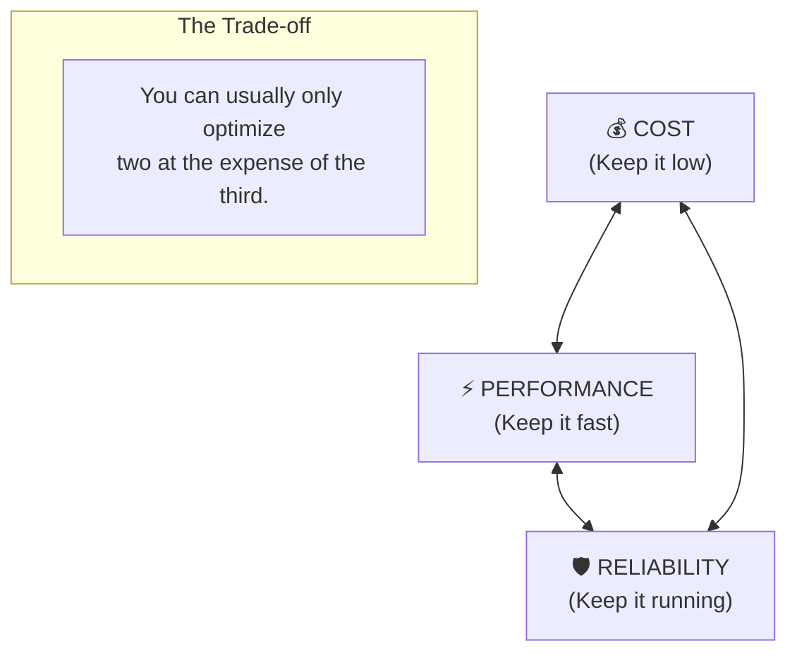

# 🏛️ Phase 6: Architect Mindset — Designing for the Future

> **Goal:** Transition from a "Code Writer" to a "System Designer". Learn the trade-offs of performance vs. cost, the patterns that power the world's largest companies, and the mental frameworks required to solve any data problem at scale.

---

## 📐 The Architectural Triangle

---

## 📚 Lessons in This Phase

| # | Lesson | Key Concepts | Industry Focus |
|---|--------|-------------|:---:|
| [1](./Lesson_1_System_Design_Basics/README.md) | **System Design Basics** | Scaling, Latency, High-Availability | **FAANG** |
| [2](./Lesson_2_Architectural_Patterns) | **Architectural Patterns** | Lambda, Kappa, Lakehouse, Mesh | **Consultancy** |
| [3](./Lesson_3_Real_World_Case_Studies) | **Case Studies** | Uber, Netflix, E-commerce | **Architect Role** |
| [4](./Lesson_4_FinOps_Cost_Architecture/README.md) | **FinOps & Cost** | Spot vs On-demand, S3 Lifecycle, Optimization | **Senior Architect** |

---

## 🎯 Phase 6: Certification & Interview Drill

### 🛡️ Professional Data Engineer Drill
*   **SLA vs. SLO vs. SLI:**
    *   **SLI (Indicator):** "Success rate of our API."
    *   **SLO (Objective):** "Success rate must be > 99.9%."
    *   **SLA (Agreement):** "If SLO is missed, we pay the client $1,000."
*   **The Drill:** Be able to calculate "Three Nines" (8.7 hours downtime/year) vs. "Five Nines" (5 minutes downtime/year).

### 🛡️ DP-600 (Microsoft Fabric) Drill
*   **Capacity Planning:** In Fabric, you don't buy "VMs"; you buy "Capacity Units (CU)". Understanding how to scale CU based on workload spikes is a key architect skill.

### 🏢 Consultancy Scenario: "The Merging Giants"
**Scenario:** Company A (AWS/Snowflake) buys Company B (Azure/Synapse). You are told to merge them into one platform.
*   **Architect Answer:** Don't just pick one and migrate. Perform a **Cost-Benefit Analysis**. 
*   **The Move:** Look at the existing talent. If the team knows SQL better than Python, Snowflake/Synapse is better. If they know Spark, Databricks is better. Suggest a **Hybrid Phase** using Unity Catalog or OneLake to link the clouds while the migration happens.

### 🚀 Startup Scenario: "Build vs. Buy"
**Scenario:** You need a Data Catalog to track 1,000 tables. Should you build a custom one using React or buy Collibra for $100k/year?
*   **Answer:** **Buy (or used managed/open source).** 
*   **The Move:** A startup's primary resource is **Time**. Building a catalog takes 3 months. Setting up Unity Catalog takes 3 hours. Always buy "Commodity" features and build "Business Unique" features.

### 🏛️ FAANG Scenario: "The Global Latency"
**Scenario:** "Our users in Asia are complaining that their dashboards are 10 seconds slower than users in the US. The data is in US-East-1."
*   **Answer:** **Data Localization and Replication.**
*   **The Drill:** Suggest **Cross-Region Replication** for the Gold tables. Move the data closer to the user. Explain the cost of storage vs. the cost of lost users.

---

### 🏛️ Architect's Tip
> "Everything is a trade-off. If someone tells you a tool is 'perfect' and 'limitless', they are a salesperson, not an architect. Your job is to find the limit and decide if you can live with it."

[Start with Lesson 1: System Design Basics →](./Lesson_1_System_Design_Basics/README.md)
