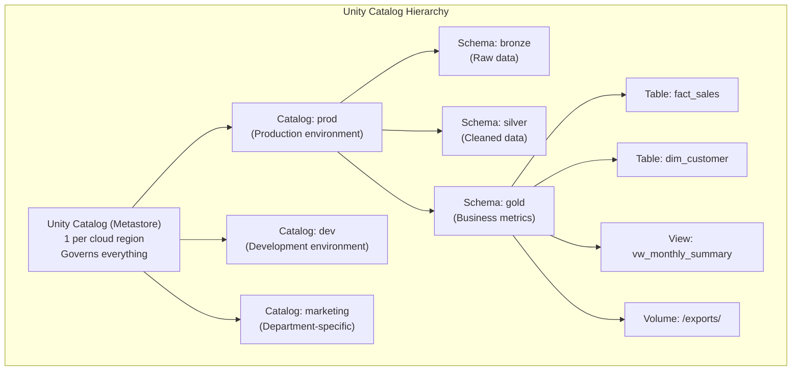

# Lesson 5: Unity Catalog Deep Dive (Security & Governance)

> **Goal:** Design and implement enterprise-grade data governance using Unity Catalog — covering the 3-level namespace, fine-grained access control, data lineage, column masking, row filtering, and audit logging.

---

## 🏗️ Phase 1: Foundations — The Unity Catalog Architecture

### 1. The 3-Level Namespace

Unity Catalog introduces a **3-level namespace** for all data assets:

```
catalog.schema.table

Examples:
  prod.gold.fact_sales           → a Delta table
  prod.gold.customer_features    → a Feature Store table
  prod.silver.orders             → a Silver table
  dev.bronze.raw_events          → dev environment table
  marketing.reports.weekly_leads → a department-specific table
```

```sql
-- Before Unity Catalog (old way — 2 levels only, workspace-scoped):
USE DATABASE gold;
SELECT * FROM fact_sales;   -- Only visible inside THIS ONE workspace!

-- With Unity Catalog (3 levels — visible across ALL workspaces):
SELECT * FROM prod.gold.fact_sales;   -- SAME data, SAME table from any workspace!

-- The power: One Unity Catalog governs:
-- • Multiple Databricks workspaces (dev, staging, prod)
-- • Multiple teams
-- • Multiple cloud regions
```

### 2. Unity Catalog Object Types

```
Unity Catalog governs ALL of these:

├── Tables (Delta, Parquet, CSV, external)
├── Views (virtual tables = saved SQL queries)
├── Volumes (files: CSV, JSON, images, PDFs)
├── Functions (SQL UDFs, registered functions)
├── Models (MLflow model registry)
├── Feature Store tables
└── External Locations (cloud storage mounts)
```



---

## 🚀 Phase 2: Access Control — RBAC in Practice

### 1. Principals — Who Gets Access?

```sql
-- Unity Catalog principals (who you grant access TO):
-- • Users:          individual@company.com
-- • Service Principals: Application identities (for pipelines, CI/CD)
-- • Groups:         A named collection of users (recommended for scale!)

-- ✅ ALWAYS use Groups, not individual users!
-- If you grant to individuals, you'll have 500 GRANT statements to maintain.
-- If you grant to groups, you add/remove users from groups — done!

-- Example group structure:
-- Group: data_engineers   → full access to bronze, silver, gold
-- Group: data_analysts    → read-only on gold, no PII
-- Group: ml_scientists    → read on gold, write on feature_store
-- Group: finance_team     → read on gold.finance schema only
-- Group: data_platform    → admin rights (platform engineers only)
```

### 2. The GRANT System — Complete Examples

```sql
-- ============================================
-- CATALOG LEVEL (broadest)
-- ============================================
-- Give data engineers full access to the dev catalog:
GRANT ALL PRIVILEGES ON CATALOG dev TO data_engineers;

-- Give analysts read-only access to prod catalog:
GRANT USE CATALOG ON CATALOG prod TO data_analysts;

-- ============================================
-- SCHEMA LEVEL
-- ============================================
GRANT USE SCHEMA ON SCHEMA prod.gold TO data_analysts;
GRANT USE SCHEMA ON SCHEMA prod.gold TO finance_team;

-- ============================================
-- TABLE LEVEL (most precise)
-- ============================================
-- Analysts can read all Gold tables:
GRANT SELECT ON ALL TABLES IN SCHEMA prod.gold TO data_analysts;

-- Finance team only sees the finance schema:
GRANT SELECT ON ALL TABLES IN SCHEMA prod.gold_finance TO finance_team;

-- Pipeline service principal can write to Silver:
GRANT MODIFY ON ALL TABLES IN SCHEMA prod.silver TO `pipeline-service-principal`;

-- ML scientists can create tables in the feature store schema:
GRANT CREATE TABLE ON SCHEMA prod.feature_store TO ml_scientists;

-- ============================================
-- VOLUME LEVEL (for files)
-- ============================================
GRANT READ VOLUME  ON VOLUME prod.landing.raw_files TO `ingestion-service`;
GRANT WRITE VOLUME ON VOLUME prod.landing.raw_files TO `ingestion-service`;

-- ============================================
-- VIEW EVERYTHING GRANTED
-- ============================================
SHOW GRANTS ON TABLE prod.gold.fact_sales;
SHOW GRANTS ON SCHEMA prod.gold;
SHOW GRANTS TO data_analysts;   -- What can this group access?
```

### 3. Dynamic Data Masking — Column-Level Protection

**Column Masking** hides sensitive data automatically based on WHO is querying:

```sql
-- Example: Credit card numbers — only the payment team sees full numbers
CREATE FUNCTION prod.gold.mask_credit_card(card_number STRING)
RETURNS STRING
LANGUAGE SQL
COMMENT 'Masks credit card number for non-payment team members'
RETURN
    CASE
        WHEN is_member('payment_team') THEN card_number          -- Full number
        WHEN is_member('fraud_team')   THEN '****-****-****-' || RIGHT(card_number, 4)  -- Last 4 only
        ELSE '****-****-****-****'                                -- Fully masked
    END;

-- Apply the mask to the column:
ALTER TABLE prod.gold.dim_customer
ALTER COLUMN credit_card_number
SET MASK prod.gold.mask_credit_card;

-- Now:
-- Payment team member runs: SELECT credit_card_number FROM gold.dim_customer
-- → Sees: 4532-1234-5678-9012

-- Analyst runs: SELECT credit_card_number FROM gold.dim_customer
-- → Sees: ****-****-****-****  (automatically masked — no code change needed!)

-- ============================================
-- Real-world masking examples:
-- ============================================

-- Email: Show full email only to HR team
CREATE FUNCTION mask_email(email STRING)
RETURNS STRING
LANGUAGE SQL
RETURN CASE WHEN is_member('hr_team') THEN email
            ELSE CONCAT(LEFT(email, 2), '***@***.com') END;

-- Phone: Show only last 4 digits
CREATE FUNCTION mask_phone(phone STRING)
RETURNS STRING  
LANGUAGE SQL
RETURN CASE WHEN is_member('support_team') THEN phone
            ELSE CONCAT('**-****-**', RIGHT(phone, 2)) END;

-- Salary: Show only to HR and Finance
CREATE FUNCTION mask_salary(salary DECIMAL)
RETURNS DECIMAL
LANGUAGE SQL
RETURN CASE WHEN is_member('hr_team') OR is_member('finance_team') THEN salary
            ELSE NULL END;
```

### 4. Row-Level Security — Filter Rows Based on WHO is Querying

**Row Filters** (Row-Level Security) limit which ROWS a user can see in a table:

```sql
-- Example: Regional managers only see THEIR region's data
CREATE FUNCTION prod.gold.region_filter(region_code STRING)
RETURNS BOOLEAN
LANGUAGE SQL
COMMENT 'Row filter: users see only their authorized regions'
RETURN
    CASE
        WHEN is_member('data_engineers') THEN TRUE    -- Engineers see ALL rows
        WHEN is_member('north_team')     THEN region_code = 'NORTH'
        WHEN is_member('south_team')     THEN region_code = 'SOUTH'
        WHEN is_member('east_team')      THEN region_code = 'EAST'
        WHEN is_member('west_team')      THEN region_code = 'WEST'
        ELSE FALSE                                     -- Unknown group: see NOTHING
    END;

-- Apply the row filter:
ALTER TABLE prod.gold.fact_sales
SET ROW FILTER prod.gold.region_filter ON (region_code);

-- Now:
-- North team member: SELECT * FROM fact_sales → only sees NORTH rows (automatically!)
-- South team member: SELECT * FROM fact_sales → only sees SOUTH rows
-- Data engineer:     SELECT * FROM fact_sales → sees ALL regions

-- ============================================
-- More row filter examples:
-- ============================================

-- Tenant isolation (multi-tenant SaaS):
CREATE FUNCTION tenant_filter(tenant_id STRING)
RETURNS BOOLEAN
LANGUAGE SQL
RETURN tenant_id = current_user_attribute('tenant_id');  -- From token claims

-- Time-based: Only see the last 12 months (for data freshness compliance)
CREATE FUNCTION recency_filter(order_date DATE)
RETURNS BOOLEAN
LANGUAGE SQL
RETURN order_date >= date_sub(current_date(), 365);

-- Department-based: HR sees full table, others see only their own records
CREATE FUNCTION employee_filter(employee_id STRING)
RETURNS BOOLEAN
LANGUAGE SQL
RETURN is_member('hr_team') OR employee_id = current_user();
```

---

## 🏛️ Phase 3: Lineage, Audit, and External Locations

### 1. Data Lineage — "Where Did This Data Come From?"

```sql
-- Unity Catalog automatically tracks lineage for all SQL operations!
-- No code needed — just use Unity Catalog and lineage is captured.

-- View lineage in the UI:
-- Unity Catalog → Explore → <table> → Lineage tab
-- Shows: which tables/files were READ and which tables WROTE to this table

-- Query lineage programmatically (system tables):
SELECT
    source_table_full_name,
    target_table_full_name,
    created_by,
    event_time
FROM system.access.table_lineage
WHERE target_table_full_name = 'prod.gold.fact_sales'
ORDER BY event_time DESC;

-- Column-level lineage (which source column maps to which target):
SELECT
    source_table_full_name,
    source_column_name,
    target_table_full_name,
    target_column_name
FROM system.access.column_lineage
WHERE target_table_full_name = 'prod.gold.fact_sales'
  AND target_column_name = 'total_revenue';
```

### 2. Audit Logging — Who Accessed What?

```sql
-- system.access.audit contains ALL access events (last 365 days)
-- Critical for: Security audits, compliance (GDPR, SOC2, HIPAA), investigations

-- Who queried sensitive customer data in the last 7 days?
SELECT
    user_identity.email   AS user,
    action_name,
    request_params.tableName AS table_name,
    event_time
FROM system.access.audit
WHERE action_name    IN ('SELECT', 'UPDATE', 'DELETE')
  AND event_time      >= date_sub(current_timestamp(), 7)
  AND request_params.tableName LIKE '%customer%'
ORDER BY event_time DESC;

-- Failed access attempts (potential security incident):
SELECT
    user_identity.email AS user,
    action_name,
    error_message,
    event_time
FROM system.access.audit
WHERE response.status_code = 403    -- FORBIDDEN
  AND event_time >= date_sub(current_timestamp(), 1)
ORDER BY event_time DESC;

-- Cost attribution: Who is using the most compute?
SELECT
    user_identity.email,
    COUNT(*) AS total_actions,
    COUNT(DISTINCT DATE(event_time)) AS active_days
FROM system.access.audit
WHERE event_time >= date_trunc('month', current_date())
GROUP BY user_identity.email
ORDER BY total_actions DESC;
```

### 3. External Locations — Connecting to Cloud Storage

```sql
-- External Locations allow Unity Catalog to govern files in S3/ADLS/GCS

-- Step 1: Create a Storage Credential (the cloud identity)
CREATE STORAGE CREDENTIAL my_azure_credential
WITH AZURE_MANAGED_IDENTITY (
    CONNECTOR_ID = '/subscriptions/.../databricks-access-connector'
);

-- Step 2: Create the External Location (path + credential)
CREATE EXTERNAL LOCATION prod_data
URL 'abfss://data@mystorageaccount.dfs.core.windows.net/'
WITH (STORAGE CREDENTIAL my_azure_credential)
COMMENT 'Production data lake in Azure ADLS Gen2';

-- Step 3: Grant access to the External Location
GRANT READ FILES  ON EXTERNAL LOCATION prod_data TO data_engineers;
GRANT WRITE FILES ON EXTERNAL LOCATION prod_data TO `ingestion-service`;

-- Now EVERY file read/write through Unity Catalog is:
-- ✅ Authenticated (no anonymous access)
-- ✅ Authorized (RBAC checked)
-- ✅ Logged in audit tables
-- ✅ Tracked in lineage
```

---

### 4. Delta Sharing — Open Data Exchange
**Delta Sharing** is the world's first open protocol for secure data sharing. It allows you to share data with **anyone**, even if they don't use Databricks.
*   **The Problem:** Sharing a Petabyte of data usually requires copying it to an S3 bucket and managing IAM keys.
*   **The Fix:** Create a `SHARE`, add tables to it, and create a `RECIPIENT`. The recipient gets a secure token and can query the data directly from PowerBI, Spark, or Pandas.
*   **Architect Note:** There is **no data copying**. You share the data *in place*.

---

## 🎯 Phase 4: Certification & Interview Drill

### 🛡️ Databricks Data Engineer Professional Drill
*   **External Locations:** Be able to explain the difference between a **Storage Credential** (The 'How' - IAM/Service Principal) and an **External Location** (The 'Where' - S3/ADLS path). You grant users access to the **External Location**, not the credential.
*   **System Tables:** Know that `system.information_schema.tables` is the "Master Registry" of all tables in the catalog. You can query it to find every table that hasn't been updated in 30 days to save costs.

### 🛡️ DP-600 (Microsoft Fabric) Drill
*   **OneLake Shortcuts vs. Delta Sharing:** For the exam, understand that both solve the same problem: **Zero-copy data access.** Shortcuts are internal to the Fabric ecosystem; Delta Sharing is an open protocol for sharing across different cloud vendors and platforms.

### 🏢 Consultancy Scenario: "The Merging Catalogs"
**Scenario:** Company A (Databricks) buys Company B (Databricks). They want a single view of all data.
*   **Architect Answer:** **Catalog Binding.**
*   **The Move:** You don't need to migrate the data. You can "Bind" the catalogs from Company B's workspace into Company A's Unity Catalog metastore. This allows users in Company A to run `SELECT * FROM company_b.gold.sales` as if it were local data.

### 🚀 Startup Scenario: "Why change from Hive?"
**Scenario:** "We are currently using the legacy Hive Metastore. It works fine. Why should we spend 2 weeks migrating to Unity Catalog?"
*   **Answer:** **Governance and Lineage.**
*   **The Drill:** In Hive, security is "All or Nothing" at the cluster level. In Unity Catalog, you can have **Row-Level Security** (Customer A only sees Customer A's data). More importantly, Unity Catalog gives you **Data Lineage** automatically. If a column is wrong, you can see every table and dashboard it affects in seconds.

### 🏛️ FAANG Scenario: "The Right to be Forgotten"
**Scenario:** "A user sends a GDPR 'Right to be Forgotten' request. We have their ID in 500 different tables. How do we ensure we deleted them everywhere?"
*   **Answer:** **Unity Catalog Lineage.**
*   **The Drill:** You can't guess where the user's data went. You use the **Lineage API** to find every downstream table that was derived from the user's source table. You then run a delete script across all those tables. Without Unity Catalog, this is an impossible manual task.

---

### 🧪 Hands-on Labs
- [unity_catalog_security_lab.sql](unity_catalog_security_lab.sql) (A script to set up a full RBAC model including masking and filtering)

---

### ✅ Key Takeaways
1. **3-Level Namespace** is the law. `catalog.schema.table`.
2. **Delta Sharing** is for sharing without copying. Open and secure.
3. **External Locations** govern your cloud storage without managing IAM keys for every user.
4. **Row/Column Security** is enforced at the catalog level. No more complex views.
5. **Lineage is Automatic.** It is your best friend for debugging and compliance.
6. **System Tables** allow you to "Query your Metadata". Use them for cost and audit reports.

[Next: Lesson 6: Cost & Operations (Managing the Lakehouse) →](../Lesson_6_Cost_and_Operations/README.md)

---

## 🧪 Practice Exercises

### Exercise 1 — Permission Management (Beginner)
**Goal:** Practice the SQL syntax for Unity Catalog permissions.

```sql
-- 1. Create a development catalog
CREATE CATALOG IF NOT EXISTS dev_sandbox;
USE CATALOG dev_sandbox;

-- 2. Create a schema for your team
CREATE SCHEMA IF NOT EXISTS data_team;
USE SCHEMA data_team;

-- 3. Create a table
CREATE TABLE test_table (id INT, val STRING);

-- 4. GRANT permissions to a colleague (or fake user)
GRANT USAGE ON CATALOG dev_sandbox TO `analyst@company.com`;
GRANT USAGE ON SCHEMA data_team TO `analyst@company.com`;
GRANT SELECT ON TABLE test_table TO `analyst@company.com`;

-- 5. VERIFY
SHOW GRANTS ON TABLE test_table;

-- 6. REVOKE
REVOKE SELECT ON TABLE test_table FROM `analyst@company.com`;
```

---

### Exercise 2 — Lineage Explorer (Intermediate)
**Goal:** Track data from source to destination in the Catalog Explorer.

```python
# 1. Run this code to create a simple lineage
spark.sql("CREATE TABLE main.default.source_data AS SELECT 1 as id, 'A' as val")

spark.sql("""
  CREATE TABLE main.default.target_data AS 
  SELECT id, val, current_timestamp() as proc_time 
  FROM main.default.source_data
""")

# 2. Go to Catalog Explorer (sidebar)
# 3. Find 'target_data' -> Click 'Lineage' tab
# 4. Click 'See Lineage Graph'
# 5. VERIFY: You should see 'source_data' pointing to 'target_data'.
```

---

### Exercise 3 — External Locations (Architect)
**Goal:** Create a managed table on an external S3/ADLS path.

```sql
-- 1. Create an External Location (Requires Cloud IAM setup)
-- CREATE EXTERNAL LOCATION prod_landing
-- URL 's3://my-bucket/landing/'
-- WITH (STORAGE CREDENTIAL `aws-storage-cred`);

-- 2. Create an External Table (Data lives in YOUR bucket, not Databricks)
CREATE TABLE main.default.external_orders
EXTERNAL
LOCATION 's3://my-bucket/landing/orders/'
AS SELECT * FROM bronze_orders;

-- 3. DROP the table
DROP TABLE main.default.external_orders;

-- 4. VERIFY: Go to your S3 bucket.
--    Does the data still exist?
--    ANSWER: YES. Because it was an EXTERNAL table. Unity Catalog only drops the metadata.
```

---

## 💼 Common Interview Questions

**Q1: What is the Three-Tier Namespace in Unity Catalog?**
> The three-tier namespace is `catalog.schema.table`. (1) **Catalog**: The high-level isolation (e.g., `prod`, `dev`, `marketing`). (2) **Schema** (formerly Database): Grouping of related objects. (3) **Table/View/Volume**: The actual data object. This structure makes security and sharing much easier than the legacy two-tier `database.table` model.

**Q2: What is the difference between a Managed Table and an External Table?**
> A **Managed Table** is stored in the "Catalog Root" (managed by Databricks). If you `DROP` the table, the data is deleted from the cloud. An **External Table** is stored in a specific path you provide (via an External Location). If you `DROP` the table, the data stays in your cloud bucket; only the reference in the catalog is removed.

**Q3: How does Lineage tracking work and what are its security implications?**
> Lineage in Unity Catalog tracks the flow of data at the table and column level. **Security implication**: Lineage respects permissions. If a user doesn't have `SELECT` on a source table, they cannot see the lineage graph for that table, even if they can see the final target table.

**Q4: What is a Volume in Unity Catalog?**
> A **Volume** is the modern way to store non-tabular data (CSVs, JSONs, images, ZIPs) in the catalog. It replaces the legacy DBFS mounts. Volumes support the same three-tier namespace and RBAC as tables, making them secure and auditable.

**Q5: What is Delta Sharing and why is it part of Unity Catalog?**
> **Delta Sharing** is an open protocol for sharing live data across different organizations (or even different cloud providers) without copying files. It's built into Unity Catalog so you can share data using the same `GRANT` syntax you use for internal users. The recipient doesn't even need a Databricks account to read the shared data!
