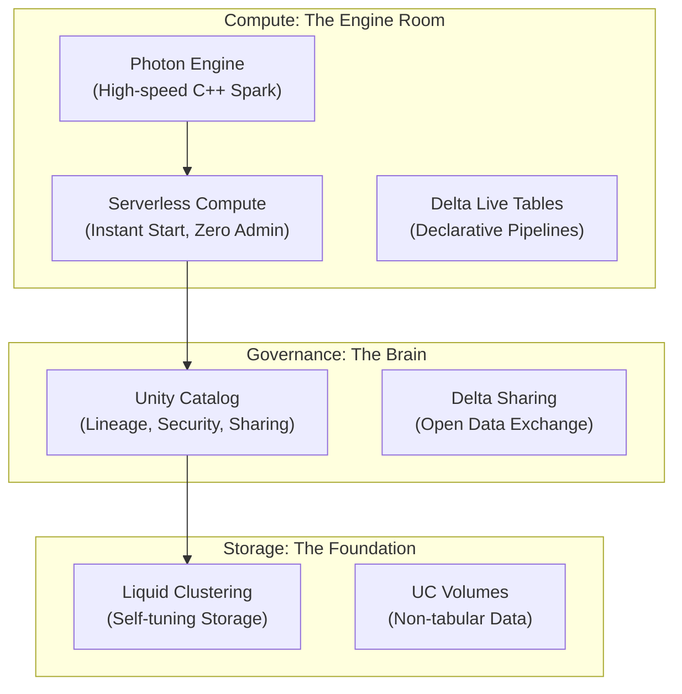

# 🧱 Phase 7: Databricks In-Depth — The Architect's Platform

> **Goal:** Transition from a Spark programmer to a Databricks Platform Architect. Master the deep internals of **Photon**, **Liquid Clustering**, **Delta Live Tables**, and **Unity Catalog** to build production-grade, serverless-ready Lakehouses.

---

## 🏛️ The Modern Databricks Stack

---

## 📚 Lessons in This Phase

| # | Lesson | Master-Level Concepts | Industry Focus |
|---|--------|-------------|:---:|
| [1](./Lesson_1_Platform_and_Clusters/README.md) | **Platform & Clusters** | Photon, Serverless, Liquid Clustering | **Engineering** |
| [2](./Lesson_2_Delta_Live_Tables/README.md) | **DLT Masterclass** | CDC, QoS, Pipeline Monitoring | **Consultancy** |
| [3](./Lesson_3_MLflow_and_Feature_Store/README.md) | **MLOps & Features** | Experiment Tracking, Model Serving | **AI/ML** |
| [4](./Lesson_4_Databricks_SQL_and_Photon/README.md) | **DBSQL & Photon** | SQL Warehouses, Query Profile tuning | **BI/Business** |
| [5](./Lesson_5_Unity_Catalog_Deep_Dive/README.md) | **Unity Catalog Advanced** | Delta Sharing, Governance Patterns | **Compliance** |
| [6](./Lesson_6_Cost_and_Operations/README.md) | **Cost & Operations** | DBU Analysis, Cluster Policies | **Strategy** |

---

## 🎯 Phase 7: Certification & Interview Drill

### 🛡️ Databricks Data Engineer Professional Drill
*   **Liquid Clustering:** Be able to explain why **Liquid Clustering** replaces Z-Ordering (It's incremental and doesn't require constant full rewrites).
*   **Photon Engine:** Know that Photon is written in **C++** and is designed specifically to speed up joins and aggregations on Delta Lake.

### 🛡️ DP-600 (Microsoft Fabric) Drill
*   **OneLake vs. Databricks:** For the exam, understand that while Fabric is "the Microsoft answer," Databricks is the "Multi-cloud answer." The underlying formats (Delta/Parquet) are identical, meaning you can migrate from one to the other with zero data loss.

### 🏢 Consultancy Scenario: "The Multi-Cloud Lock-in"
**Scenario:** A client wants to use Databricks but is terrified of "Vendor Lock-in." 
*   **Architect Answer:** **Open Formats (Delta Lake).**
*   **The Move:** Explain that even if they leave Databricks tomorrow, their data is in **Standard Parquet/Delta** format. They can read it with open-source Spark, Presto, or Trino. This "Open" nature is the #1 selling point in consultancy.

### 🚀 Startup Scenario: "Zero-Ops with Serverless"
**Scenario:** You have no DevOps team. You need a data warehouse that "just works."
*   **Answer:** **Databricks Serverless SQL.**
*   **The Move:** Don't waste time configuring clusters, instance types, or VPC peering. Use Serverless. It starts in 3 seconds, scales to zero when not in use, and means you never have to "babysit" a virtual machine.

### 🏛️ FAANG Scenario: "Scaling Delta Sharing"
**Scenario:** You need to share 1 Petabyte of data with 5 different partner companies, all using different cloud providers (AWS, Azure, GCP).
*   **Answer:** **Delta Sharing.**
*   **The Drill:** Explain the **Recipient Token** model. You don't need to create IAM roles for your partners. You give them a secure link, and they can query the data directly from THEIR tool (even if it's not Databricks) without you moving a single byte of data.

---

### 🏛️ Architect's Tip
> "In Chapter 3, you learned how to write Spark code. In Chapter 7, you learn how to **optimize the platform**. A junior fixed a query by adding RAM; a senior fixes it by enabling Photon and adjusting the Liquid Clustering key."

[Start with Lesson 1: Platform & Clusters →](./Lesson_1_Platform_and_Clusters/README.md)
