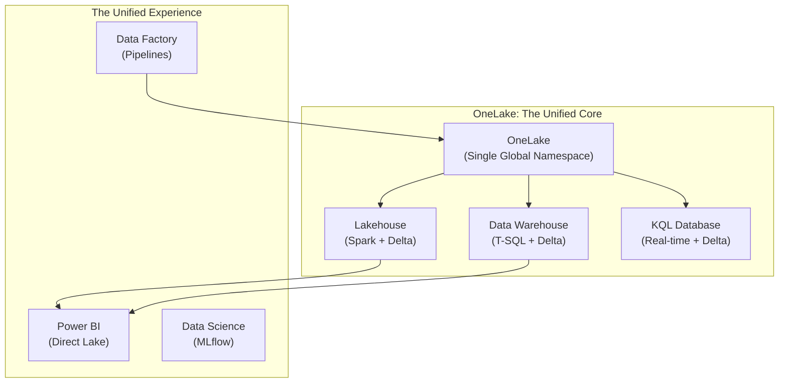

# 🌐 Phase 8: Microsoft Fabric — The Enterprise Analytics Suite

> **Goal:** Master Microsoft Fabric — the world's most unified data platform. Learn how to leverage **OneLake**, **Direct Lake**, and **Data Factory** to build end-to-end analytics solutions that bridge the gap between Data Engineering and Business Intelligence without copying data.

---

## 🏛️ The OneLake Vision: "OneDrive for Data"

---

## 📚 Lessons in This Phase

| # | Lesson | Master-Level Concepts | Industry Focus |
|---|--------|-------------|:---:|
| [1](./Lesson_1_Fabric_Overview_and_OneLake/README.md) | **OneLake Architecture** | Shortcuts, Unity across domains | **Corporate** |
| [2](./Lesson_2_Data_Factory_Pipelines/README.md) | **Data Factory In-Depth** | Dataflows Gen2, Copy Activity | **ETL/ELT** |
| [3](./Lesson_3_Lakehouse_and_Warehouse/README.md) | **Lakehouse vs Warehouse** | T-SQL vs Spark, Choice logic | **Architect** |
| [4](./Lesson_4_Notebooks_and_Spark/README.md) | **Fabric Spark** | Serverless tuning, Lakehouse API | **Developer** |
| [5](./Lesson_5_Real_Time_Analytics/README.md) | **Real-Time Analytics** | Kusto (KQL), Eventstreams | **Ops/IoT** |
| [6](./Lesson_6_PowerBI_and_Semantic_Models/README.md) | **Direct Lake & BI** | No-Copy Power BI, DAX | **Analyst** |

---

## 🎯 Phase 8: Certification & Interview Drill

### 🛡️ DP-600 Focus: "Direct Lake"
*   **The Drill:** Why is **Direct Lake** better than Import or DirectQuery?
    *   **Answer:** Import requires data copying and takes hours/days to refresh. DirectQuery is slow because it queries the source live. **Direct Lake** reads the **Delta Parquet** files directly from OneLake into the Power BI memory — zero copy, sub-second speed.

### 🛡️ DP-600 Focus: "Shortcuts"
*   **The Drill:** Your data is in **AWS S3** and you want to use it in **Fabric** without moving it.
    *   **Answer:** Create a **Shortcut**. It points to S3 but looks like a folder in OneLake. Fabric never moves the data, only reads it when needed.

### 🏢 Consultancy Scenario: "The Synapse Migration"
**Scenario:** A client has a complex Azure Synapse setup and wants to move to Fabric.
*   **Architect Answer:** **Strategy — Co-existence before Migration.**
*   **The Move:** Don't do a "Big Bang" migration. Use **Shortcuts** to link Synapse storage to Fabric. Build new reports in Fabric. Slowly migrate Spark notebooks (since both use PySpark). The SQL scripts will need a minor tweak as Fabric DW uses a different SQL dialect than Synapse Dedicated Pools.

### 🚀 Startup Scenario: "The Free Trial Hustle"
**Scenario:** You have $0 budget for a data stack.
*   **Answer:** **The 60-Day Fabric Trial.**
*   **The Drill:** Fabric offers a full-featured 60-day trial (F64 Capacity). Use this to build a **Proof of Concept (PoC)**. Show the value to your investors. When the trial ends, you can scale down to a smaller F2 capacity for ~$300/month.

### 🏛️ FAANG Scenario: "Fabric vs. Databricks"
**Scenario:** "We are a massive global retail company. Why would we pick Fabric over Databricks?"
*   **Answer:** **Integration vs. Specialization.**
*   **The Drill:** Pick **Fabric** if the primary goal is **Speed to Dashboard** and your team is already 100% on Microsoft. Pick **Databricks** if you need **Photon-speed Spark** for 100PB datasets or advanced **AI/ML** capabilities that aren't yet fully mature in Fabric.

---

### 🏛️ Architect's Tip
> "Fabric is the first platform where the **Data Engineer** and the **Power BI Analyst** actually work on the same file. The 'Handover' phase is gone. Learn to love the **Semantic Model** — it's where the value is delivered."

[Start with Lesson 1: Fabric Overview and OneLake →](./Lesson_1_Fabric_Overview_and_OneLake/README.md)
